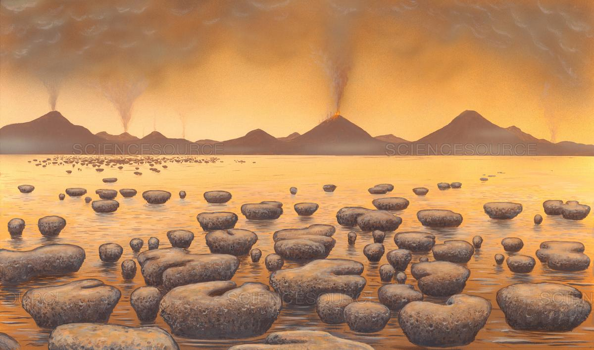
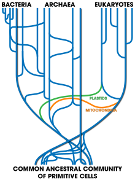
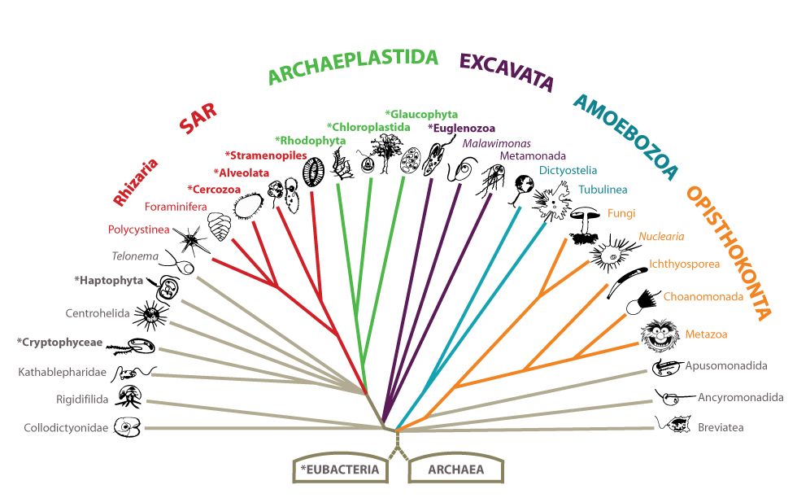
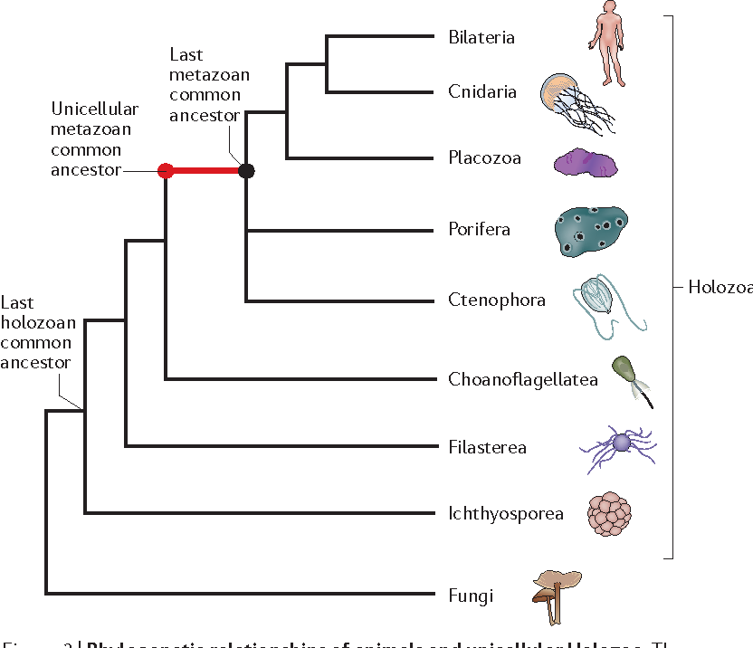
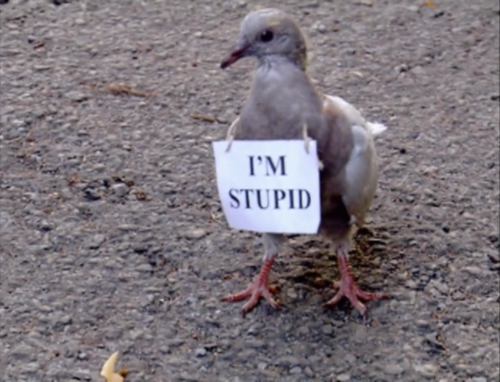
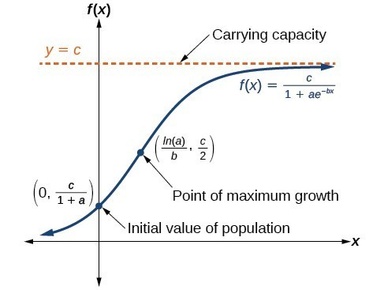

<style type="text/css">
.main-container {
  max-width: 1800px;
  margin-left: auto;
  margin-right: auto;
}
</style>


## [HOME](http://gzahn.github.io/) | [ABOUT ME](http://gzahn.github.io/about-me/) | [LAB](http://gzahn.github.io/lab/) | [RESEARCH](http://gzahn.github.io/pubs-and-pres/) | [TEACHING](http://gzahn.github.io/coursemap/)

<div style= "float:right;position: relative;top:10px">
```{r, out.width = "300px",echo=FALSE}
knitr::include_graphics("../media/campbell_biol.jpg")
```
</div>

<style>
div.gray { background-color:#aabdaf; border-radius: 5px; padding: 20px;}
</style>
<div class = "gray">


# **College Biology II**{#top}
Utah Valley University - BIOL1620


## Quick links:

#### [Course Syllabus](http://gzahn.github.io/BIOL1620/syllabus.html){target="_blank"}

#### [Your-Choice Reading List](https://gzahn.github.io/media/YOUR-CHOICE_Book_List.html){target="_blank"}
Audiobooks are only acceptable if they are **unabridged**.

#### [Advice from Former Students](https://github.com/gzahn/Protocols/blob/master/BIOL_1620_Advice_from_Students.pdf){target="_blank"}

___

<br>

<style>
div.blue { background-color:#a89d82; border-radius: 5px; padding: 20px;}
</style>
<div class = "blue">

## Weekly Content:

<div style= "float:right;position: relative;top:10px">
```{r, out.width = "350px",echo=FALSE}

```
</div>

### **Week 1**{#Week-1}

**Topics:** 

  - Early Earth | Evolution | Phylogenies

**Readings and Assignments**  

  - Campbell Chs 25-26
  - Canvas quiz 1 due 11:59pm Friday of the first week (all others due **before** the first class of that week!)
  - Pre-Test due Friday 11:59pm
  - First assignment (getting to know the course) is due **before our next class.**
  - Pick a book to read for Your-Choice Points ASAP
  - If you don't have Campbell Biology yet (for this first week only), here's a pdf to get you started: [Chapters 25-26](https://gzahn.github.io/media/Campbell_Chs_25-26.pdf){target="_blank"}
  - **See our Teams page files for more details about the textbook!**

**Resources**

  - [Major Topics](https://gzahn.github.io/BIOL1620/mp1.txt){target="_blank"}
  - Early Earth [Slides](https://github.com/gzahn/BIOL_1620/raw/master/01_First_Day-Early_Earth_and_Syllabus.pdf)
  - Antibiotic Resistance [Slides](https://github.com/gzahn/BIOL_1620/raw/master/02_Antibiotic_Resistance.pdf)
  - [Rise of Oxygen](https://gzahn.github.io/media/rise_of_oxygen.html){target="_blank"}
  - [How to Read Pylogenies](https://evolution.berkeley.edu/evolibrary/article/_0_0/evo_05){target="_blank"}
  - [How to Build Phylogenies](https://www.khanacademy.org/science/biology/her/tree-of-life/a/building-an-evolutionary-tree){target="_blank"}
  - [Mechanisms of Antibiotic Resistance](https://www.ncbi.nlm.nih.gov/pmc/articles/PMC4888801/){target="_blank"}


[Back to top of page](#top)

___

<div style= "float:right;position: relative;top:10px">
```{r, out.width = "350px",echo=FALSE}
knitr::include_graphics("../media/week2.jpg")
```
</div>

### **Week 2**{#Week-2}

**Topics**

  - What is life? | Thermodynamics | Major Metabolic Groups | Nature of Science

**Readings and Assignments**

  - Good (optional points) Your-Choice book for this would be _Life’s Edge: The Search for What It Means to Be Alive_
  - No quiz due this week

**Resources**

  - [Major Topics](https://gzahn.github.io/BIOL1620/mp2.txt){target="_blank"}
  - Survey of Metabolic Groups [Slides](https://github.com/gzahn/BIOL_1620/raw/master/04_TOL_Survey_Metabolism.pdf)
  - [Primary Nutritional Groups](https://en.wikipedia.org/wiki/Primary_nutritional_groups){target="_blank"}
  - What is Life [Online Resource](https://www.khanacademy.org/science/high-school-biology/hs-biology-foundations/hs-biology-and-the-scientific-method/a/what-is-life){target="_blank"}
  - [The True Meaning of Life](https://www.youtube.com/watch?v=aboZctrHfK8){target="_blank"}
  - Interesting, if Provocative,  [Hypothesis](https://www.scientificamerican.com/article/a-new-physics-theory-of-life/){target="_blank"}
  
  
  
[Back to top of page](#top)

___

<div style= "float:right;position: relative;top:10px">
```{r, out.width = "350px",echo=FALSE}
knitr::include_graphics("../media/week3.jpg")
```
</div>


### **Week 3**{#Week-3}

**Topics**

  - Mechanisms of Evolution | Nature of Science

**Readings and Assignments**

  - Campbell Chs 22-23
  - Canvas quiz 2 due before our first class this week (see Canvas)

**Resources**

  - [Major Topics](https://gzahn.github.io/BIOL1620/mp3.txt){target="_blank"}
  - Mechanisms of Evolution [Slides](https://github.com/gzahn/BIOL_1620/raw/master/03_Nature_of_Science-Mech_of_Evolution.pdf)
  - Mechanisms of Evolution [Website](https://evolution.berkeley.edu/evolibrary/article/evo_14){target="_blank"}
  - Artificial Selection [Simulation](http://ccl.northwestern.edu/netlogo/models/BirdBreeder){target="_blank"}
  - Artificial vs Natural Selection [Program](https://www.khanacademy.org/science/ap-biology/natural-selection/artificial-selection/a/evolution-natural-selection-and-human-selection){target="_blank"}
  - Nature of Science [presentation](https://gzahn.github.io/media/nospresentation72112.pdf)
  

  
[Back to top of page](#top)
  
___

<div style= "float:right;position: relative;top:10px">
```{r, out.width = "250px",echo=FALSE}

```
</div>
  
  
### **Week 4**{#Week-4}

**Topics**

  - Bacteria and Archaea | Lateral Gene Transfer | Endosymbiosis

**Readings and Assignments**

  - Campbell Ch 27
  - Canvas quiz 3 due before our first class this week (see Canvas)
  - Exam 1 on Friday (closes at 11:59pm)
  - 1/4th of the semester as passed, and you need to turn in Your-Choice Points

**Resources**

  - [Major Topics](https://gzahn.github.io/BIOL1620/mp4.txt){target="_blank"}
  - Bacteria and Archaea [Slides](https://github.com/gzahn/BIOL_1620/raw/master/07_Prokaryotes.pdf)
  - Lateral Gene Transfer [Between Humans and Microbes](https://www.the-scientist.com/features/bacteria-and-humans-have-been-swapping-dna-for-millennia-32779){target="_blank"}
  - Primary vs Secondary [Endosymbiosis](https://endosymbiotichypothesis.wordpress.com/primary-versus-secondary-endosymbiosis/){target="_blank"}
  - *Paulinella* [complicates things](https://www.sciencedirect.com/science/article/pii/S0960982212003077){target="_blank"}


  
[Back to top of page](#top)

___


<div style= "float:right;position: relative;top:10px">
```{r, out.width = "350px",echo=FALSE}

```
</div>

### **Week 5**{#Week-5}

**Topics**

  - Eukaryotic Supergroups | Overview of "Protists"

**Readings and Assignments**

  - Campbell Ch 28
  - Canvas quiz 4 due before our first class this week (see Canvas)

**Resources**

  - [Major Topics](https://gzahn.github.io/BIOL1620/mp5.txt){target="_blank"}
  - Protist [Slides](https://github.com/gzahn/BIOL_1620/raw/master/08_Protist_Intro.pdf)
  - Revised [Classification of Eukaryotes](https://onlinelibrary.wiley.com/doi/full/10.1111/j.1550-7408.2012.00644.x){target="_blank"}
  - Why the World Needs [Protists](https://gzahn.github.io/media/corliss2004.pdf){target="_blank"}


[Back to top of page](#top)

___


<div style= "float:right;position: relative;top:10px">
```{r, out.width = "350px",echo=FALSE}

```
</div>

### **Week 6**{#Week-6}

**Topics**

  - Animals | Defining Traits | Evolution

**Readings and Assignments**

  - Campbell Ch 32
  - Canvas quiz 5 due before our first class this week (see Canvas)

**Resources**

  - [Major Topics](https://gzahn.github.io/BIOL1620/mp6.txt){target="_blank"}
  - Metazoa [Slides](https://github.com/gzahn/BIOL_1620/raw/master/10_Metazoa_Intro.pdf)
  - Metazoa [Brain Teasers](https://github.com/gzahn/BIOL_1620/raw/master/11_Metazoa_First_land_animals_brain_teasers.pdf)
  - Animal Evolution [Timeline](https://sci.waikato.ac.nz/evolution/AnimalEvolution.shtml){target="_blank"}
  - Molecular Clocks and [Early Animal Evolution](https://www.ncbi.nlm.nih.gov/pmc/articles/PMC4650124/){target="_blank"}
  - Ediacaran [Fossils](https://ucmp.berkeley.edu/vendian/critters.html){target="_blank"}
  - Cambrian [Fossils](http://www.fossilmuseum.net/Paleobiology/CambrianFossils.htm){target="_blank"}
  - [Burgess Shale](https://burgess-shale.rom.on.ca/en/science/burgess-shale/03-fossils.php){target="_blank"}
  - Good [Website](https://www.shapeoflife.org/) on animal groups (Click on "Resources" at the top of the page)


[Back to top of page](#top)


___

### **Week 7**{#Week-7}

<div style= "float:right;position: relative;top:10px">
```{r, out.width = "350px",echo=FALSE}
knitr::include_graphics("../media/week7.png")
```
</div>

**Topics**

  - Invertebrate and Vertebrate Classes | Mammals

**Readings and Assignments**

  - Campbell Chs 33-34
  - Canvas quiz 6 due before our first class this week (see Canvas)
  - Optional Your-Choice Points: Cave of Forgotten Dreams [Video](https://drive.google.com/open?id=1els5LTLnstqsqKFZ-9gm34M8sJtQ3SVZ){target="_blank"} goes well with these lessons

**Resources**

  - [Major Topics](https://gzahn.github.io/BIOL1620/mp7.txt){target="_blank"}
  - Invertebrate [Slides](https://github.com/gzahn/BIOL_1620/raw/master/12_Invertebrates.pdf)
  - Vertebrate [Slides](https://github.com/gzahn/BIOL_1620/raw/master/13_Vertebrates.pdf)
  - Mammals, Primates, Hominins [Slides](https://github.com/gzahn/BIOL_1620/raw/master/14_Mammals_Primates_Hominins.pdf)
  - Human Evolution [Timeline](http://humanorigins.si.edu/evidence/human-evolution-timeline-interactive){target="_blank"}
  - Animal [Phyla](http://www.fossilmuseum.net/Tree_of_Life/Kingdom_animalia/animalphyla.htm){target="_blank"}
  


[Back to top of page](#top)

___

<div style= "float:right;position: relative;top:10px">
```{r, out.width = "350px",echo=FALSE}
knitr::include_graphics("../media/week8.jpg")
```
</div>


### **Week 8**{#Week-8}
**Topics**

  - Fungi

**Readings and Assignments**

  - Campbell Ch 31
  - Canvas quiz 7 due before our first class this week (see Canvas)
  - Exam 2 due Friday (closes 11:59pm)  --  Exam 2 opens Wednesday because of Fall Break
  - 50 Your-Choice Points Due Friday 11:59pm

**Resources**

  - [Major Topics](https://gzahn.github.io/BIOL1620/mp8.txt){target="_blank"}
  - Fungus [Slides](https://github.com/gzahn/BIOL_1620/raw/master/15_Fungi_Intro.pdf)
  - Common Ancestor of Animals and [Fungi](https://gzahn@github.io/media/2881059.pdf){target="_blank"}
  - Fungal [Phyla](https://courses.lumenlearning.com/wmopen-biology2/chapter/classifications-of-fungi/){target="_blank"}
  - Fungal Endophytes and [Your Favorite Professor](https://www.sciencenews.org/article/plant-microbes-crops-food-endangered-species){target="_blank"} (Free, but need to enter an email address to subscribe in order to read the article)
  

[Back to top of page](#top)

___


<div style= "float:right;position: relative;top:10px">
```{r, out.width = "350px",echo=FALSE}
knitr::include_graphics("../media/fertilizer.jpeg")
```
</div>

[Back to top of page](#top)  


### **Week 9**{#Week-9}

**Topics**

  - Plant Nutrition | Soil | GMOs

**Readings and Assignments**

  - Make progress on Your-Choice points since there is no reading assignment or quiz this week

**Resources**

  - [Major Topics](https://gzahn.github.io/BIOL1620/mp9.txt){target="_blank"}
  - Plant Nutrition [Slides](https://github.com/gzahn/BIOL_1620/raw/master/17_Plant_Nutrition.pdf)
  - GMO [Slides](https://github.com/gzahn/BIOL_1620/raw/master/19_GMOs.pdf)
  - GMO Corn [Experiment](https://biofortified.org/experiment/){target="_blank"}
  - Fake "Science" Version of [Same Experiment](https://non-gmoreport.com/articles/june2013/farmer-experiment-squirrels-prefer-organic-corn.php){target="_blank"}
  - Glyphosate [MDS](https://alligare.com/wp-content/uploads/2019/06/glyphosate-5.4-sds-v3.1.pdf){target="_blank"}
  - Evolution of [Plant Carnivory](https://www.nature.com/news/how-plants-evolved-into-carnivores-1.21425){target="_blank"}
  - Wonderful [documentary](https://www.amazon.com/Plants-Behaving-Badly-Season-1/dp/B071HDHGJ2){target="_blank"} from PBS (Need Amazon Prime subscription). Episode 1 is about carnivorous plants. Episode 2 is about orchids.
 


  
[Back to top of page](#top)

___

<div style= "float:right;position: relative;top:10px">
```{r, out.width = "350px",echo=FALSE}
knitr::include_graphics("../media/week10.jpg")
```
</div>

### **Week 10**{#Week-10}

**Topics**

  - Plant Evolution and Life Cycles

**Readings and Assignments**

  - Campbell Chs 29-30
  - Canvas quiz 8 due before our first class this week (see Canvas)

**Resources**

  - [Major Topics](https://gzahn.github.io/BIOL1620/mp10.txt){target="_blank"}
  - Plant Evolution [Slides](https://github.com/gzahn/BIOL_1620/raw/master/20_Plant_Evolution.pdf)
  - Land Plant Evolution [Timeline](https://www.pnas.org/doi/10.1073/pnas.1719588115){target="_blank"}
  - Adaptations for [Land](https://bio.libretexts.org/Bookshelves/Introductory_and_General_Biology/Book%3A_General_Biology_(Boundless)/25%3A_Seedless_Plants/25.01%3A_Early_Plant_Life/25.1C%3A_Plant_Adaptations_to_Life_on_Land){target="_blank"}
  - Alternation of Generations [Video](https://study.com/academy/lesson/alternation-of-generations-the-gametophyte-and-sporophyte.html){target="_blank"}


[Back to top of page](#top)


___

  <div style= "float:right;position: relative;top:10px">
```{r, out.width = "250px",echo=FALSE}
knitr::include_graphics("../media/week12.png")
```
</div>

### **Week 11**{#Week-11}
**Topics**

  - Major Plant Groups | Plant Anatomy

**Readings and Assignments**

  - Campbell Chs 35, 37 (optional)
  - No quiz over these chapters

**Resources**

  - [Major Topics](https://gzahn.github.io/BIOL1620/mp11.txt){target="_blank"}
  - Seed Plants [Slides](https://github.com/gzahn/BIOL_1620/raw/master/21_Seed_Plants.pdf) 
  - Plant Anatomy [Slides](https://github.com/gzahn/BIOL_1620/raw/master/22_Plant_Anatomy.pdf)


**Supplemental videos**

  - [Seed plants 1](https://youtu.be/iKsntUnAFdw) (What good are seeds?)
  - [Seed plants 2](https://youtu.be/XBuOh7j0uLY) (Major gytmnosperm groups)
  - [Seed plants 3](https://youtu.be/yFp3D7eU_fs) (Angiosperms)
  
  
</br></br></br></br></br>


[Back to top of page](#top)

___

<div style= "float:right;position: relative;top:10px">
```{r, out.width = "350px",echo=FALSE}

```
</div>


### **Week 12**{#Week-12}
**Topics**

  - Animal Behavior

**Assignments**

  - Exam 3 Friday (closes at 11:59pm)
  - Your-Choice Points are **nearly due**
  - Campbell Chs 39, 51 (Optional)
  - No quiz over these chapters

**Resources**

  - [Major Topics](https://gzahn.github.io/BIOL1620/mp12.txt){target="_blank"}
  - Animal Behavior [Slides](https://github.com/gzahn/BIOL_1620/raw/master/23_Animal_Behavior.pdf)
  - [Superstitious Pigeons](https://www.all-about-psychology.com/support-files/superstition-in-the-pigeon.pdf){target="_blank"}
  - Evolutionary Selection for [Superstition](https://www.ncbi.nlm.nih.gov/pmc/articles/PMC2615824/){target="_blank"}
  - Classical vs Operant [Conditioning](https://www.khanacademy.org/test-prep/mcat/behavior/learning-slug/a/classical-and-operant-conditioning-article){target="_blank"}
  - Cuckoo Bird [Gentees](https://cpb-us-w2.wpmucdn.com/u.osu.edu/dist/3/39517/files/2015/09/35025058-14uu57d.pdf){target="_blank"}
  

**Supplemental videos**

  - [Animal Behavior 1](https://www.youtube.com/watch?v=jqlJdyONbYc&t=18s)
  - [Animal Behavior 2](https://www.youtube.com/watch?v=IwnXupjOKxE)
  - [Animal Behavior 3](https://www.youtube.com/watch?v=ai6MSqFHiHg)
  
[Back to top of page](#top)

___


<div style= "float:right;position: relative;top:10px">
```{r, out.width = "350px",echo=FALSE}

```
</div>

### **Week 13**{#Week-13}
**Topics**

  - Population Ecology

**Readings and Assignments**

  - Campbell Chs 52, 53
  - Canvas quiz 9 due before our first class this week (see Canvas)

**Resources**

  - [Major Topics](https://gzahn.github.io/BIOL1620/mp13.txt){target="_blank"}
  - Population Ecology [Slides](https://github.com/gzahn/BIOL_1620/raw/master/24_Ecology_Intro_and_PopEcol.pdf)
  - Logistic Growth [Model](https://www.biointeractive.org/classroom-resources/population-dynamics){target="_blank"}
  - Population [Genomics](https://www.nature.com/scitable/knowledge/library/population-genomics-15812442/){target="_blank"}
  - Population Genetics and [Neanderthals](https://www.genomeweb.com/sequencing/neanderthal-population-dynamics-clarified-new-sequence-data){target="_blank"}
  - More [Amazing Neanderthal Stuff](https://www.ncbi.nlm.nih.gov/pmc/articles/PMC5772775/){target="_blank"}
  - Earth's [historical climate](https://xkcd.com/1732/){target="_blank"} cartoon
  - IPCC [AR5 Synthesis Report](https://www.ipcc.ch/site/assets/uploads/2018/02/SYR_AR5_FINAL_full.pdf){target="_blank"}
  - IPCC [Physical Sciences Basis](https://www.ipcc.ch/site/assets/uploads/2018/02/WG1AR5_all_final.pdf){target="_blank"} Report - Evidence for anthropogenic climate change

**Supplemental videos**

  - [Ecology Intro 1](https://www.youtube.com/watch?v=YZmmx_fWQfo) - Levels of scale
  - [Ecology Intro 2](https://www.youtube.com/watch?v=oU7xCrTfs2s) - Climate modeling

[Back to top of page](#top)

___


<div style= "float:right;position: relative;top:10px">
```{r, out.width = "350px",echo=FALSE}
knitr::include_graphics("../media/turkey.jpeg")
```
</div>

### **Week 14**{#Week-14}

**Thanksgiving Break**

**Final Your-Choice Points Due Friday 11:59pm**

You've had all semester and at the end of Thanksgiving Break, all those assignments are due. I'll start grading over the weekend, but it will take me a while since most of you will have waited until the last possible minute to turn them in.


</br></br></br></br></br></br>

[Back to top of page](#top)

___


<div style= "float:right;position: relative;top:10px">
```{r, out.width = "350px",echo=FALSE}
knitr::include_graphics("../media/week15.jpg")
```
</div>

### **Week 15**{#Week-15}
**Topics**

  - Community Ecology | BioGeoChemistry

**Readings and Assignments**

  - Campbell Chs 54-55
  - Canvas quiz 10 due before our first class this week (see Canvas) (This quiz is open for all of Thanksgiving Break)

**Resources**

  - [Major Topics](https://gzahn.github.io/BIOL1620/mp14.txt){target="_blank"}
  - Community Ecology [Slides](https://github.com/gzahn/BIOL_1620/raw/master/25_Community_Ecology.pdf)
  - Analyze Metagenomes Yourself! With [This Website](https://www.mg-rast.org/mgmain.html?mgpage=analysis){target="_blank"}
  - Sea Ice [Video](https://gzahn.github.io/media/SeaIce.mp4){target="_blank"}
  - IPCC AR5 [Report](https://www.ipcc.ch/site/assets/uploads/2018/02/SYR_AR5_FINAL_full.pdf){target="_blank"} Read it and weep.
  - Modeling Trout [Extinction Risk](https://trout.shinyapps.io/lahontan/){target="_blank"}


[Back to top of page](#top)

___

<div style= "float:right;position: relative;top:10px">
```{r, out.width = "350px",echo=FALSE}
knitr::include_graphics("../media/week16.jpg")
```
</div>

### **Week 16**{#Week-16}
**Topics**

  - Wrap-up | Gaia Hypothesis | What is Life?

**Readings and Assignments**

  - Post-Test due Friday (closes at 11:59pm)
  - If you haven't turned in Your-Choice Points yet, you've missed your chance
  - Also, if that's the case, you had your chance so no whining

**Resources**

  - Daisyball [Simulation](http://www.gingerbooth.com/flash/daisyball/DaisyBall.html){target="_blank"}
  - [Gaia hypothesis](https://courses.seas.harvard.edu/climate/eli/Courses/EPS281r/Sources/Gaia/Gaia-hypothesis-wikipedia.pdf){target="_blank"}
  

  
[Back to top of page](#top)

___

</div>
