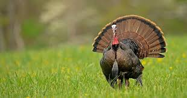

<style type="text/css">
.main-container {
  max-width: 1800px;
  margin-left: auto;
  margin-right: auto;
}
</style>

## [HOME](http://gzahn.github.io/) | [ABOUT ME](http://gzahn.github.io/about-me/) | [LAB](http://gzahn.github.io/lab/) | [RESEARCH](http://gzahn.github.io/pubs-and-pres/) | [BLOG](http://gzahn.github.io/blog-archive/) | [DATA COURSE](http://gzahn.github.io/data-course/) | [INTRO BIO II](http://gzahn.github.io/BIOL1620/)

<div style= "float:right;position: relative;top:10px">
```{r, out.width = "300px",echo=FALSE}

```
</div>

<style>
div.gray { background-color:#aabdaf; border-radius: 5px; padding: 20px;}
</style>
<div class = "gray">


# **College Biology II**{#top}
Utah Valley University - BIOL1620

#### This course section is entirely online. All assignments, quizzes, and exams will be turned in and taken on Canvas. My preferred contact method is our group Slack channel.

#### This webpage will host links to all resources and videos, and serves as a roadmap for the semester, listing reading assignments and due dates, etc.
[How to use this website](https://youtu.be/fnQ7ziEg9SY){target="_blank"}


## Quick links:

#### [Course Syllabus](http://gzahn.github.io/media/BIOL_1620_Syllabus_FA_2020.pdf){target="_blank"}
#### [Shared Course Notes](https://docs.google.com/document/d/1ZUwrp3pccob99FptLDjIShcp2Y5PNIiJ1FJ95mUNYMk/edit?usp=sharing){target="_blank"}
(Anyone with link can edit)

#### [Your-Choice Reading List](https://gzahn.github.io/media/Zotero_Report.html){target="_blank"}
Audiobooks are only acceptable if they are **unabridged**.

#### [Advice from Former Students](https://github.com/gzahn/Protocols/blob/master/BIOL_1620_Advice_from_Students.pdf){target="_blank"}
#### Wear a mask if you're in public, please [(see this paper)](https://gzahn.github.io/media/2009637117.full.pdf){target="_blank"}
___

#### Table of Contents

[Week 1](#Week-1)    |    [Week 5](#Week-5)    |    [Week 9](#Week-9) | [Week 13](#Week-13)

[Week 2](#Week-2)    |    [Week 6](#Week-6)    |    [Week 10](#Week-10) | [Week 14](#Week-14)

[Week 3](#Week-3)    |    [Week 7](#Week-7)    |    [Week 11](#Week-11) | [Week 15](#Week-15)

[Week 4](#Week-4)    |    [Week 8](#Week-8)    |    [Week 12](#Week-12) | [Week 16](#Week-16)


</div>

___

<style>
div.blue { background-color:#a89d82; border-radius: 5px; padding: 20px;}
</style>
<div class = "blue">


<div style= "float:right;position: relative;top:10px">
```{r, out.width = "350px",echo=FALSE}
knitr::include_graphics("../media/week1.jpg")
```
</div>

### **Week 1**{#Week-1}
**Topics:** 

  - Early Earth | Evolution | Phylogenies

**Readings and Assignments**  

  - Campbell Chs 25-26
  - Canvas quiz 1 due 2pm Friday of the first week
  - Pick a book to read for Your-Choice Points ASAP
  - Good time to get some Your-Choice points for [this podcast](https://gzahn.github.io/media/Making_Sense_166_McCarthy_Sam_Harris.mp3){target="_blank"}

**Resources**

  - [Major Topics](https://gzahn.github.io/BIOL1620/mp1.txt){target="_blank"}
  - Early Earth [Slides](https://github.com/gzahn/BIOL_1620/raw/master/01_First_Day-Early_Earth_and_Syllabus.pdf)
  - Antibiotic Resistance [Slides](https://github.com/gzahn/BIOL_1620/raw/master/02_Antibiotic_Resistance.pdf)
  - [Rise of Oxygen](https://www.astrobio.net/news-exclusive/the-rise-of-oxygen/){target="_blank"}
  - [How to Read Pylogenies](https://evolution.berkeley.edu/evolibrary/article/_0_0/evo_05){target="_blank"}
  - [How to Build Phylogenies](https://www.khanacademy.org/science/biology/her/tree-of-life/a/building-an-evolutionary-tree){target="_blank"}
  - [Mechanisms of Antibiotic Resistance](https://www.ncbi.nlm.nih.gov/pmc/articles/PMC4888801/){target="_blank"}
  
**Videos**

  - 
  -
  -

[Back to top of page](#top)

___

<div style= "float:right;position: relative;top:10px">
```{r, out.width = "350px",echo=FALSE}
knitr::include_graphics("../media/week2.jpg")
```
</div>

### **Week 2**{#Week-2}
**Topics**

  - What is life? | Thermodynamics | Major Metabolic Groups | Nature of Science

**Readings and Assignments**

  - Good (optional points) Your-Choice book for this would be [What is Life?](https://gzahn.github.io/media/What-is-Life.pdf){target="_blank"} (free pdf at the link)

**Resources**

  - [Major Topics](https://gzahn.github.io/BIOL1620/mp2.txt){target="_blank"}
  - Survey of Metabolic Groups [Slides](https://github.com/gzahn/BIOL_1620/raw/master/04_TOL_Survey_Metabolism.pdf){target="_blank"}
  - [Primary Nutritional Groups](https://en.wikipedia.org/wiki/Primary_nutritional_groups){target="_blank"}
  - What is Life [Online Resource](https://www.khanacademy.org/science/high-school-biology/hs-biology-foundations/hs-biology-and-the-scientific-method/a/what-is-life){target="_blank"}
  - [The True Meaning of Life](https://www.youtube.com/watch?v=aboZctrHfK8){target="_blank"}
  - Interesting, if Provocative, [Hypothesis](https://www.scientificamerican.com/article/a-new-physics-theory-of-life/){target="_blank"}
  
**Videos**

  - 
  -
  -  
  
  
[Back to top of page](#top)

___

<div style= "float:right;position: relative;top:10px">
```{r, out.width = "350px",echo=FALSE}

```
</div>


### **Week 3**{#Week-3}
**Topics**

  - Mechanisms of Evolution | Nature of Science

**Readings and Assignments**

  - Campbell Chs 22-23
  - Canvas quiz 2 due _Wednesday_ before 2pm

**Resources**

  - [Major Topics](https://gzahn.github.io/BIOL1620/mp3.txt){target="_blank"}
  - Mechanisms of Evolution [Slides](https://github.com/gzahn/BIOL_1620/raw/master/03_Nature_of_Science-Mech_of_Evolution.pdf)
  - Mechanisms of Evolution [Website](https://evolution.berkeley.edu/evolibrary/article/evo_14){target="_blank"}
  - Artificial Selection [Simulation](http://ccl.northwestern.edu/netlogo/models/BirdBreeder){target="_blank"}
  - Artificial vs Natural Selection [Program](https://learn.genetics.utah.edu/content/evolution/artificialnatural/){target="_blank"}
  - Nature of Science [Presentation](https://www.vmnh.net/content/File/VSSI_1_2012/nospresentation72112.pdf){target="_blank"}
  
**Videos**

  - 
  -
  -  
  
[Back to top of page](#top)
  
___

<div style= "float:right;position: relative;top:10px">
```{r, out.width = "250px",echo=FALSE}
knitr::include_graphics("../media/week4.png")
```
</div>
  
  
### **Week 4**{#Week-4}
**Topics**

  - Bacteria and Archaea | Lateral Gene Transfer | Endosymbiosis

**Readings and Assignments**

  - Campbell Ch 27
  - Canvas quiz 3 due Monday before 2pm
  - Exam 1 on Friday
  - 1/4th of the semester as passed, and you need to turn in Your-Choice Points

**Resources**

  - [Major Topics](https://gzahn.github.io/BIOL1620/mp4.txt){target="_blank"}
  - Bacteria and Archaea [Slides](https://github.com/gzahn/BIOL_1620/raw/master/07_Prokaryotes.pdf)
  - Lateral Gene Transfer [Between Humans and Microbes](https://www.the-scientist.com/features/bacteria-and-humans-have-been-swapping-dna-for-millennia-32779){target="_blank"}
  - Endosymbiosis [Evidence](https://www.biology.iupui.edu/biocourses/N100/2k2endosymb.html){target="_blank"} 
  - Primary vs Secondary [Endosymbiosis](https://endosymbiotichypothesis.wordpress.com/primary-versus-secondary-endosymbiosis/){target="_blank"}
  - *Paulinella* [complicates things](https://www.sciencedirect.com/science/article/pii/S0960982212003077){target="_blank"}

**Videos**

  - 
  -
  -
  
[Back to top of page](#top)

___


<div style= "float:right;position: relative;top:10px">
```{r, out.width = "350px",echo=FALSE}
knitr::include_graphics("../media/week5.png")
```
</div>

### **Week 5**{#Week-5}
**Topics**

  - Eukaryotic Supergroups | Overview of "Protists"

**Readings and Assignments**

  - Campbell Ch 28
  - Canvas quiz 4 due Monday before 2pm

**Resources**

  - [Major Topics](https://gzahn.github.io/BIOL1620/mp5.txt){target="_blank"}
  - Protist [Slides](https://github.com/gzahn/BIOL_1620/raw/master/08_Protist_Intro.pdf)
  - Revised [Classification of Eukaryotes](https://onlinelibrary.wiley.com/doi/full/10.1111/j.1550-7408.2012.00644.x){target="_blank"}
  - Why the World Needs [Protists](https://bioone.org/journals/The-Journal-of-Eukaryotic-Microbiology/volume-51/issue-1/j.1550-7408.2004.tb00156.x/Why-the-World-Needs-Protistsa-classinternal-link-hrefn1--sup1/10.1111/j.1550-7408.2004.tb00156.x.pdf?casa_token=byYM1ThozLMAAAAA:RK4pMnynfHEP6fTlNWdFKk0CkWfMqbQEbc_Y25MJcsLvCcL-rcb0cg8X0rSrOmY6CbaYgUw){target="_blank"}

**Videos**

  - 
  -
  -
  
[Back to top of page](#top)

___


<div style= "float:right;position: relative;top:10px">
```{r, out.width = "350px",echo=FALSE}
knitr::include_graphics("../media/week6.png")
```
</div>

### **Week 6**{#Week-6}
**Topics**

  - Animals | Defining Traits | Evolution

**Readings and Assignments**

  - Campbell Ch 32
  - Canvas quiz 5 due Monday before 2pm

**Resources**

  - [Major Topics](https://gzahn.github.io/BIOL1620/mp6.txt){target="_blank"}
  - Metazoa [Slides](https://github.com/gzahn/BIOL_1620/raw/master/10_Metazoa_Intro.pdf)
  - Metazoa [Brain Teasers](https://github.com/gzahn/BIOL_1620/raw/master/11_Metazoa_First_land_animals_brain_teasers.pdf)
  - Animal Evolution [Timeline](https://sci.waikato.ac.nz/evolution/AnimalEvolution.shtml){target="_blank"}
  - Molecular Clocks and [Early Animal Evolution](https://www.ncbi.nlm.nih.gov/pmc/articles/PMC4650124/){target="_blank"}
  - Ediacaran [Fossils](https://ucmp.berkeley.edu/vendian/critters.html){target="_blank"}
  - Cambrian [Fossils](http://www.fossilmuseum.net/Paleobiology/CambrianFossils.htm){target="_blank"}
  - [Burgess Shale](https://burgess-shale.rom.on.ca/en/science/burgess-shale/03-fossils.php){target="_blank"}
  - Good [Website](https://www.shapeoflife.org/) on animal groups (Click on "Resources" at the top of the page)
  
**Videos**

  - 
  -
  -
  
[Back to top of page](#top)


___

### **Week 7**{#Week-7}

<div style= "float:right;position: relative;top:10px">
```{r, out.width = "350px",echo=FALSE}

```
</div>

**Topics**

  - Invertebrate and Vertebrate Classes | Mammals

**Readings and Assignments**

  - Campbell Chs 33-34
  - Canvas quiz 6 due Monday before 2pm
  - Note: No Class Monday – Washington and Lincoln Day
  - Optional Your-Choice Points: Cave of Forgotten Dreams [Video](https://drive.google.com/open?id=1els5LTLnstqsqKFZ-9gm34M8sJtQ3SVZ){target="_blank"} goes well with these lessons

**Resources**

  - [Major Topics](https://gzahn.github.io/BIOL1620/mp7.txt){target="_blank"}
  - Invertebrate [Slides](https://github.com/gzahn/BIOL_1620/raw/master/12_Invertebrates.pdf)
  - Vertebrate [Slides](https://github.com/gzahn/BIOL_1620/raw/master/13_Vertebrates.pdf)
  - Mammals, Primates, Hominins [Slides](https://github.com/gzahn/BIOL_1620/raw/master/14_Mammals_Primates_Hominins.pdf)
  - Human Evolution [Timeline](http://humanorigins.si.edu/evidence/human-evolution-timeline-interactive){target="_blank"}
  - Animal [Phyla](http://www.fossilmuseum.net/Tree_of_Life/Kingdom_animalia/animalphyla.htm){target="_blank"}
  
**Videos**

  - 
  -
  -  

[Back to top of page](#top)

___

<div style= "float:right;position: relative;top:10px">
```{r, out.width = "350px",echo=FALSE}

```
</div>


### **Week 8**{#Week-8}
**Topics**

  - Fungi

**Readings and Assignments**

  - Campbell Ch 31
  - Canvas quiz 7 due Monday before 2pm
  - Exam 2 on Friday
  - 50 Your-Choice Points Due Friday **Before** Exam 2

**Resources**

  - [Major Topics](https://gzahn.github.io/BIOL1620/mp8.txt){target="_blank"}
  - Fungus [Slides](https://github.com/gzahn/BIOL_1620/raw/master/15_Fungi_Intro.pdf)
  - Common Ancestor of Animals and [Fungi](https://gzahn@github.io/media/2881059.pdf){target="_blank"}
  - Fungal [Phyla](https://courses.lumenlearning.com/wmopen-biology2/chapter/classifications-of-fungi/){target="_blank"}
  - Fungal Endophytes and [Your Favorite Professor](https://www.sciencenews.org/article/plant-microbes-crops-food-endangered-species){target="_blank"} (Free, but need to enter an email address to subscribe in order to read the article)
  
**Videos**

  - 
  -
  -
  
[Back to top of page](#top)

___

<div style= "float:right;position: relative;top:10px">
```{r, out.width = "350px",echo=FALSE}

```
</div>


### **Week 9**{#Week-9}
**Topics**

  - Plant Nutrition | Soil | GMOs

**Readings and Assignments**

  - Keep Working on Your-Choice Points Since There is No Reading or Quiz This Week

**Resources**

  - [Major Topics](https://gzahn.github.io/BIOL1620/mp9.txt){target="_blank"}
  - Plant Nutrition [Slides](https://github.com/gzahn/BIOL_1620/raw/master/17_Plant_Nutrition.pdf)
  - GMO [Slides](https://github.com/gzahn/BIOL_1620/raw/master/19_GMOs.pdf)
  - GMO Corn [Experiment](https://biofortified.org/experiment/){target="_blank"}
  - Fake "Science" Version of [Same Experiment](https://non-gmoreport.com/articles/june2013/farmer-experiment-squirrels-prefer-organic-corn.php){target="_blank"}
  - Glyphosate [MDS](https://www.lakerestoration.com/pdf/glyphosatemsds.pdf){target="_blank"}
  - Evolution of [Plant Carnivory](https://www.nature.com/news/how-plants-evolved-into-carnivores-1.21425){target="_blank"}
  - Wonderful [documentary](https://www.amazon.com/Plants-Behaving-Badly-Season-1/dp/B071HDHGJ2){target="_blank"} from PBS (Need Amazon Prime subscription). Episode 1 is about carnivorous plants. Episode 2 is about orchids.
  - [New study](https://www.cell.com/current-biology/fulltext/S0960-9822(20)30567-4){target="_blank"} shows **duplication of entire genomes!** of carnivorous plants. They're expressing root proteins in their leaves, WTF!?

**Videos**

  - 
  -
  -
  
___

<div style= "float:right;position: relative;top:10px">
```{r, out.width = "350px",echo=FALSE}
knitr::include_graphics("../media/week10.jpg")
```
</div>

[Back to top of page](#top)  


### **Week 10**{#Week-10}
**Topics**

  - Plant Evolution and Life Cycles

**Readings and Assignments**

  - Campbell Chs 29-30
  - Canvas quiz 8 due Monday before 2pm

**Resources**

  - [Major Topics](https://gzahn.github.io/BIOL1620/mp10.txt){target="_blank"}
  - Plant Evolution [Slides](https://github.com/gzahn/BIOL_1620/raw/master/20_Plant_Evolution.pdf)
  - Land Plant Evolution [Timeline](https://www.pnas.org/content/115/10/E2274){target="_blank"}
  - Adaptations for [Land](https://bio.libretexts.org/Bookshelves/Introductory_and_General_Biology/Book%3A_General_Biology_(Boundless)/25%3A_Seedless_Plants/25.1%3A_Early_Plant_Life/25.1C%3A_Plant_Adaptations_to_Life_on_Land){target="_blank"}
  - Alternation of Generations [Video](https://study.com/academy/lesson/alternation-of-generations-the-gametophyte-and-sporophyte.html){target="_blank"}
  
**Videos**

  - 
  -
  -  
  
[Back to top of page](#top)

___

<div style= "float:right;position: relative;top:10px">
```{r, out.width = "350px",echo=FALSE}

```
</div>

### **Week 11**{#Week-11}

**Topics**

  - Major Plant Groups | Plant Anatomy

**Readings and Assignments**

  - Campbell Chs 35, 37 (optional)
  - No quiz over these chapters

**Resources**

  - [Major Topics](https://gzahn.github.io/BIOL1620/mp11.txt){target="_blank"}
  - Seed Plants [Slides](https://github.com/gzahn/BIOL_1620/raw/master/21_Seed_Plants.pdf) 
  - Plant Anatomy [Slides](https://github.com/gzahn/BIOL_1620/raw/master/22_Plant_Anatomy.pdf)

**Videos**

  - [Seed plants 1](https://youtu.be/iKsntUnAFdw) (What good are seeds?)
  - [Seed plants 2](https://youtu.be/XBuOh7j0uLY) (Major gytmnosperm groups)
  - [Seed plants 3](https://youtu.be/yFp3D7eU_fs) (Angiosperms)
  - [Seed plants 4](https://youtu.be/HlYZnKWeVLg) (Outtake)


[Back to top of page](#top)

___

  <div style= "float:right;position: relative;top:10px">
```{r, out.width = "250px",echo=FALSE}
knitr::include_graphics("../media/week13.png")
```
</div>

### **Week 12**{#Week-12}
**Topics**

  - Animal Behavior

**Assignments**

  - Exam 3 Friday
  - Campbell Chs 39, 51 (Optional)
  - No quiz over these chapters

**Resources**

  - [Major Topics](https://gzahn.github.io/BIOL1620/mp12.txt){target="_blank"}
  - Animal Behavior [Slides](https://github.com/gzahn/BIOL_1620/raw/master/23_Animal_Behavior.pdf)
  - [Superstitious Pigeons](https://www.all-about-psychology.com/support-files/superstition-in-the-pigeon.pdf){target="_blank"}
  - Evolutionary Selection for [Superstition](https://www.ncbi.nlm.nih.gov/pmc/articles/PMC2615824/){target="_blank"}
  - Classical vs Operant [Conditioning](https://www.khanacademy.org/test-prep/mcat/behavior/learning-slug/a/classical-and-operant-conditioning-article){target="_blank"}
  - Cuckoo Bird [Gentees](https://cpb-us-w2.wpmucdn.com/u.osu.edu/dist/3/39517/files/2015/09/35025058-14uu57d.pdf){target="_blank"}
  
**Videos**

  - [Animal Behavior 1](https://www.youtube.com/watch?v=jqlJdyONbYc&t=18s)
  - [Animal Behavior 2](https://www.youtube.com/watch?v=IwnXupjOKxE)
  - [Animal Behavior 3](https://www.youtube.com/watch?v=ai6MSqFHiHg)
  
[Back to top of page](#top)

___

<div style= "float:right;position: relative;top:10px">
```{r, out.width = "350px",echo=FALSE}
knitr::include_graphics("../media/week14.jpg")
```
</div>


### **Week 13**{#Week-13}
**Topics**

  - Population Ecology

**Readings and Assignments**

  - Campbell Chs 52, 53
  - Canvas quiz 9 due Monday before 2pm
  - Your-Choice Points are **nearly due**

**Resources**

  - [Major Topics](https://gzahn.github.io/BIOL1620/mp13.txt){target="_blank"}
  - Population Ecology [Slides](https://github.com/gzahn/BIOL_1620/raw/master/24_Ecology_Intro_and_PopEcol.pdf)
  - Logistic Growth [Model](https://forio.com/simulate/jdarkow/logistic-growth-darkow-v2/simulation/){target="_blank"}
  - Population [Genomics](https://www.nature.com/scitable/knowledge/library/population-genomics-15812442/){target="_blank"}
  - Population Genetics and [Neanderthals](https://www.genomeweb.com/sequencing/neanderthal-population-dynamics-clarified-new-sequence-data){target="_blank"}
  - More [Amazing Neanderthal Stuff](https://www.ncbi.nlm.nih.gov/pmc/articles/PMC5772775/){target="_blank"}
  - Earth's [historical climate](https://xkcd.com/1732/){target="_blank"} cartoon
  - IPCC [AR5 Synthesis Report](https://www.ipcc.ch/site/assets/uploads/2018/02/SYR_AR5_FINAL_full.pdf){target="_blank"}
  - IPCC [Physical Sciences Basis](https://www.ipcc.ch/site/assets/uploads/2018/02/WG1AR5_all_final.pdf){target="_blank"} Report - Evidence for anthropogenic climate change
  
**Videos**

  - [Ecology Intro 1](https://www.youtube.com/watch?v=YZmmx_fWQfo) - Levels of scale
  - [Ecology Intro 2](https://www.youtube.com/watch?v=oU7xCrTfs2s) - Climate modeling
  - [Ecology Intro 3]() - Intro to population ecology

[Back to top of page](#top)

___


<div style= "float:right;position: relative;top:10px">
```{r, out.width = "350px",echo=FALSE}

```
</div>

### **Week 14**{#Week-14}

# Thanksgiving Break

After your gluttonous meal, instead of watching TV, you should pick up that Your-Choice book you have been pretending to read and just read it like a champion. You're gonna want those points!

Seriously, it's almost too late at this point. That book review is essentially overdue already, and you wouldn't be in this position if you had taken all the advice that told you to read that book and write that review months ago, but here you are. Maybe you have to rush it and you don't get full credit, but it's better than nothing, right?

- **All Your-Choice Points Due Sunday (end of break) at 11:59pm**

___


<div style= "float:right;position: relative;top:10px">
```{r, out.width = "350px",echo=FALSE}

```
</div>

### **Week 15**{#Week-15}
**Topics**

  - Community Ecology | BioGeoChemistry

**Readings and Assignments**

  - Campbell Chs 54-55
  - Canvas quiz 10 due Monday before 2pm
  
**Resources**

  - [Major Topics](https://gzahn.github.io/BIOL1620/mp14.txt){target="_blank"}
  - Community Ecology [Slides](https://github.com/gzahn/BIOL_1620/raw/master/25_Community_Ecology.pdf)
  - Analyze Metagenomes Yourself! With [This Website](https://www.mg-rast.org/mgmain.html?mgpage=analysis){target="_blank"}
  - Community Ecology [Free Online Course](https://alison.com/topic/learn/72407/patterns-of-population-distribution-learning-outcomes){target="_blank"} (you get what you pay for)
  - Decent Community Ecology [Video](https://ocw.mit.edu/high-school/biology/exam-prep/ecology/communities-ecosystems/community-ecology/#vid_index){target="_blank"}
  - Sea Ice [Video](https://gzahn/github.io/media/SeaIce.mp4){target="_blank"}
  - IPCC AR5 [Report](https://www.ipcc.ch/site/assets/uploads/2018/02/SYR_AR5_FINAL_full.pdf){target="_blank"} Read it and weep.
  - Modeling Trout [Extinction Risk](https://trout.shinyapps.io/lahontan/){target="_blank"}

**Videos**

  - 
  -
  -

[Back to top of page](#top)

___

<div style= "float:right;position: relative;top:10px">
```{r, out.width = "350px",echo=FALSE}
knitr::include_graphics("../media/week16.jpg")
```
</div>

### **Week 16**{#Week-16}
**Topics**

  - Wrap-up | Gaia Hypothesis | What is Life?

**Readings and Assignments**

  - Post-Test Friday
  - If you haven't turned in Your-Choice Points yet, you've missed your chance
  - Also, if that's the case, you had your chance so no whining

**Resources**

  - Daisyball [Simulation](http://www.gingerbooth.com/flash/daisyball/DaisyBall.html){target="_blank"}
  - [Gaia hypothesis](https://courses.seas.harvard.edu/climate/eli/Courses/EPS281r/Sources/Gaia/Gaia-hypothesis-wikipedia.pdf){target="_blank"}
  
**Videos**

  - 
  -
  -
  
  
[Back to top of page](#top)

___

</div>
