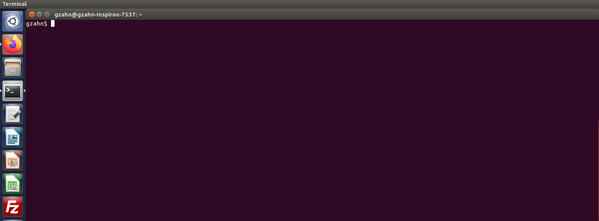

# **Before the workshop: Getting your computer ready**

By following these instructions, you will:

+ install the main programs we will use 

+ install the special R packages that we will be using

+ download the data and code that we will be analyzing


________________

## **Installing the programs we will use in the workshop...**

#### **Install R**
Use the following link to download R for your particular computer system:
https://cran.r-project.org/

---

#### **Install R-Studio**
It's a good idea to install R (above) before installing R-Studio
https://www.rstudio.com/products/rstudio/download/#download

---

#### **Install Git**

Here's the download page:
https://git-scm.com/downloads

If you are on a Windows computer, click the "Windows" button and your download should start automatically.
Run the .exe file to install "Git Bash"

If you are on a Mac, click the "Mac" button and the .dmg file should download automatically. 
This will open in your software center and install.

If you are on Linux, here are the instructions, depending on your version:
https://git-scm.com/download/linux

---

#### **Copy the workshop github repository to your own computer**

Once you have Git installed, open it up (in Windows this will be a shortcut called "Git Bash", 
in Mac or Linux, just open your terminal -that scary command prompt- and Git will be working in the background)
You will see a simple command line interface that looks something like this:

```{r, out.width = "600px",echo=FALSE}

```


Navigate to your computer Desktop using the command-line. 
If you've never done this before, here's a nice introduction:
https://computers.tutsplus.com/tutorials/navigating-the-terminal-a-gentle-introduction--mac-3855

Basically, you can enter commands to move into or out of directories and look at what files are present.

+ the command "ls" lists the files in your current directory
+ the command "pwd" shows you the PATH and name of your current directory
+ the command "cd" stands for 'change directory'

Here's an example output from those first two commands:

```{bash}
ls #this lists files in my current directory
```

```{bash}
pwd #this tells me what my current directory is
```

The "cd" command (change directory) requires a bit more. You have to tell it what directory to change to...

Mac and Linux users can probably just type "cd ~/Desktop" and they will instantly be on their Desktop folder.

Windows file paths are a bit different, but it's probably something like this:

```{bash, eval=FALSE, include=TRUE}
cd C:\Users\YOUR_NAME\Desktop
```

Once you're in your Desktop folder (you can check with "pwd")
copy and paste the following into your terminal and then hit enter:

```{bash, eval=FALSE, include=TRUE}
git clone https://github.com/gzahn/Microbiome_Workshop
```

The standard CTL-C / CTL-V do not work in your command-line terminal. But you can still right-click and select "Paste" as usual. (Alternately, try SHIFT-INS or CTL-SHIFT-V)

---

This will download a folder onto your computer. **It will be found wherever you were when you entered the previous command**....so hopefully your Desktop. 

If you have it, that means you successfully "cloned" the online workshop repository onto your local computer.  

That takes care of the software installation and course materials. Now, you need to install the R packages we will be using for microbiome analyses.

________________


## **Installing R Packages**

**1.  Open RStudio**

This is how we will interact with the R language (which runs in the background).

**2.  Go to File > Open Project**

**3.  Navigate to the "Microbiome_Workshop" folder that you just downloaded (it should be on your Desktop)**

**4.  Double-click on "Microbiome_Workshop.Rproj"**

Now, you will be in what's called an R-Project. This let's RStudio know where all the files for the workshop are stored on your computer.

**5.  Now, go to File > Open File**

**6.  Double-click on the "scripts" directory and then double-click on "install_packages.R"**

You should see a new R script appear in the top-left window of RStudio. The first line of that script should say "# PREPARE YOUR SYSTEM TO INSTALL STUFF ####"

**7.  Highlight everything in that script (CTL-A) and run it by clicking the "Run" button at the top of the window or by using CTL-ENTER**

**8.  Wait patiently for the script to run. It will download and install a suite of bioinformatics tools for you to use, and can take a while to complete.** 

Some of the installations may not work; the script will inform you of which ones did not install properly. See "Troubleshooting installations" below if that is the case.

**9.  When you see "All the packages were loaded properly," you are ready for the workshop!**


____

## Troubleshooting package installations

If running the install_packages.R script gave you some errors at the end, it should be a list of the packages that did not install and load correctly. The following links take you to the installation pages for each of the packages we will be using in the workshop:

[ape](http://ape-package.ird.fr/ape_installation.html){target="_blank"}

[corncob](https://github.com/bryandmartin/corncob){target="_blank"}

[msa](https://bioconductor.org/packages/release/bioc/vignettes/msa/inst/doc/msa.pdf){target="_blank"}

[patchwork](https://patchwork.data-imaginist.com/){target="_blank"}

[phangorn](https://cran.r-project.org/web/packages/phangorn/readme/README.html){target="_blank"}

[tidyverse](https://www.tidyverse.org/packages/){target="_blank"}

[vegan](https://rdrr.io/cran/vegan/){target="_blank"}

[Biostrings](https://bioconductor.org/packages/release/bioc/html/Biostrings.html){target="_blank"}

[ShortRead](https://bioconductor.org/packages/release/bioc/html/ShortRead.html){target="_blank"}

[decontam](https://github.com/benjjneb/decontam){target="_blank"}

[phyloseq](https://joey711.github.io/phyloseq/install.html){target="_blank"}

[dada2](https://benjjneb.github.io/dada2/dada-installation.html){target="_blank"}

[devtools](https://cran.r-project.org/web/packages/devtools/readme/README.html){target="_blank"}

[bioconductor](https://www.bioconductor.org/install/){target="_blank"}
<br> <br>