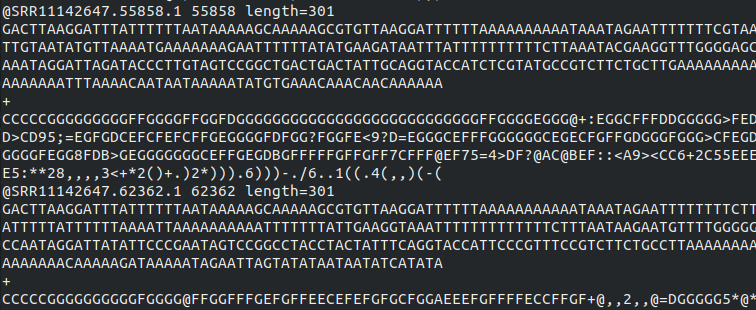
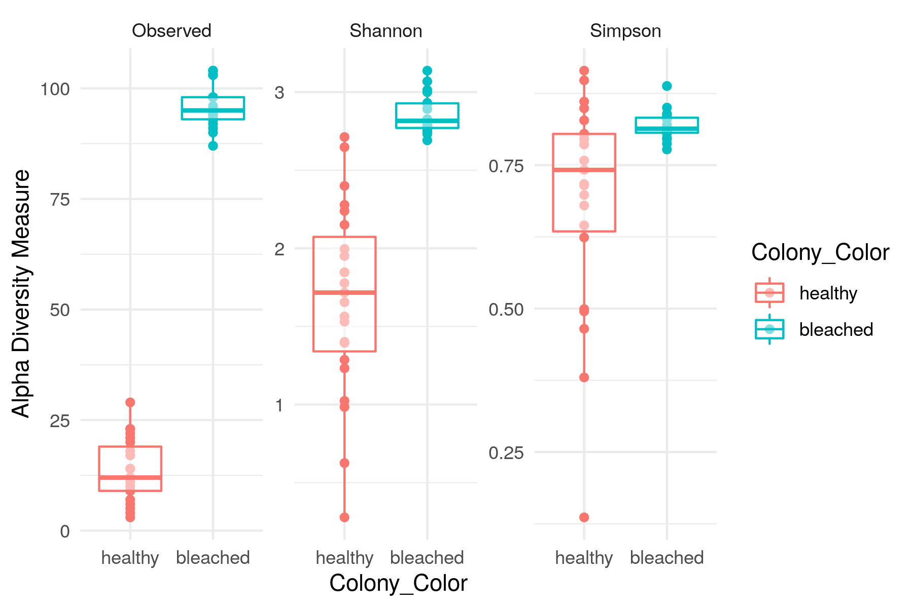

<style>
div.gray { background-color:#aabdaf; border-radius: 5px; padding: 20px;}
</style>
<div class = "gray">


# **Microbiome Analysis Workshop Syllabus**

## Learning objectives:

1.	Understand the role of code in reproducible research

2.	Process meta-amplicon data files into a useful data set

3.	Investigate a meta-amplicon data set using exploratory analyses

4.	Test hypotheses using meta-amplicon data

5.	Generate intuitive figures that illustrate findings

## About the workshop:

This workshop will take place over the course 5 hours (including a lunch break). It is designed to give you the tools needed to analyse high-throughput amplicon DNA data sets. This type of data is common in microbiome research, particularly when one is interested in knowing the relative abundance of bacterial or fungal taxa in a set of samples. The data set we will use is simulated data from coral reefs in the Chagos Archipelago. We have 43 coral samples from which bacterial 16S amplicons have been sequenced, along with 3 PCR negative controls. We will be looking for how bacterial communities change when associated with corals in various stages of bleaching.

We assume no prior coding experience, and we expect that by the end of the day you will be comfortable running R scripts to process and investigate large meta-amplicon data sets. Most of the code that we use in the workshop can be easily reused with minimal customization to match your own data. 

You will learn how to build a reproducible pipeline that turns this raw data...


```{r, out.width = "600px",echo=FALSE}

```

...into figures like this:


```{r, out.width = "600px",echo=FALSE}

```


## Preparation before the workshop:

You will need to prepare your computer prior to the workshop by [following the directions HERE](https://gzahn.github.io/Microbiome_Workshop/Before_the_Workshop.html){target="_blank"}. That web page will guide you through installing all the software that we will be using.

You will need adminstrator access on your computer in order to install software. If it's your own laptop, that's not an issue.


## Schedule:

**Morning session (10am)**

  - Discussion about the data and workflow
  - Process raw data into a usable form using DADA2
  - Learn how to modify the code for your own data
  
**Lunch (12pm)**

**Afternoon session (1-3pm)**

  - Explore data set
  - Hypothesis testing and visualizations using Phyloseq
  - Discussions and next steps


## Surveys:

You will take a brief survey before and after the workshop. This will be anonymous and is designed to help us improve our teaching of the lesson materials.


## The workshop team:

Dr. Geoffrey Zahn 

Trevor Millar

Lacee Bowen

Magnolia Morelli
