<style type="text/css">
.main-container {
  max-width: 1800px;
  margin-left: auto;
  margin-right: auto;
}
</style>


## [HOME](http://gzahn.github.io/) | [ABOUT ME](http://gzahn.github.io/about-me/) | [LAB](http://gzahn.github.io/lab/) | [RESEARCH](http://gzahn.github.io/pubs-and-pres/) | [TEACHING](http://gzahn.github.io/coursemap/)

<div style= "float:right;position: relative;top:10px">
```{r, out.width = "300px",echo=FALSE}
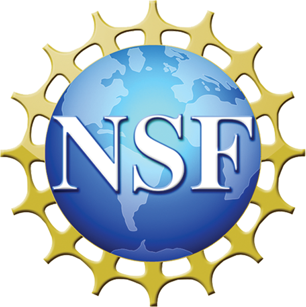
```
</div>

<style>
div.gray { background-color:#aabdaf; border-radius: 5px; padding: 20px;}
</style>
<div class = "gray">


# **Intro to Undergrad Resarch: NSF S-STEM Cohort**{#top}
Utah Valley University

#### This course section is entirely online. All assignments, quizzes, and exams will be turned in and taken on Canvas. My preferred contact method is our group Slack channel.

#### This webpage will host links to all resources and videos, and serves as a roadmap for the semester, listing readings, assignments, etc.

___

#### **Course overview:**


___

## Quick links:

#### [Course Syllabus](https://gzahn.github.io/SSTEM/media/S-STEM_Course_Syllabus_2020.pdf){target="_blank"}


____


## Table of Contents

[Week 1](#Week-1)    |    [Week 5](#Week-5)    |    [Week 9](#Week-9) | [Week 13](#Week-13)

[Week 2](#Week-2)    |    [Week 6](#Week-6)    |    [Week 10](#Week-10) | [Week 14](#Week-14)

[Week 3](#Week-3)    |    [Week 7](#Week-7)    |    [Week 11](#Week-11) | [Week 15](#Week-15)

[Week 4](#Week-4)    |    [Week 8](#Week-8)    |    [Week 12](#Week-12) | [Week 16](#Week-16)


</div>

___

<style>
div.blue { background-color:#a89d82; border-radius: 5px; padding: 20px;}
</style>
<div class = "blue">


<div style= "float:right;position: relative;top:10px">
```{r, out.width = "350px",echo=FALSE}
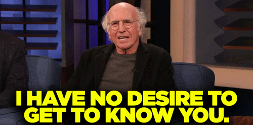
```
</div>


### **Week 1 - Getting to know the program and mentors**{#Week-1}

**Topics:** 

  - Biology research mentors' presentations
  - Getting to know your cohort
  - Logistics and expectations of S-STEM program

**Assignments:**  

  - Watch all mentor introduction videos (Links in the mentor choice form, below)
  - Group discussion and Q/A session online
  - **Turn in your ranked** [**mentor choice form**](https://gzahn.github.io/SSTEM/media/Research_Mentor_Ranking_Sheet.xlsx){target="_blank"} on Canvas
  - Read this short [paper](https://www.ncbi.nlm.nih.gov/pmc/articles/PMC5417415/){target="_blank"} for discussion
  
**Resources**

  - About the S-STEM Program from NSF [slide](https://nsf.gov/attachments/244322/public/S-STEM_Powerpoint1.pptx){target="_blank"}
  - About UVU's Biology S-STEM Program [Excerpts from proposal](https://gzahn.github.io/SSTEM/media/UVU_S-STEM_proposal_excerpts.pdf){target="_blank"}
  - Previous cohort's research proposal [posters](https://gzahn.github.io/SSTEM/media/Fa_2019_Research_Proposal_Posters.pdf){target="_blank"}

[Back to top of page](#top)

___

<div style= "float:right;position: relative;top:10px">
```{r, out.width = "300px",echo=FALSE}
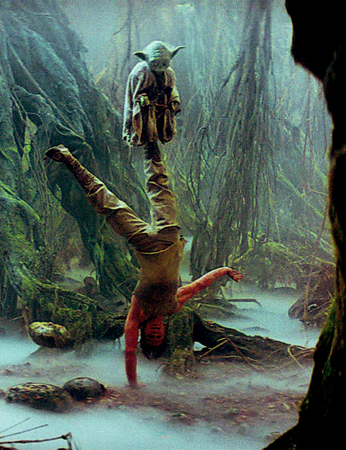
```
</div>


### **Week 2 - What makes for good mentorship**{#Week-2}

**Topics:** 

  - Expectations for advisors and advisees
  - What to look for in an advisor

**Assignments:**  

  - **begin lab rotations (2 weeks per lab, 5 labs)**
  - **it's up to you to make the most of your time with each research mentor**
  - **stay in touch**
  
**Resources**

  - Choosing a lab [document](https://gzahn.github.io/SSTEM/media/Choosing_a_Lab.pdf){target="_blank"}
  - Advice from the NIH [link](https://www.niaid.nih.gov/grants-contracts/choose-mentor){target="_blank"}
  - Advice from the AHA [link](https://www.ahajournals.org/doi/full/10.1161/circulationaha.107.752683){target="_blank"}
  - Advice from grad students [link](https://evbio.uchicago.edu/sites/default/files/client-wysiwyg-uploads/BSD%20Student%20Mentor%20Guide.pdf){target="_blank"}
  - Things your mentor wants you to know [link](https://undergradinthelab.com/node/126){target="_blank"}
  - The importance of [peer-mentoring](https://www.insidehighered.com/news/2019/10/11/study-says-when-it-comes-everyday-mentoring-and-training-sciences-postdocs-are-new){target="_blank"}
  

[Back to top of page](#top)

___
<div style= "float:right;position: relative;top:10px">
```{r, out.width = "350px",echo=FALSE}
knitr::include_graphics("./media/dogsurf.gif")
```
</div>


### **Week 3 - effective time management**{#Week-3}

**Topics:** 

  - Fitting research into academics
  - Work-life balance
  - Mental health
  - Imposter syndrome and other cognitive snags
  
**Assignments:**  

  - Create a time budget that makes room for classes, work, family, research, and staring into the existential void
  - Take care of yourself
  - Keep in touch with your lab rotation activities and email your next mentor
  
**Resources**

  - Advice from "undergrad in the lab" about time management: [link 1 ](https://undergradinthelab.com/node/149) | [link 2](https://undergradinthelab.com/node/156){target="_blank"} | [link 3](https://undergradinthelab.com/node/98){target="_blank"}
  - Undergrad research and [mental health](https://www.lifescied.org/doi/10.1187/cbe.19-11-0217){target="_blank"}
  - Talking about mental health during [grad school](https://www.chronicle.com/article/Why-We-Need-to-Talk-More-About/247002){target="_blank"}
  - Imposter syndrome and [how to fight it](https://www.apa.org/gradpsych/2013/11/fraud){target="_blank"}
  - Dunning-Kruger effect [explained](https://youtu.be/GJz66wm95-M){target="_blank"}
  - Excellent piece on imposter syndrome from [Josh Schimel](https://schimelwritingscience.wordpress.com/2017/11/09/what-the-hell-am-i-doing-here-impostor-syndrome-and-role-models/){target="_blank"}

[Back to top of page](#top)

___
<div style= "float:right;position: relative;top:10px">
```{r, out.width = "350px",echo=FALSE}
knitr::include_graphics("./media/stupidpeople.gif")
```
</div>


### **Week 4 - issues facing underrepresented scholars**{#Week-4}

**Topics:** 

  - Racial, gender, and sexual-orientation biases 
  - Finding and fixing our own biases
  - How to be part of the solution
  - Discussion with [Jazmine Benjamin](https://twitter.com/J_I_Benjamin){target="_blank"} (PhD student at U Alabama, Birmingham)

**Assignments:**  

  - Read **all** of the pieces below in the resources section (video is optional if you're time-crunched, but it's interesting)
  - Group video chat
  - Turn in a reflection piece on your place within these issues
  - Don't forget about your research duties; Ask your mentor useful questions to see if the lab is a good fit.
  
**Resources**

  - Hal's [Story](https://functionalecologists.com/2020/06/30/hal-halvorson-living-openly/){target="_blank"}
  - Female perspectives in [STEM](http://www.fromthelabbench.com/from-the-lab-bench-science-blog/2016/3/8/being-woman){target="_blank"}
  - On "being black in nature" [part 1](https://www.earthisland.org/journal/index.php/articles/entry/being-black-while-in-nature/){target="_blank"} [part 2](https://orionmagazine.org/article/9-rules-for-the-black-birdwatcher/){target="_blank"} [part 3](https://baynature.org/2020/06/04/qa-with-bird-savant-john-robinson-on-black-birders-week/){target="_blank"}
  - Neil DeGrasse Tyson on [being black in science](https://youtu.be/z7ihNLEDiuM){target="_blank"}
  - "STEMing while black" panel discussion [video](https://youtu.be/JoOTePPNK1w){target="_blank"}

[Back to top of page](#top)

___
<div style= "float:right;position: relative;top:10px">
```{r, out.width = "350px",echo=FALSE}
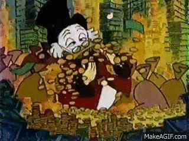
```
</div>


### **Week 5 - applying for funding**{#Week-5}

**Topics:** 
  
  -	Internal funding opportunities at UVU
  - Application processes

**Assignments:**  

  - Check out the resources below
  - Identify a funding source you'd like to try for and make a timeline for applying
  
**Resources**

  - SAC, URSCA, and TEELS [awards](https://www.uvu.edu/cos/student_funding_resources.html){target="_blank"}
  - BOTS [award](https://www.uvu.edu/undergrad-research/student-research/apply-for-funding/bots.html){target="_blank"}
  - CRFS [award](https://www.uvu.edu/crfs/programs/grants.html){target="_blank"}
  - Rough grant deadline [spreadsheet](https://github.com/gzahn/Protocols/raw/master/UVU_Student_Grants_Timeline.ods){target="_blank"}
  - Funded SAC [example](https://gzahn.github.io/SSTEM/media/SAC_Example.pdf)

[Back to top of page](#top)

___
<div style= "float:right;position: relative;top:10px">
```{r, out.width = "350px",echo=FALSE}
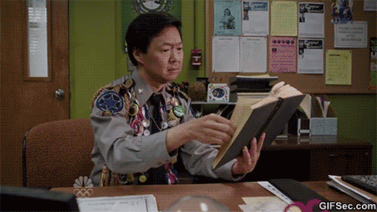
```
</div>


### **Week 6 - how to read a scientific paper**{#Week-6}

**Topics:** 

  - Research reports / reviews / editorials
  - Following the backwards citation trail
  - Critical evaluation
			
**Assignments:**  

  - Find the following paper in full:
  
  Walker, R. S., Gurven, M., Burger, O., & Hamilton, M. J. (2008). The trade-off between number and size of offspring in humans and other primates. Proceedings of the Royal Society B: Biological Sciences, 275(1636), 827–834.

  - Follow a citation trail backwards for at least 5 statements you found interesting in the paper
  - Compile a document with the bibliographies of the previous works and the quoted relevant sections
  
**Resources**

  - Your best friend for finding papers: [google scholar](https://scholar.google.com/){target="_blank"}
  - An illegal way to get papers you don't have access to is [SciHub](https://sci-hub.tw/){target="_blank"} (I would never advocate this behavior though)
  - Types of scholarly [publications](https://undergraduatesciencelibrarian.org/a-very-brief-introduction-to-the-scientific-literature/types-of-scientific-literature/){target="_blank"}
  - Don't forget about [pre-prints](https://www.sciencemag.org/news/2017/09/are-preprints-future-biology-survival-guide-scientists){target="_blank"}

[Back to top of page](#top)

___
<div style= "float:right;position: relative;top:10px">
```{r, out.width = "350px",echo=FALSE}
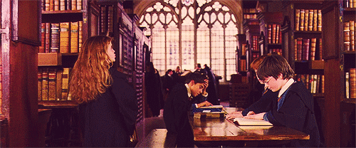
```
</div>


### **Week 7 - how to find gaps in knowledge**{#Week-7}

**Topics:** 

  - Using the library
  - Literature reviews
  - Managing references with Zotero
  
**Assignments:**  

  - Download [Zotero](https://www.zotero.org/){target="_blank"}
  - Use it to collect 20 peer-reviewed articles on a topic of your choice
  - Create a bibliography in the format required by the journal *"Nature"*
  
**Resources**

  - Your UVU [librarian](https://www.uvu.edu/library/guides/biology.html){target="_blank"}
  - Intro to library [video series](https://www.uvu.edu/library/tutorials/biology/m1-intro.html){target="_blank"} (arrow button to keep going is hidden at the top-right)- 
  - Zotero quick-start [guide](https://www.zotero.org/support/quick_start_guide)
  - Be sure to take advantage of the life-saving [add-on features](https://www.zotero.org/support/plugins){target="_blank"}
  
[Back to top of page](#top)

___

<div style= "float:right;position: relative;top:10px">
```{r, out.width = "350px",echo=FALSE}
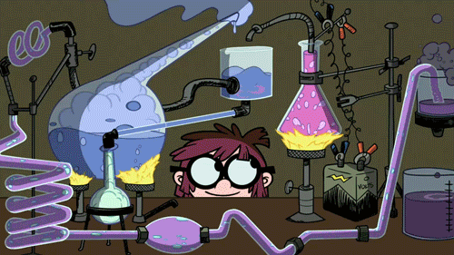
```
</div>


### **Week 8 - experimental design**{#Week-8}

**Topics:** 

  - Principles and types 
  - Qualitative, quantitative, how we "know"
  - Observational vs manipulated
  - Inductive and deductive reasoning
  
**Assignments:**  

  - Bring your research ideas to group discussions
  - Go through the resources below well enough to follow a discussion as we design experiments together

**Resources**

  - Short primer on [designs](https://www.scribbr.com/methodology/experimental-design/){target="_blank"}
  - Much longer, but much more thorough, intro to [design](https://conjointly.com/kb/navigating-the-kb/){target="_blank"}
  - Inductive vs deductive [reasoning](https://www.livescience.com/21569-deduction-vs-induction.html){target="_blank"}
  
  
[Back to top of page](#top)

___
<div style= "float:right;position: relative;top:10px">
```{r, out.width = "350px",echo=FALSE}
knitr::include_graphics("./media/office_space.gif")
```
</div>


### **Week 9 - realities of research**{#Week-9}

**Topics:** 

  - Keeping a lab notebook
  - Reproducibility
  -	Adapting to inevitable failure
	
**Assignments:**  

  - Read this [short paper](https://jcs.biologists.org/content/121/11/1771){target="_blank"}

**Resources**

  - Lab notebook [rules](https://undergradinthelab.com/node/200){target="_blank"}
  - What is [reproducible research?](https://stm.sciencemag.org/content/8/341/341ps12.full){target="_blank"}
  - The why and how of making science [reproducible](https://ropensci.github.io/reproducibility-guide/sections/introduction/){target="_blank"}
  - Failure is the most common part of science [article](https://www.natureindex.com/news-blog/how-to-deal-with-failure-rejection-academic-research-say-senior-scientists){target="_blank"}
  - Paper on the value of [failure in science](https://www.frontiersin.org/articles/10.3389/fnins.2019.01121/full){target="_blank"}
  - Here's a perfect [example](http://htmlpreview.github.io/?https://raw.githubusercontent.com/cbwall/Coral-larvae-temp-and-nutrients/master/Kitchen-et-al.-larvae-temp-nutr.html){target="_blank"} of making research fully-open and reproducible (check out the "code" buttons, showing **exactly** how each analysis was done!)
  - Shameless plug for another class I teach: [Data Analysis for Biologists](https://gzahn.github.io/data-course/)

[Back to top of page](#top)

___
<div style= "float:right;position: relative;top:10px">
```{r, out.width = "350px",echo=FALSE}
knitr::include_graphics("./media/bookburning.gif")
```
</div>


### **Week 10 - the publication process**{#Week-10}

**Topics:** 

  - Writing science
  - Selecting an appropriate journal
  - Peer review process
	
**Assignments:**  

  - Find 3 journals that you would like to eventually submit a manuscript to
  - Find their "author information" pages
  
**Resources**

  - The peer-review [process](https://authorservices.wiley.com/Reviewers/journal-reviewers/what-is-peer-review/the-peer-review-process.html){target="_blank"}
  - Article on [writing science](https://esajournals.onlinelibrary.wiley.com/doi/full/10.1002/bes2.1258){target="_blank"}
  - What you wish you'd have know before submitting your [first article](https://schimelwritingscience.wordpress.com/2016/06/08/what-do-you-wish-you-had-known-before-submitting-your-first-article/){target="_blank"}
  - Why journals are so slow [processing manuscript submissions](https://schimelwritingscience.wordpress.com/2014/12/29/why-journals-sometimes-are-slow-processing-papers-look-in-the-mirror/){target="_blank"}
 
 
[Back to top of page](#top)

___
<div style= "float:right;position: relative;top:10px">
```{r, out.width = "350px",echo=FALSE}
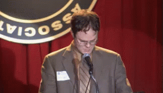
```
</div>


### **Week 11 - giving effective presentations**{#Week-11}

**Topics:** 

  - Types of presentations
  - Poster design
  - Telling a storylogistics and expectations of S-STEM program
  - Logistics tips and tricks

**Assignments:**  

  - Go through the resources below
  - Check out the previous cohort [posters](https://gzahn.github.io/SSTEM/media/Fa_2019_Research_Proposal_Posters.pdf){target="_blank"}
  - Find the worst scientific poster of all time - show it to us in our group chat
  
**Resources**

  - Video on [poster design](https://youtu.be/1RwJbhkCA58){target="_blank"} and poster sessions
  - How to do a bad job with a [poster presentation](https://gzahn.github.io/SSTEM/media/forgettable_poster.docx){target="_blank"}
  - 10 simple rules for [good posters](https://journals.plos.org/ploscompbiol/article?id=10.1371/journal.pcbi.0030102){target="_blank"}
  - More good poster design [info](https://undergradinthelab.com/node/48){target="_blank"}
  
  
[Back to top of page](#top)

___
<div style= "float:right;position: relative;top:10px">
```{r, out.width = "350px",echo=FALSE}
knitr::include_graphics("./media/conference.gif")
```
</div>


### **Week 12 - getting the most out of a conference**{#Week-12}

**Topics:** 

  - Finding a conference
  - The art of "abstract projection"
  - What goes on at a Typical conference
  - How to network
			
**Assignments:**  

  - **Finish lab rotations / select research mentor**
  - Sign mentorship agreement documents
  - Discuss relevant conferences with your mentor
  
**Resources**

  - [UCUR](http://ucur.org/){target="_blank"}
  - [NCUR](https://www.cur.org/what/events/students/ncur/){target="_blank"}
  - Undergrad at a conference [trip report](https://timescavengers.blog/2018/05/14/attending-professional-conferences-as-an-undergraduate/){target="_blank"}
  - Conference [tips](https://webcache.googleusercontent.com/search?q=cache:p9xZVRLtMo8J:https://undergrad.research.ucsb.edu/2016/01/undergraduate-researchers-guide-conferences-packing/+&cd=12&hl=en&ct=clnk&gl=us&client=ubuntu){target="_blank"}


[Back to top of page](#top)

___
<div style= "float:right;position: relative;top:10px">
```{r, out.width = "350px",echo=FALSE}
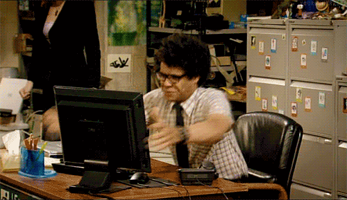
```
</div>


### **Week 13 - how to build and prepare an effective CV**{#Week-13}

**Topics:** 

  - Effective use of social media
  - Web presence
  - What goes on a CV
  
**Assignments:**  

  - Look through the resources to see undergrad CV examples
  - Track down the CVs of 3 scientists who's work interests you. What do they have in common? What's unique?
  - Upload and share your CV on Slack
  - Peer-review of each others' CVs
  - **work with mentor to select research topic**
  
**Resources**

  - Thoughts from [*Nature*](https://www.nature.com/articles/s41556-018-0253-6){target="_blank"}
  - Thoughts about [#Sciencetwitter](https://astrobites.org/2020/01/17/you-should-get-twitter-for-science/){target="_blank"}
  - Example undergrad [CV](https://www.american.edu/careercenter/upload/curriculum-vitae-samples.pdf){target="_blank"}
  - Make a free website [here](https://www.wix.com/){target="_blank"} or [here](https://pages.github.com/){target="_blank"}
 
[Back to top of page](#top)

___
<div style= "float:right;position: relative;top:10px">
```{r, out.width = "350px",echo=FALSE}
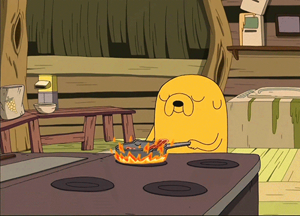
```
</div>


### **Week 14 - Thanksgiving Break**{#Week-14}

**Topics:** 

  - Stuffing vs mashed potatoes
  - How to bring up science with your crazy "5G-towers-are-causing-coronavirus" aunt
  - How to avoid your racist uncle
  
**Assignments:**  

  - **annotated literature review of research topic (due at end of break)**
  
**Resources**

  - Recipe [website](https://www.seriouseats.com/thanksgiving){target="_blank"}

[Back to top of page](#top)

___
<div style= "float:right;position: relative;top:10px">
```{r, out.width = "350px",echo=FALSE}
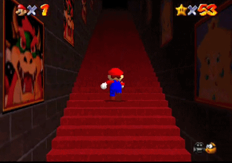
```
</div>


### **Week 15 - next steps**{#Week-15}

**Topics:** 

  - Getting the most from the S-STEM program
  - Setting goals
  - Building a support network of collaborators and allies

**Assignments:**  

  - **develop research plans with your mentor and work on your poster**
  
<br/><br/><br/><br/><br/><br/>

[Back to top of page](#top)

___
<div style= "float:right;position: relative;top:10px">
```{r, out.width = "350px",echo=FALSE}
knitr::include_graphics("./media/fin.gif")
```
</div>


### **Week 16 - presenting your research plan**{#Week-16}
  
**Assignments:**  

  - **Poster session ~~in SB atrium~~ online**
  

<br/><br/><br/>

[Back to top of page](#top)

___

<br/><br/><br/><br/><br/><br/><br/><br/><br/>
</div>