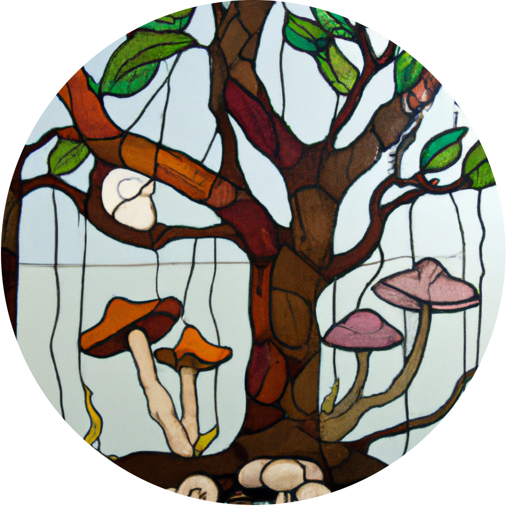

Aside
================================================================================

Contact Info {#contact}
--------------------------------------------------------------------------------

- <i class="fa fa-envelope"></i> gzahn@uvu.edu
- <i class="fa fa-github"></i> [github.com/gzahn](https://github.com/gzahn)
- <i class="fa fa-home"></i> https://gzahn.github.io

Skills {#skills}
--------------------------------------------------------------------------------

- #### `r icons::fontawesome$solid$laptop` Computational:

  - **R**
  - **Bash**
  - **SQL**
  - **Python**
  - **Unix admin**
  - **High-performance computing**
  - **Metagenomics / Metabarcoding**

- #### `r icons::fontawesome$solid$flask` Wet-lab:

  - **DNA** (extraction/prep/seq/*etc.*)
  - **Culturing** (Fungi and 'Protists')
  - **Microscopy** (BF/DIC/Fluor/SEM)
  - **Soil analysis**
  - **Microcosms**

- #### `r icons::fontawesome$solid$book` Academic:

  - **Course and program design**
  - **Active learning**
  - **Course-based undergraduate research**
  - **Mentoring**
  - **Lab management**
  - **Grants management**

Main
================================================================================

Geoff Zahn, PhD {#title}
--------------------------------------------------------------------------------

**Translational microbial ecology | Microbiomes and symbiosis**

Professional Appointments {data-icon=home}
--------------------------------------------------------------------------------

### Associate Professor

Utah Valley University

Orem, UT

Current - 2023

### Assistant Professor

Utah Valley University

Orem, UT

2023 - 2017

### Private Consulting

Forensic Bioinformatics / Data Science + App development

Various

Current - 2020

### Director of Environmental Biology

GeoDataCrawler Research Institute

Athens, GA

2021 - 2018

### Postdoctoral Associate

University of Hawai`i at Manoa

Honolulu, HI

2017 - 2015

 

Education {data-icon=graduation-cap data-concise=true}
--------------------------------------------------------------------------------

### University of Arkansas

Ph.D. in Biology

Fayetteville, AR

2015

### Missouri State University

B.S. in Ecology, Evolution, and Systematics

Springfield, MO

2010

 

Selected Funding and Awards {data-icon=coins}
--------------------------------------------------------------------------------

**Total funding: $1,193,494**

### PI: Faculty-Mentored Experiences for Improving Undergraduate Biology Student Outcomes

$972,287

NSF (DUE – 1833880)

2023 - 2018

### College of Science Dean's Award of Excellence for Scholarship

$5,500

UVU

2020, 2022

### Presidential Fellowship for Faculty Scholarship

$8,000

UVU

2019

### PI: SEED: Engaging undergraduates in advanced research

$30,000

UVU

2018 - 2017

### PI: New methods to survey fungal endophytes in endangered cacti

$2,550

Capitol Reef National Park

2018

### Co-PI: Assessing Undergraduate Research Teams at an Open Enrollment Institution

$29,327

UVU

2018

### Translational Mycology Postdoctoral Award

Plant conservation from a microbial perspective

Mycological Society of America 

2016

### Co-PI: Restoration of endangered plants by manipulating foliar fungal symbionts

$40,500

Oahu Army Natural Resources Program

2015

### Japan Society for the Promotion of Science Travel Award

$750

Washington, D.C.

2014

### PI: The Importance of microbial interactions to soil carbon cycling on a warming planet

$22,570

NSF (OISE-1308856) / JSPS (SP01363)

2013

### Student Mentee Funding Awards

138 undergrad mentees funded from a variety of internal and external programs

N/A

Current - 2017

 

Teaching and Mentoring {data-icon=chalkboard-teacher}
--------------------------------------------------------------------------------

### Designed a new [Bioinformatics Degree Program](https://www.uvu.edu/catalog/current/departments/biology/bioinformatics-bs/)

Experienced with univ. curriculum processes and accreditation

N/A

N/A

### [R for Biologists](https://gzahn.github.io/data-course/)

Intro to R language and data science, including dataviz & modeling (designed and taught)

N/A

N/A

### [Bioinformatics Data Skills](https://gzahn.github.io/binf-data-skills/)

Unix/Bash and HPC use for bioinformatics (designed and taught)

N/A

N/A

### [Mycology](https://gzahn.github.io/mycology/)

Research-based mycology (designed and taught)

N/A

N/A

### [Microbiome Boot Camp](https://gzahn.github.io/microbiome_bootcamp/)

Advanced R, numerical ecology, community ecology, scientific writing (designed and taught)

N/A

N/A

### Bioinformatics Capstone

Project-based (designed and taught)

N/A

N/A

### [Organismal Biology](https://gzahn.github.io/BIOL1620/)

Intro biology II (taught)

N/A

N/A

### Developed online lab for non-major's biology

University of Arkansas - asynchronous pedagogy practices

N/A

N/A

 

Publications {data-icon=book}
--------------------------------------------------------------------------------

###  The core mangrove microbiome reveals shared taxa potentially involved in nutrient cycling and promoting host survival. 

Wainwright BJ, Millar T, Bowen L, Semon L, Hickman KJE, Lee JN, Yeo ZY, & Zahn G. *Environmental Microbiome* 10.1186/s40793-023-00499-5. 

N/A

2023

### Inclusion of database outgroups reduces false positives in fungal metabarcoding taxonomic assignments.  

Rawson C, & Zahn G. *Mycologia* 10.1080/00275514.2023.2206931 

N/A

2023

### Long-term soil fungal community recovery after fire is impacted by climate change.  

McGee S, Tidwell A, Riggs E, Veltkamp H, & Zahn G. *Western North American Naturalist*  

N/A

2022

### Marker Genes (16S and ITS) Protocol for Plant Microbiome Analyses.  
Zahn G. *BIO-PROTOCOL* 10.21769/BioProtoc.4395 

N/A

2022

### Global patterns in endemicity and vulnerability of soil fungi.  

Tedersoo L, Mikryukov V, Zizka A, Bahram M, Hagh-Doust N, Anslan S, Prylutskyi O, Delgado-Baquerizo M, Maestre FT, … Abarenkov K. *Global Change Biology* 10.1111/gcb.16398 

N/A

2022

### The Global Soil Mycobiome consortium dataset for boosting fungal diversity research.  

Tedersoo L, Mikryukov V, Anslan S, Bahram M, Khalid AN, Corrales A, Agan A, Vasco-Palacios A-M, Saitta A, … Abarenkov K. *Fungal Diversity* 10.1007/s13225-021-00493-7 

N/A

2021

### Examination of host-taxon, environment, and distance effects on leaf fungal endophytes in the dominant woody genus, Metrosideros, on O’ahu.  

Sur GL, Zahn G, & Stacy EA. *Fungal Ecology* 10.1016/j.funeco.2021.101093 

N/A

2021

### Biogeographic structure of fungal communities in seagrass Halophilia ovalis across the Malay Peninsula.  

Quek ZBR, Zahn G, Lee NLY, Ooi JLS, Lee JN, Huang D, & Wainwright BJ. *Environmental Microbiology Reports* 10.1111/1758-2229.13003 

N/A

2021

### Restoration of the mycobiome of the endangered Hawaiian mint Phyllostegia kaalaensis increases its resistance to a common powdery mildew.  

Egan CP, Koko JH, Muir CD, Zahn G, Swift SOI, Amend AS, & Hynson NA. *Fungal Ecology* 10.1016/j.funeco.2021.101070 

N/A

2021

### Hawaiian Fungal Amplicon Sequence Variants Reveal Otherwise Hidden Biogeography.  

Tipton L, Zahn GL, Darcy JL, Amend AS, & Hynson NA. *Microbial Ecology* 10.1007/s00248-021-01730-x 

N/A

2021

### Essential oil, insect, and microbe relationships in Juniperus osteosperma (Cupressaceae) trees killed by wildfire.  

Wilson T, Poulson A, Packer C, Carlson R, Davis R, Dey M, Owen N, Smalley S, Dodge R, … Stevens M. *Phytologia*  

N/A

2021

### Host age is not a consistent predictor of microbial diversity in the coral Porites lutea.  

Wainwright BJ, Zahn GL, Afiq-Rosli L, Tanzil JTI, & Huang D. *Scientific Reports* 10.1038/s41598-020-71117-4 

N/A

2020

### Fungal communities living within leaves of native Hawaiian dicots are structured by landscape-scale variables as well as by host plants.  

Darcy JL, Swift SOI, Cobian GM, Zahn GL, Perry BA, & Amend AS. *Molecular Ecology* 10.1111/mec.15544 

N/A

2020

### Fungal aerobiota are not affected by time nor environment over a 13-y time series at the Mauna Loa Observatory.  

Zahn G, Tipton L, Datlof E, Kivlin SN, Sheridan P, Amend AS, & Hynson NA. *Proceedings of the National Academy of Sciences* 10.1073/pnas.1907414116 

N/A

2019

### Foliar fungi alter reproductive timing and allocation in Arabidopsis under normal and water-stressed conditions.  

Zahn G, & Amend AS. *Fungal Ecology* 10.1016/j.funeco.2019.04.002 

N/A

2019

### Characterization of fungal biodiversity and communities associated with the reef macroalga Sargassum ilicifolium reveals fungal community differentiation according to geographic locality and algal structure.  

Wainwright BJ, Bauman AG, Zahn GL, Todd PA, & Huang D. *Marine Biodiversity* 10.1007/s12526-019-00992-6 

N/A

2019

### Characterisation of coral-associated bacterial communities in an urbanised marine environment shows strong divergence over small geographic scales.  

Wainwright BJ, Afiq-Rosli L, Zahn GL, & Huang D. *Coral Reefs* 10.1007/s00338-019-01837-1 

N/A

2019

### Seagrass-associated fungal communities show distance decay of similarity that has implications for seagrass management and restoration.  

Wainwright BJ, Zahn GL, Zushi J, Lee NLY, Ooi JLS, Lee JN, & Huang D. *Ecology and Evolution* 10.1002/ece3.5631 

N/A

2019

### Seagrass-associated fungal communities follow Wallace’s line, but host genotype does not structure fungal community.  

Wainwright BJ, Zahn GL, Arlyza IS, & Amend AS. *Journal of Biogeography* 10.1111/jbi.13168 

N/A

2018

### Foliar microbiome transplants confer disease resistance in a critically-endangered plant.  

Zahn G, & Amend AS. *PeerJ* 10.7717/peerj.4020 

N/A

2017

### Uncovering unseen fungal diversity from plant DNA banks.  

Datlof EM, Amend AS, Earl K, Hayward J, Morden CW, Wade R, Zahn G, & Hynson NA. *PeerJ* 10.7717/peerj.3730 

N/A

2017

### Fungi associated with mesophotic macroalgae from the ’Au’au Channel, west Maui are differentiated by host and overlap terrestrial communities.  

Wainwright BJ, Zahn GL, Spalding HL, Sherwood AR, Smith CM, & Amend AS. *PeerJ* 10.7717/peerj.3532 

N/A

2017

### The effects of amoebal bacterivory on carbon and nitrogen dynamics depend on temperature and soil structure interactions.  

Zahn G, Wagai R, & Yonemura S. *Soil Biology and Biochemistry*

N/A

2016

### Ecological distribution of protosteloid amoebae in New Zealand.  

Zahn G, Stephenson SL, & Spiegel FW. *PeerJ*  

N/A

2014

### First records of Protosteloid Amoebae (Eumycetozoa) from the Democratic Republic of the Congo.  

De Haan M, Cocquyt C, Tice A, Zahn G, & Spiegel FW. *Plant Ecology and Evolution*  

N/A

2014

### Pil1, an eisosome organizer, plays an important role in the recruitment of synaptojanins and amphiphysins to facilitate receptor-mediated endocytosis in yeast.  

Murphy ER, Boxberger J, Colvin R, Lee SJ, Zahn G, Loor F, & Kim K. *European Journal of Cell Biology*  

N/A

2011

 

Selected Invited Presentations {data-icon=microphone}
--------------------------------------------------------------------------------

### Translating mentored undergraduate research into student retention and success

National Science Foundation S-STEM Symposium

Washington, D.C.

2023

### Less content, more context: Research as pedagogy in undergraduate mycology courses

Mycological Society of America

FL, USA

2022

### Who’s there and who cares: the how and why of fungal community structure

Brigham Young University 

UT, USA

2021

### The causes and consequences of fungal community structure
	
University of Arkansas/Missouri State University
	
AR/MO, USA
	
2018

### Picky Eaters: Prey choice by soil protists is altered by temperature and soil structure

Cornell University, 

NY, USA

2016

### Effects of belowground trophic complexity on carbon cycling under changing climatic and edaphic conditions

Joint Genome Institute

CA, USA

2015

### The functional and distributional ecology of mycetozoans under changing edaphic and climatic dynamics 
Climate Impact Research Center

Abisko, Sweden

2015

### Picky eaters: climate alters amoeba prey choice and the microbial loop 

NIAES

Tsukuba, Japan

2014

### The Tropical Mycetozoans 

Organization for Tropical Studies

Las Cruces, Costa Rica 

2012

 

Selected Contributed Presentations {data-icon=chart-line}
--------------------------------------------------------------------------------

### Aquatic Plant-Associated Fungi Along an Urbanization Gradient

Mycological Society of America

AZ, USA

2023

### Metagenomic Tools for Mycobiome Analyses in Model vs. Non-Model Systems

Mycological Society of America

AZ, USA

2023

### Improving the Accuracy of Meta-Amplicon Taxonomic Assignments Through the Inclusion of Outgroups in Fungal Databases

Mycological Society of America

AZ, USA

2023

### Inspecting the microbiome and metabolomic compartments of Mediterranean sponge holobionts through an integrated ‘omics approach
	
International Sponge Symposium

Leiden, Netherlands

2022

### Fungal endophytes and pathogens in endangered hawaiian endemics:  Plant conservation from a microbial perspective

Mycological Society of America, 

CA, USA

2016

### The interactive effects of protozoan predation pressure and environmental factors on carbon and nitrogen cycling in soils under warming conditions 

International Society for Microbial Ecology

Seoul, South Korea

2014

### Using metagenomics and metatranscriptomics to uncover mechanisms of soil communities’ effects on carbon cycling under warming conditions 

DOE Joint Genome Institute

CA, USA

2014

### The Role of Soil Amoebae in Nutrient Cycling on a Warming Planet 

Graduate University for Advanced Studies

Sokendai, Japan

2013

### The Protosteloid Amoebae of New Zealand

Mycological Society of America

AK, USA

2011

 

Code Contributions {data-icon=code}
--------------------------------------------------------------------------------

### Microbiome protocol for ITS/16S exploration

https://github.com/gzahn/Microbiome_Workshop

N/A

N/A

### R for exploratory data analysis course

https://gzahn.github.io/data-course/

N/A

N/A

### Collection of custom bioinformatics tools
		
https://github.com/gzahn/tools

N/A

N/A

### Tool for creating QIIME-compatible taxonomic databases from any subset of NCBI data.
		
https://doi.org/10.5281/zenodo.3688556

N/A

N/A

### Bioinformatics Data Skills course
		
https://gzahn.github.io/binf-data-skills/

N/A

N/A

 

Synergistic activities {data-icon=chess}
--------------------------------------------------------------------------------

### `r icons::fontawesome(style = 'solid',name = 'people-carry')` Mentorship

N/A

N/A

N/A

  - Graduate committee member (4 MS, 3 PhD)
  - Undergrad research mentor (38 students)
  - [Lab alumni](https://gzahn.github.io/lab)

### `r icons::fontawesome(style='solid',name='apple-alt')` Societies & Service

N/A

N/A

N/A

  - Editor of *Mycologia*
  - Education Committee - Mycological Society of America
  - IUCN Species Survival Group - Slime Moulds Specialist
  - Member: ISME, MSA, Intnl. Soc. for Fungal Conserv., Japan SPS Alumni Assoc.
  - NSF GK-12 Teaching Fellow (2011-2012)
  - Faculty senator - UVU (2017-2020)
  - Program and course development (Univ. of Arkansas, Utah Valley Univ.)
  - Faculty search committees (Chair 1x, Member 6x)
  - Council for Undergraduate Research (member)
  
  
### `r icons::fontawesome(style='solid',name='handshake')` Collaborations (current and past)

N/A

N/A

N/A

  - National Univ. of Singapore
  - Universiti Malaysia Terengganu
  - Universiti Malaya, Kuala Lumpur
  - Univ. of Hawaii at Manoa
  - Oxford Univ.
  - Univ. of Arkansas
  - Univ. of Nevada, Las Vegas
  - Okanagan College
  - University of Colorado, Anschutz
  - Stazione Anton Dorhn
  - Washington State Univ.
  - SUNY Syracuse
  - Univ. of Colorado, Denver
  - Pacific NW National Lab
  - SoftCell, Inc.
  - Young Living, Inc.

  
### `r icons::fontawesome(style='solid',name='handshake')` Outreach

N/A

N/A

N/A

  - Stockman Grass Farmer Magazine [Article](https://bit.ly/2KsYlBB)
  - ScienceNews [Article](https://www.sciencenews.org/article/plant-microbes-crops-food-endangered-species?tgt=nr) featuring work
  - [Article](https://www.hawaiinewsnow.com/story/35862634/researchers-find-scores-of-potentially-new-species-of-fungi-in-deep-waters-off-maui/) on my marine mycology discoveries
  - Annual science fair judge
  - 6th-grade teacher and inquiry-based lesson planning (2011-2012)
  
### `r icons::fontawesome(style='solid',name='check-double')` Peer review

N/A

N/A

N/A

  - NSF panel reviewer & *ad hoc* reviewer
  - NSF GRFP
  - BARD US-Israel Agr. Dev. Fund
  - Journals:
	-	Soil Biol. and Biochem. (Distinguished), PeerJ, Pedobiologia (Distinguished),	Oikos, ISME Journal, Fungal Ecology (Distinguished), Molecular ecology, Ecology and Evolution, American Fern Journal, New, Phytologist, Phytobiomes

 

