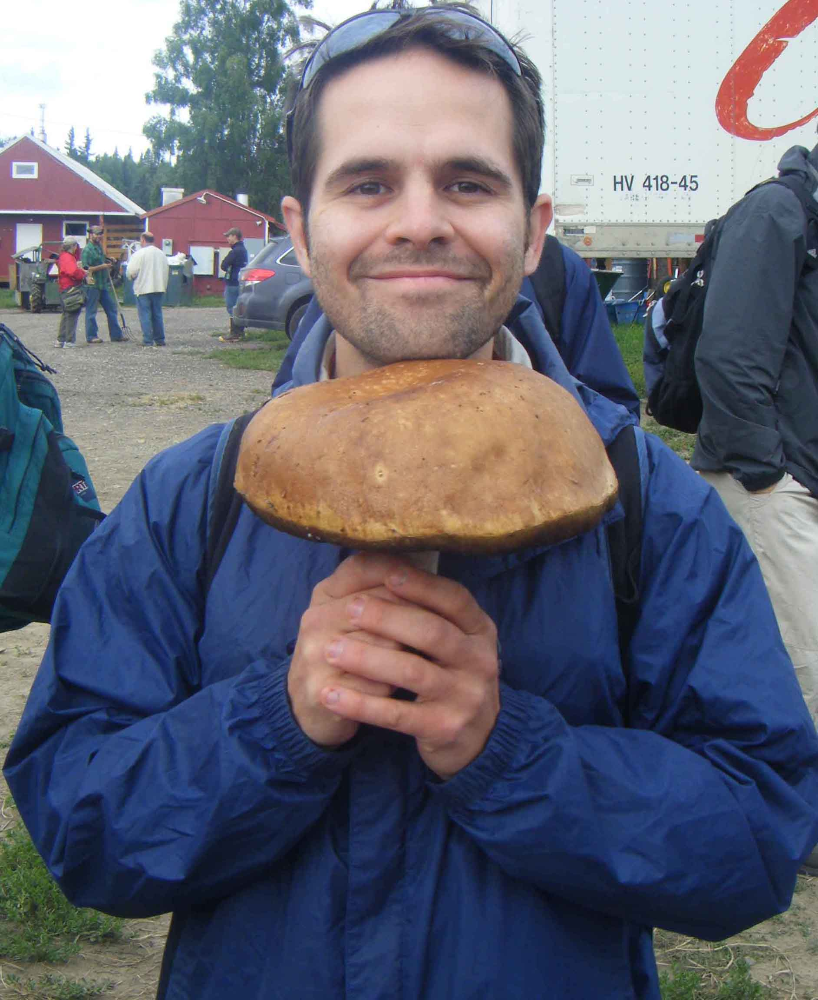
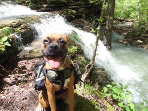

<style type="text/css">
.main-container {
  max-width: 1800px;
  margin-left: auto;
  margin-right: auto;
}
</style>

## [HOME](http://gzahn.github.io/) | [ABOUT ME](http://gzahn.github.io/about-me/) | [LAB](http://gzahn.github.io/lab/) | [RESEARCH](http://gzahn.github.io/pubs-and-pres/) | [BLOG](http://gzahn.github.io/blog-archive/) | [DATA COURSE](http://gzahn.github.io/data-course/)

<style>
div.gray { background-color:#aabdaf; border-radius: 5px; padding: 20px;}
</style>
<div class = "gray">
# **About me / [CV](https://github.com/gzahn/Profile/blob/master/CV_TT.pdf)**
### **Browse this site for information about our research or [follow this link](https://github.com/gzahn/Profile/blob/master/CV_TT.pdf) for my (fairly) current C.V.**

### I am an Assistant Professor of Mycology at Utah Valley University. My students and I are investigating extremophilic fungi, the effect of fire severity on forest soil microbial community recovery, and the microbes associated with coral ecosystems under climate change. I am broadly interested in microbial ecology and biogeochemistry, but am particularly drawn to applied questions and manipulative experimentation.


<div style= "float:right;position: relative;top:10px">
```{r, out.width = "400px",echo=FALSE}

```
</div>

### I received my PhD in Biology at the University of Arkansas, where my research focused on the distributional and functional ecology of slime molds.  I received my B.S. in Biology at Missouri State University where I became interested in conservation.  

### When I am not playing with my microbes I enjoy hiking, brewing, kayaking for days at  a time, and cooking. Also, I have the best dog ever, Dr. Indiana Jones.
</div>

<div style= "float:left;position: relative;top:-10px;left:20px">
```{r, out.width = "300px",echo=FALSE}

```
</div>

<style>
div.blue { background-color:#a89d82; border-radius: 5px; padding: 20px;}
</style>
<div class = "blue">

<br><br><br><br><br><br><br><br><br>
<br><br><br>
___

## Contact Info:

Geoffrey Zahn<br>
Biology Department - Utah Valley University<br>
800 W University Parkway - SB243c<br>
Orem, UT 84058<br>
zahn.geoff@gmail.com


</div>


