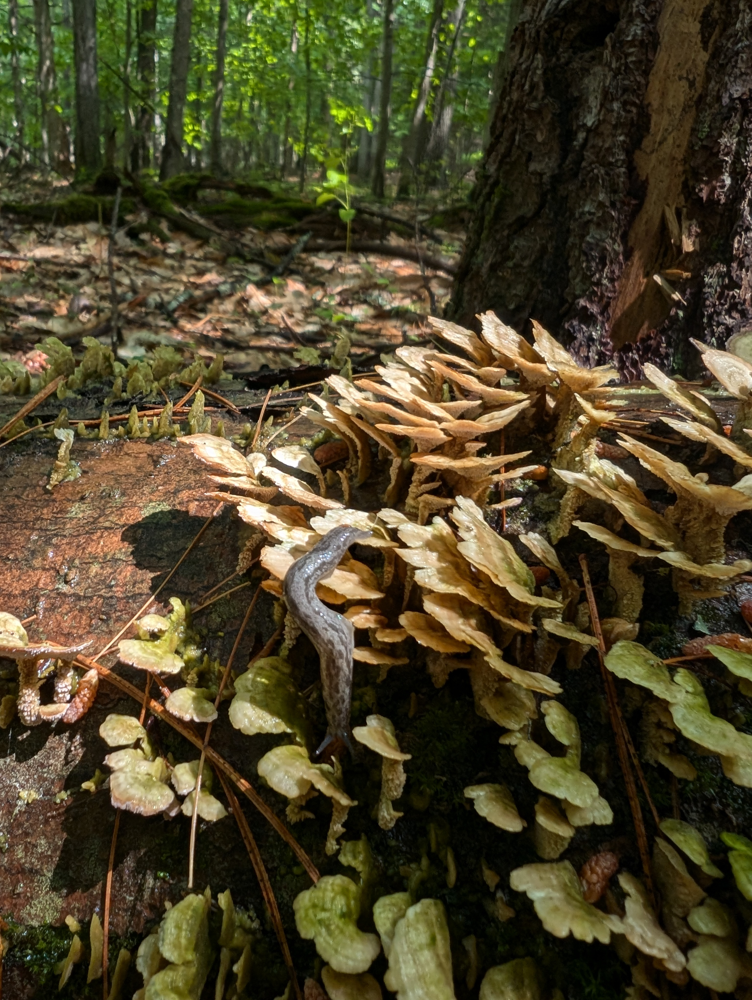

<style type="text/css">
.main-container {
  max-width: 1800px;
  margin-left: auto;
  margin-right: auto;
}
</style>


## [HOME](http://gzahn.github.io/) | [ABOUT ME](http://gzahn.github.io/about-me/) | [LAB](http://gzahn.github.io/lab/) | [RESEARCH](http://gzahn.github.io/pubs-and-pres/) | [TEACHING](http://gzahn.github.io/coursemap/) | [CV](https://gzahn.github.io/about-me/CV.pdf)

<style>
div.gray { background-color:#aabdaf; border-radius: 5px; padding: 20px;}
</style>
<div class = "gray">
# **About me**

# **[CV](https://gzahn.github.io/about-me/CV.pdf)**

___

#### **I offer a wide range of data analytics and microbial bioinformatics consultancy services. If you are interested please get in touch.**

___

### I am an Associate Professor of Bioinformatics/Mycology at Utah Valley University and Visiting Professor of Environmental Studies at Dartmouth College. My students and I investigate how microbiome communities influence host organisms' fitness and recovery from disturbance. We also study the factors that shape microbiome community formation. I am broadly interested in microbial ecology and biogeochemistry, but am particularly drawn to applied questions and manipulative experimentation.


<div style= "float:right;position: relative;top:10px">
```{r, out.width = "400px",echo=FALSE}

```
</div>

### I did my postdoctoral work at the University of Hawaiʻi at Mānoa where I investigated fungal ecology and used microbes to advance plant conservation efforts. I received my PhD in Biology at the University of Arkansas, where my research focused on the distributional and functional ecology of slime molds.  I received my B.S. in Biology at Missouri State University where I became interested in conservation.  

### When I am not playing with my microbes I enjoy hiking, brewing, kayaking for days at  a time, and cooking.

</div>

<div style= "float:left;position: relative;top:10px;left:20px">
```{r, out.width = "300px",echo=FALSE}
knitr::include_graphics(c("../wp-content/uploads/P4280105-300x225.jpg","../media/singapore_mangrove.jpg","../media/geoff_mangrove.jpg"))
```


</div>


<style>
div.blue { background-color:#a89d82; border-radius: 5px; padding: 20px;}
</style>
<div class = "blue">

<br><br><br><br><br><br><br><br><br>
<br><br><br>


```{r, echo=FALSE,out.width = "300px"}
knitr::include_graphics(c("../media/thlayli.jpg","../media/PXL_20230909_205730304.jpg","../media/mushrooms1.jpg"))
```


___


</div>


