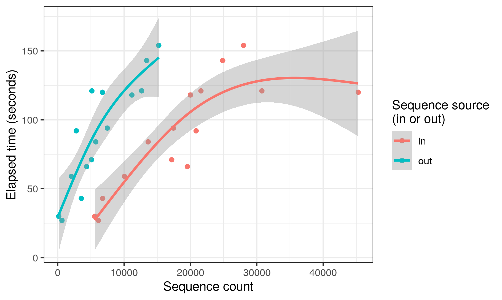

    
# **Bioinformatics Data Skills**
    
## Assignment 5

___

### Here, we're going to work with the output from our Case Study using some familiar tools along with 'awk'

You created a summary file during the ITSxpress Case Study called "ITSxpress_summary_info.txt" that contains filenames, the number of sequences in, the number of sequences out, and the elapsed time.

___

```{r, out.width = "350px",echo=FALSE}

```

Here's a graphical look at performance speed on my laptop vs the number of DNA reads that went into and came out of ITSxpress.


**I want you to figure out:**
  
  **1. The proportion of passing sequences for each file**
  
  **2. The list of filenames that had fewer than 20% of their reads pass ITSxpress**
  
  **3. The total number of sequences in those files from #2**

The best command-line tool for this is 'awk' which you can read about in BDS Ch 7. Typically, I (and most other?) bioinformaticians, would switch to Python or R for this sort of analysis (as seen in the figure above), but getting a basic grasp of simple awk commands is still very worthwhile. There's a benefit to being able to parse output as part of your bioinformatics pipeline, even writing if-else statements that are ready to deal with files that didn't perform well in a previous step, like in this case.

For a real-life example, there could have been some files that had NO reads make it through ITSxpress. Those empty files could mess up downstream steps in your pipeline if they weren't removed. 'awk' can help deal with that sort of thing in this situation.

At this point, it's maybe best to think of 'awk' being a companion to 'sed' in that while 'sed' works with lines, 'awk' works with columns. And it can do math!

___


For the first task:
  
  + Copy the summary file from Case Study 1 to this Assignment_5 directory
  + Use 'awk' to find the proportion of reads that passed ITSxpress for each file (out/in)
  + Add those values as a new column and save that output as Passing_Proportions.tsv


For the second task:
 
  + Use awk to extract a list of filenames that had fewer than 20% passing reads
  + Save that list as "Unsuccessful_ITSxpress_Files.txt"
  
For the third task:

  + Use any method to print the total number of sequences in those files (see BDS p. 160)
  + No need to save this value to a file, just make sure your code prints it to the screen 
 
 
**Be sure you are using good relative filepaths and have a useful directory structure for this project... if you copy the summary output file from Case Study 1 to this assignment directory, be sure to include that code as well, for example!** 

___
  
### **What to turn in:**

  - Documented code used to accomplish each task saved as plain-text file (either .txt or .sh)
  - Be sure to include comments explaining what is going on in your code
  
Upload that plain-text file to Canvas. You'll be graded on completeness, documentation, and readability.

___

<br/>