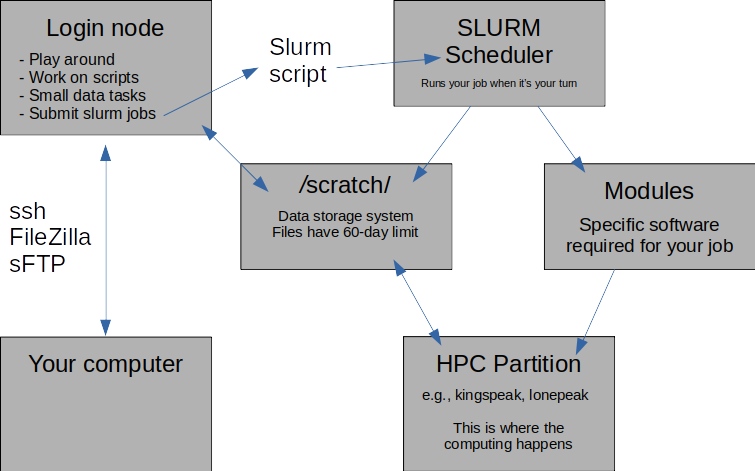
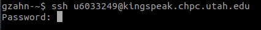
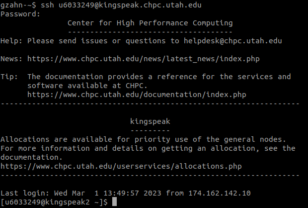
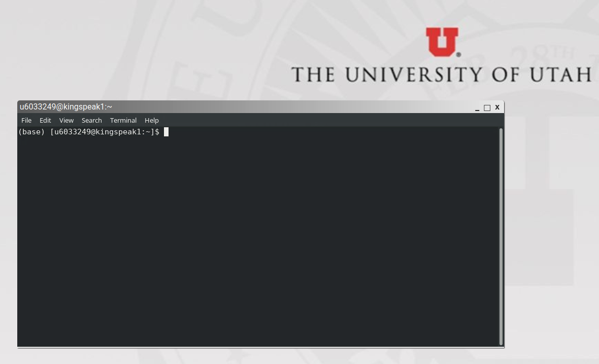
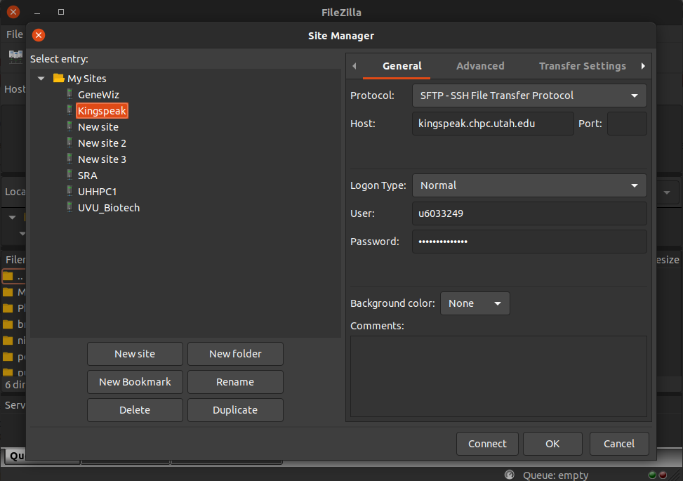
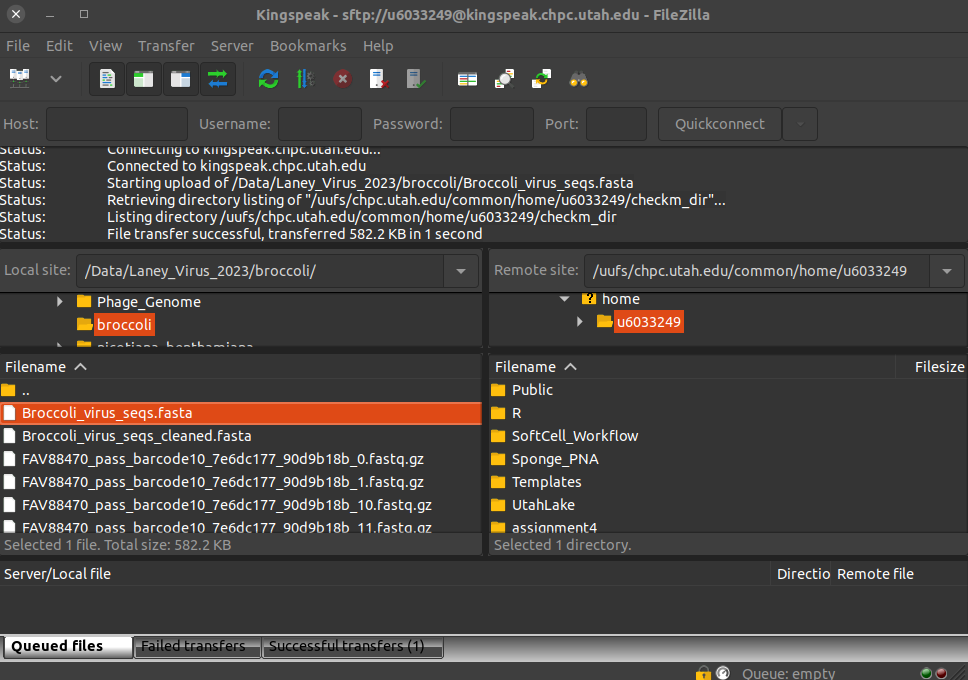
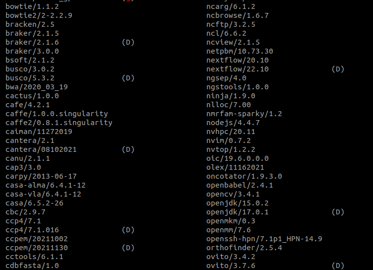
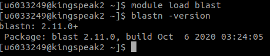

```{r setup, include=FALSE}
knitr::opts_chunk$set(echo = FALSE)
```


# Overview

The CHPC allows you to submit computational jobs to their remote computing cluster. [Their website](https://www.chpc.utah.edu/){target="_blank"} has a lot of good info, tutorials and videos. It also has comprehensive info about all computational resources at your disposal. 

Currently, UVU has free access to the [Kingspeak](https://www.chpc.utah.edu/documentation/guides/kingspeak.php){target="_blank"} and [Lonepeak](https://www.chpc.utah.edu/documentation/guides/lonepeak.php){target="_blank"} partitions. We have to wait in line (sometimes for quite a while) since UofU researchers have priority, but it's a valuable service. We also have access to some other *pre-emptable* partitions, but I'm going to skip discussing what that means for now.

These partitions can be logged into remotely from any computer (or your termux phone app) and you can transfer files and submit computational jobs.

A typical workflow (for our case) is:

  1. upload your data/files to the CHPC
  2. log in to the CHPC terminal
  3. build a script that incorporates your resource request and actual code to run
  4. submit your script to the SLURM scheduler
  5. wait for your job to run
  6. download results back to your computer
  
Here's a simplified graphical overview of the CHPC ecosystem:

```{r}

```


# Logging in

There are 2 main ways to interact with the HPC:

  1. Secure shell (ssh) from your terminal
  2. FastX web client

## ssh

Using ssh is convenient if you are used to using a terminal already and connections tend to be very fast and responsive. However, interruption to your internet will hang up the connection and you'll have to log in again from scratch.

To log in from your terminal, simply use ssh with your ```username@kingspeak.chpc.utah.edu``` or ```username@lonepeak.chpc.utah.edu```, depending on which cluster you want to work in. Your first time, it will ask you if you trust this server and want to save a key. Say yes. It will also ask for your password (it won't show as you type).

```{r}

```

Now, you're in! Note how the terminal prompt has changed to indicate you're now working in the CHPC.

```{r}

```

## FastX

Using the FastX web client tends to be less responsive (delay between typing and seeing what you type) but connections are 'persistent' meaning that you can log in and out repeatedly on the same session.

To use the web portal, simply point your browser to either ```https://kingspeak1.chpc.utah.edu:3300/``` or ```https://lonepeak1.chpc.utah.edu:3300/```, depending on which system you want to work with. You'll be taken to a login page where you enter your credentials. Once you log in, you'll have access to a virtual linux desktop and can open the virtual terminal to work in.

```{r}

```

<br>
___
<br>


# Tranferring files

The easiest way to transfer files back and forth to the CHPC is to use [FileZilla](https://filezilla-project.org/){target="_blank"}. Once you download and install the "FileZilla Client" it works as a desktop file transfer app. Once it's open on your computer, you can hit ```CTL-S``` to establish a new connection.

```{r}

```

You can create and save a connection as seen in the image above. Here, I've saved one called "Kingspeak" and it has my login credentials saved as well. Set the "Host" to either kingspeak or lonepeak as before, set the "Protocol" to SFTP and the "Login Type" to Normal.

Once you connect (say yes if it asks you if you trust the connection), you'll have two file browsers. The one on the left is your computer and the one on the right is the CHPC. You can move files back and forth by clicking and dragging.

```{r}

```

**For LARGE file transfers:**

The CHPC has a special [data transfer node](https://www.chpc.utah.edu/documentation/data_services.php){target="_blank"}. So if you have several hundred Gb of data or more, this is the way to go, but it's beyond the scope of what we typically do.

**SFTP connections are also an option if you prefer the command-line for file transfers.**

<br>
___
<br>

# Using specific software

You are free to install any software you need into your CHPC home directory. But it's likely that they already have your software available. On the CHPC, most pre-installed software is accessed as a "module." To scroll through what is available, type ```module avail``` into the CHPC terminal. The up/down keys and spacebar will let you scroll. Hitting "q" will exit the list.


```{r}

```

If your software is not on the list, you can either install it to your HOME directory or email the CHPC admin and ask them about getting it installed as a module.

If your software IS on the list, lucky you! All you need to do to use it is type ```module load softwarename``` and you can use it as normal.

```{r}

```

**REMINDER: DO NOT RUN ANY BIG JOBS ON THE LOGIN NODE. SUBMIT THEM AS SLURM SCRIPTS.**


<br>
___
<br>


# Submitting jobs

Any real work needs to be submitted to the CHPC as a SLURM script. Here's an example slurm script that runs a hypothetical blastn command: [Download File](https://gzahn.github.io/binf-data-skills/Practice/slurm_example.slurm){target="_blank"}

The header section is all about what resources you are requesting. In the example script, I am requesting:
  
  - 300 minutes of time
  - On 1 node
  - Directing my output and error streams to files
  - Asking for 16 cores
  - On my uvu account
  - In the 'kingspeak-shared' partition
  - And asking it to email me if the job completes or fails
  - And finally, asking for 64Gb of memory
  
After that slurm header, I am asking it to load the blast software.

Next is the actual code I want to run. And that's it!

Once you have your slurm script the way you want it, it's time to submit the job. You can do this using 'sbatch' as follows:

```sbatch slurm_example.slurm```

**Here's a nice walkthrough of other slurm commands:** [**LINK**](https://hpc.nmsu.edu/discovery/slurm/slurm-commands/){target="_blank"}


