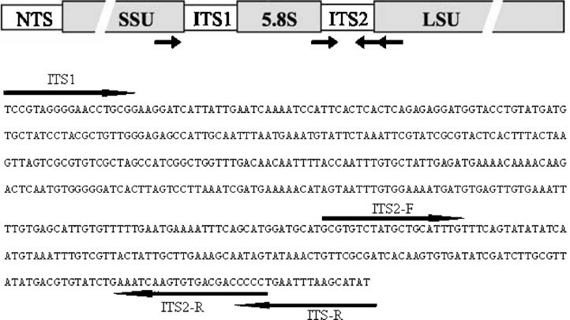

    
# **Bioinformatics Data Skills**
    
## Case Study 1: Use an existing tool to accompish a customized task

<br/><br/><br/><br/>


<div style= "float:right;position: relative;top:10px">
```{r, out.width = "350px",echo=FALSE}

```
</div>

___


  +  **The internally transcribed spacer region is a region between highly conserved the small subunit (SSU) of rRNA and the large subunit (LSU) of the rRNA. **
  
  +  **In Eukaryotes it contains the 5.8s genes and two variable length spacer regions.** 
  
  +  **In amplicon sequencing studies it is common practice to trim off the conserved (SSU, 5,8S or LSU) regions.  **
  
  +  **The conserved sites, including where the primers sit, can mess up taxonomic assignment algorithms, and is generally not informative.**

___
  
#### So, we're going to be using an existing piece of software to extract just the ITS1 region from a series of DNA reads.  The tool we will use is called [itsxpress](https://github.com/usda-ars-gbru/itsxpress){target="_blank"} 

  +  **Getting it installed and working properly is the first task:**

  - It depends on a lot of other software, including HMMER3, biopython, and others
  - You will need to install the [conda](https://docs.conda.io/en/latest/miniconda.html){target="_blank"} system in order to even install itsxpress
  - [miniconda installation instructions](https://conda.io/projects/conda/en/latest/user-guide/install/index.html){target="_blank"}
    
  +  **Once you have installed itsxpress, make sure it's in your $PATH so the program can be found, and then take a look at how to use it from the help page.**
  
  +  **We need to run itsxpress on all the fastq files in our [data set](https://gzahn.github.io/binf-data-skills/Case_Studies/01_extract_ITS1_region/data/ITS_Reads.zip), making sure to stash all the output information and diagnostics for eah file.**
  
  +  **In other words, our script should automatically perform the following for each file:**
  
    1. Extract the ITS1 regions from each sample (AKA, from each file)
    2. Use exact depreplication
    3. Store all diagnostic log information in a unique file for each pair of reads
  
  +  **Further, we want to get some summary information about how many reads in each file successfully had an ITS1 detection and extraction**
  
  +  **Use grep, sed, awk, cut, paste (or whatever tools you need) to extract summary info out of the log files about how well itsxpress performed**
  
    1. How many input sequences were there?
    2. How many output sequences made it through?
    3. How long did it take?
    4. Save all this summary info into a new file called "ITSxpress_summary_info.txt"
  
___


### **What to turn in:**

  - Store a cleaned-up plain-text file that documents the code you used to accomplish everything
  - Be sure to include comments explaining what is going on in your code
  - Upload that plain-text file to Canvas. You'll be graded on completeness, documentation, and readability.
  - Copy/Paste the contents of ITSxpress_summary_info.txt into the text entry box of the Canvas assignment as well.
  


___

<br/>