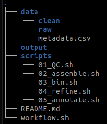
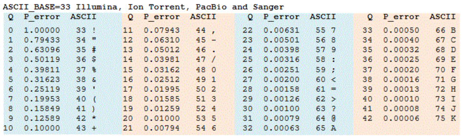

```{r setup, include=FALSE,message=FALSE,warning=FALSE}
knitr::opts_chunk$set(echo = FALSE)
library(tidyverse)
library(kableExtra)
```

### A few words of wisdom

  - File extensions don't actually mean anything. A .csv file doesn't *have* to be comma-separated values. A .txt file could actually be a gzipped fasta.
  - Use relative file paths whenever possible. Each project has its own directory and file paths start from there.
  - There are usually 50 ways to accomplish the same task. There is no 'right way' as long as it works, is consistent, and is reproducible.
  - File/Dir names **NEVER** have spaces in them. File names should be useful to both you and the code you write. You should use a naming system that can be *programmatically* accessed.
    + ```sample_01_R1.fasta``` is a good name
    + ```Sample1R1.fasta``` is a bad name
    + ```sample 1 forwardreads.fasta``` is unacceptable and will get you kicked out of class


### Bash programs

```{r programs, include=FALSE,message=FALSE,warning=FALSE}
bash_programs <- c('pwd','ls',"cd",'cat','touch','nano','cp','mv','rm','cut','grep','wget','sed','mkdir')
purpose <- c('where am I?','what stuff is here?','change directory <path>',
              'stick stuff together and print to screen','reset timestamp / make empty file','bash text editor','copy <from> <to>','move <from> <to>',
              'remove FOREVER','pick fields (columns) -f field #s -d delimiter','find lines in a file that match a pattern','pull a file from a URL and save it as a file locally','streaming editor','make new directory')
info <- c("https://ss64.com/bash/pwd.html","https://ss64.com/bash/ls.html",
             "https://ss64.com/bash/cd.html","https://ss64.com/bash/cat.html","https://ss64.com/bash/touch.html","https://www.howtogeek.com/howto/42980/the-beginners-guide-to-nano-the-linux-command-line-text-editor/","https://ss64.com/bash/cp.html","https://ss64.com/bash/mv.html","https://ss64.com/bash/rm.html","https://ss64.com/bash/cut.html","https://ss64.com/bash/grep.html","https://linuxize.com/post/wget-command-examples/","https://www.tutorialspoint.com/sed/sed_quick_guide.htm",'https://man7.org/linux/man-pages/man1/mkdir.1.html')
```

```{r,echo=FALSE}
data.frame(bash_programs,purpose,info) %>% 
  kable() %>% 
  kable_classic(lightable_options = 'hover') %>%
  kable_styling(bootstrap_options = c("striped", "hover", "condensed", "responsive")) %>% 
  row_spec(0,bold = TRUE)

```

___

### Project structure

Every project you work on should strive to be self-contained. It should also document itself.

  - README file to explain project motivation, data sources, hypotheses, *etc.*
  - Workflow file that documents EVERYTHING that you've done, from acquiring raw data through all processing/analysis steps
  - Data should live inside the project (if not using cloud solutions)
  - File names should be intuitive and programmatic



___

### Manipulating 'streams'

**All terminal information is text-based and flows through 3 main 'streams.' These streams have names and numbers:**

  - \<stdin\>
  - \<stdout\>
  - \<stderr\>
  
(You can have other streams, but only need them in special scenarios)

**\<stdin\>**   The input text. Can come from keyboard entry, a file, or another program. This is what is typically fed into a program.  AKA: **0>**

**\<stdout\>**    The output from a program. Typical default is to send it to the terminal screen. AKA: **1>**

**\<stderr\>**    The error info (if it exists). AKA: **2>**

**Streams can be redirected in various ways to make them more useful.**

**\>**     This redirects the \<stdout\> to a file (overwrites any existing file). Equivalent to **1>**

**\>\>**    This redirects the \<stdout\> to a file (appends to bottom of any existing file). Equivalent to **1>>**

**|**   This redirects the \<stdout\> to a program. You can chain together many programs to process subsequent outputs in turn... a pipeline.

**2>**    This redirects the \<stderr\> to a file (overwrites)

**3>**    This redirects the \<a-third-secret-stream\> to a file (overwrites)

___


### Wildcards and pattern matching

```{r,echo=FALSE}
data.frame(symbol=c("\\*","\\? or . depending on regex flavor","[1,2,3]","x{4}","^","[^a]","$","\\\\"),
           meaning=c("matches 0 to infinite of ANYTHING", "matches up to one instance of any character", "matches exactly one instance of 1, 2, OR 3","the preceding character will be matched exactly 4 times","pattern after ^ must be at the BEGINNING of a line","matches any character EXCEPT 'a'","pattern preceding $ must be at the END of a line","'escape character' any special character will be interpreted literally instead of its special meaning")) %>% 
  kable() %>% 
  kable_classic(lightable_options = 'hover') %>%
  kable_styling(bootstrap_options = c("striped", "hover", "condensed", "responsive")) %>% 
  row_spec(0,bold = TRUE)
```

___


### File paths vs $PATH

In Bash, \$ denotes 'the value of a variable'

Thus, you have a variable named PATH, and \$PATH is the literal contents of that variable. Your \$PATH contains a colon-separated list of paths (locations) in your computer that Bash automatically knows about. Any programs (like ls, grep, etc.) that live somewhere in your \$PATH can be executed from anywhere on your computer.

If you want to be able to call up a program like seqtk, once you download it, you need to either move it into an existing PATH directory, or add its location to your \$PATH.

**If you want to add a new directory to your PATH:** [See here](https://linuxize.com/post/how-to-add-directory-to-path-in-linux/)

___

### Fasta and Fastq files

**Fasta** (*usually* denoted by .fna .fa .fasta extension)

These *ought* to follow a consistent every-other-line format, but in practice sometimes the sequence lines are split over several lines... because life isn't fair

\>name

Sequence

```{bash eval=FALSE}
>Name of sequence - other info - can be anything, really
ACCTCTCGGCTAGCATATCTAGGCTATCAGAC
>Name of sequence 2 - etc
CTTCGCTAAGAATATAAGATCTCGCTAGATCA
```


**Fastq** (*usually* denoted by .fnq .fq .fastq extension)

These *ought* to follow a standard every-four-lines pattern.

@name

sequence

\+

quality scores

```{bash eval=FALSE}
@Name of sequence - other info - can be anything, really
ACCTCTCGGCTAGCATATCTAGGCTATCAGAC
+
KKTUT&TKKT?EJ@%%FLALALAKAKKKKKKK
@Name of sequence 2 - etc
CTTCGCTAAGAATATAAGATCTCGCTAGATCA
+
AAAAAA%A$$$A%A^^^AAAA?/AAA22233A
```


Quality score interpretation:


The fact that sequence header (names) lines start with '@' paired with the fact that '@' is a valid quality score makes counting sequences more difficult than with a fasta file.  

```{bash,eval=FALSE}
# Count seqs in a fasta file
grep -c "^>" file.fasta

# Count seqs in a fastq file
sed -n '2~4p' file.fastq | wc -l # pull every 4th line starting at line 2 and then count
```


### Programs we've installed

[**seqtk**](https://github.com/lh3/seqtk) -- This "sequence toolkit" contains a crapload of useful stuff for working with fasta and fastq files

```{bash,eval=FALSE}
# examples: seqtk <subcommand> <options> file (accepts <stdin>) (accepts .gz compression)
seqtk seq -r file.fasta # reverse compliment a fasta file
seqtk comp file.fasta.gz # nucleotide composition of each read in file
```


### Nifty things

```import newimage.png``` (Gives a screenshot tool)