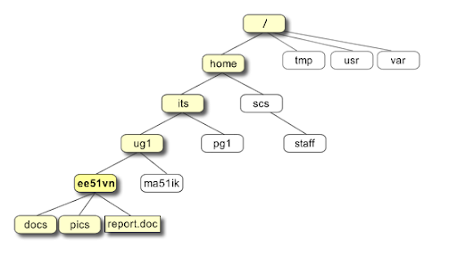

<style type="text/css">
.main-container {
  max-width: 1800px;
  margin-left: auto;
  margin-right: auto;
}
</style>


## [HOME](http://gzahn.github.io/) | [ABOUT ME](http://gzahn.github.io/about-me/) | [LAB](http://gzahn.github.io/lab/) | [RESEARCH](http://gzahn.github.io/pubs-and-pres/) | [TEACHING](http://gzahn.github.io/coursemap/)

<div style= "float:right;position: relative;top:10px">
```{r, out.width = "350px",echo=FALSE}
knitr::include_graphics("./Media/binf_data_skills_sticker.png")
```
</div>


# **Bioinformatics Data Skills**{#top}
Utah Valley University - BIOL490R (Special Topics)

___

#### Computer requirements for this class: [CLICK HERE](https:\\gzahn.github.io/binf-data-skills/OS.html){target="_blank"}

## Handy links:

#### [Course Syllabus](https:\\gzahn.github.io/binf-data-skills/syllabus.html){target="_blank"}
#### Course [file repository](){target="_blank"}
#### [Shared Course Notes](){target="_blank"}
(Anyone with link can edit)


___


</div>

___

<style>
div.blue { background-color:#a89d82; border-radius: 5px; padding: 20px;}
</style>
<div class = "blue">

## Command Line Projects and the Unix Philosophy

<div style= "float:right;position: relative;top:10px">
```{r, out.width = "350px",echo=FALSE}

```
</div>

### **Week 1**{#Week-1} 
#### Ideology of 'Robust and Reproducible' Bioinformatics

**Topics:**

  - What are "data skills?" | Reproducibility and open science | How to learn bioinformatics | Documentation | The importance of caution

**Assignments:**

  - Read through **BDS Chapter 1**... twice, and carefully
  - Find and explore the supplemental materials for the chapter on GitHub
  - Go through the resources below (Do this every week before class!)
  - [**Assignment 1 -**](https://gzahn.github.io/binf-data-skills/Assignments/Assignment_1.html){target="_blank"} Reflection piece on why you want to learn command line skills and best practices
  - Set up your computer environment (Command-line, Git)

**Resources**

  - Intro to Linux [Video](https://youtu.be/0EYrzOKtuBg){target="_blank"}
  - [Download Git](https://git-scm.com/downloads){target="_blank"}
  - Supplemental files for all textbook chapters -  [REPOSITORY](https://github.com/vsbuffalo/bds-files){target="_blank"}
  - Navigating your computer with a terminal [video](https://youtu.be/fdkbQ0MduBY){target="_blank"}
  - Recorded Lesson [Part 1](https://youtu.be/oXBkqoz-xf4){target="_blank"}
  - Recorded Lesson [Part 2](https://youtu.be/3W5tkJ5NDrQ){target="_blank"}

**Practice**

  - Make sure you've watched the videos above and can navigate in your command line terminal.
  - Do you know what the following commands do?
  
      
          pwd
      
          cd ~
      
          cd ..
      
          ls -a
      
          ls -l
  
**For your consideration:**

  - *"Debugging is twice as hard as writing the code in the first place. Therefore, if you write the code as cleverly as possible, you are, by definition, not smart enough to debug it."* --Brian Kernighan
  - *"Since the computer is a sharp enough tool to be really useful, you can cut yourself on it."* -- John Tukey

  
[Back to top of page](#top)

___

<div style= "float:right;position: relative;top:10px">
```{r, out.width = "350px",echo=FALSE}

```
</div>

### **Week 2**{#Week-2}
#### Proper Project Organization

**Topics:**

  - One directory per project | data as 'read-only' | rules for naming things | project structure | documentation

**Assignments:**

  - Read through **BDS Chapter 2** at least once
  - Work through **BDS Chapter 2**, following along in your own terminal 
  - [**Assignment 2 -**](https://gzahn.github.io/binf-data-skills/Assignments/Assignment_2.html){target="_blank"} Create oganized project template using code

**Resources**
  
  - Guide to reproducible code... [read this!](https://gzahn.github.io/binf-data-skills/Media/guide-to-reproducible-code.pdf){target="_blank"}
  - File paths [explained](https://desktop.arcgis.com/en/arcmap/10.3/tools/supplement/pathnames-explained-absolute-relative-unc-and-url.htm){target="_blank"}
  - [Example project structure](https://github.com/gzahn/Data_Course/tree/master/Code_Examples/Example_Project){target="_blank"}
  - Beginners' guide to the Bash terminal [video](https://youtu.be/oxuRxtrO2Ag?list=PLzNKOozWiEuyNu-kHpVZk59uf04wkQyY2){target="_blank"} (need to watch if you haven't used a terminal before)
  - Common Unix [commands](https://www.unixtutorial.org/basic-unix-commands){target="_blank"}
  - Recorded Lesson [Part 1](https://youtu.be/YaAEFORfND8){target="_blank"}
  - Recorded Lesson [Part 2](https://youtu.be/7l8XXKivOK4){target="_blank"}
  
**Practice**

  - Re-create your project directory template by copy-pasting each line of code from your assignment to make sure it gives the same result
  - Spend time making sure that you intuitively understand relative filepaths and get comfy with the terminal
  - Spend 2-3 hours mucking about in your terminal reworking the lines from Chapter 2 over and over until it feels normal
  
**For your consideration:**

  - *If you are learning to play the piano, and you settle for a couple hours a week of instruction without practicing on your own, you're gonna be a really crappy piano player, like me.* --Geoff Zahn
  
  
[Back to top of page](#top)


</div>

<style>
div.gray { background-color:#aabdaf; border-radius: 5px; padding: 20px;}
</style>
<div class = "gray">

## Unix refresher and sequence data types

<div style= "float:right;position: relative;top:10px">
```{r, out.width = "350px",echo=FALSE}

```
</div>


### **Week 3**{#Week-3}
#### The Unix Shell

**Topics:**

  - The Unix philosophy | text streams | pipes and redirection | process control | process substitution


**Assignments:**

  - Read through **BDS Chapter 3**
  - Work through **BDS Chapter 3**, following along in your own terminal
  - [**Assignment 3 -**](https://gzahn.github.io/binf-data-skills/Assignments/Assignment_3.html){target="_blank"} Running shell scripts, redirecting, pipes, background processes
  - Read/watch **_ALL_** of the resouces below. Be able to write a for-loop. 

**Resources**

  - [Basic Unix Commands](https://www.unixtutorial.org/basic-unix-commands?print=pdf){target="_blank"}
  - [Very Useful Tutorial](https://www.learnenough.com/command-line-tutorial/basics#sec-introduction){target="_blank"}
  - On the [Value of](https://medium.com/@eytanadar/on-the-value-of-command-line-bullshittery-94dc19ec8c61#.4qt0dd22r){target="_blank"} Command-Line Bullshittery
  - On the [Annoyance of](https://gzahn.github.io/archived_websites/command_line_bullshittery.html){target="_blank"} Command-Line Bullshittery
  - So is this stuff even useful for bioinformatics?  [YES!](https://github.com/stephenturner/oneliners){target="_blank"}
  - Video walkthroughs of some command line stuff:
    + [Part 1 - first commands](https://youtu.be/t5ovp3Iibl0){target="_blank"}
    + [Part 2 - pipes and wildcards](https://youtu.be/9YRwN2Tu1AM){target="_blank"}
    + [Part 3 - relative filepaths](https://youtu.be/2UsV3xva_Lk){target="_blank"}
    + Command line program [flags/parameters](https://youtu.be/sLayockzACQ){target="_blank"}
    + How to avoid two potentially dangerous [command line errors](https://youtu.be/_31MXNlHU_E){target="_blank"}
    + For-loops [video](https://youtu.be/aMmG4iXTBYk){target="_blank"} walkthrough in BASH
  - Bonus tips: 
    + BASH aliases [video](https://youtu.be/21LpBiQVDhM){target="_blank"}
    + BASH alias [examples](https://gzahn.github.io/data-course/Repository/Code_Examples/handy_bash_aliases.txt){target="_blank"}
  - Recorded Lesson [Part 1](https://youtu.be/1nM-vXIg4vQ){target="_blank"}
  - Recorded Lesson [Part 2](https://youtu.be/tZKeo1o2bi0){target="_blank"} (mostly trying to get things to work on Windows)
  
**Practice**

  - [Practice tasks](https://gzahn.github.io/binf-data-skills/Practice/Chapter_3_Practice.html){target="_blank"}
            

**For your consideration:**

  - *"This is the Unix philosophy: Write programs that do one thing and do it well. Write programs to work together. Write programs to handle text streams, because that is a universal interface."* --Doug McIlroy
  
[Back to top of page](#top)

___

  
<div style= "float:right;position: relative;top:10px">
```{r, out.width = "350px",echo=FALSE}
knitr::include_graphics("./Media/fastq_fig.jpg")
```
</div>
  
  
### **Week 4**{#Week-4}
#### Working with Sequence Data

**Topics** 

  - fasta and fastq file formats | using existing tools to work with sequence data

**Assignments:**

  - Read through **BDS Chapter 10** at least once
  - Don't work through the examples yet (we can return to them once we have more skills)
  - [**Assignment 4 -**](https://gzahn.github.io/binf-data-skills/Assignments/Assignment_4.html){target="_blank"} converting between formats, inspecting and trimming reads, using pre-made command-line tools

**Resources**

  - [fasx-toolkit](http://hannonlab.cshl.edu/fastx_toolkit/){target="_blank"}
  - [seqtk](https://github.com/lh3/seqtk){target="_blank"}
  - fasta and fastq [formats](https://compgenomr.github.io/book/fasta-and-fastq-formats.html){target="_blank"}
  - [phred scores](https://www.drive5.com/usearch/manual/quality_score.html){target="_blank"}
  - fasta format for [peptide sequences](https://zhanglab.ccmb.med.umich.edu/FASTA/){target="_blank"}
  - Recorded Lesson [Part 1](https://youtu.be/A8Lpn5BOwnw){target="_blank"}
  - Recorded Lesson [Part 2](https://youtu.be/gXvv1K9PAO4){target="_blank"}
  - Recorded Lesson [Part 3](https://youtu.be/haQp5IYHNfU){target="_blank"} 
  
**Practice**

  - How many total sequences are stored (in total) in the fastq files associated with Assignment_4?
  - How many sequences *end* with the seqeunce "AT" in each fastq file?
  - Which fastq file associated with Assignment_4 contains the following sequence:
  
          CCTTCATGCTGTCCTGCAATTACGATAGCATTTCTTTGACGACGAC
  
**For your consideration:**

  - *"Treat data as read-only."* --Vince Buffalo
  - Never directly edit any fasta or fastq file! If you have to make edits, redirect them to a new version of the raw file.
  
  
[Back to top of page](#top)


</div>

<style>
div.blue { background-color:#a89d82; border-radius: 5px; padding: 20px;}
</style>
<div class = "blue">

## Using Existing Tools in the Command Line

<div style= "float:right;position: relative;top:10px">
```{r, out.width = "350px",echo=FALSE}

```
</div>

### **Week 5**{#Week-5}
#### Combining Unix Skills and Command-Line Software

**Topics:**

  - Interfacing with command-line tools | redirecting stdout and stderr | customizing parameters
  
**Assignments:**

  - [**Case study 1 - Using command-line skills to run existing software on many files**](https://gzahn.github.io/binf-data-skills/Case_Studies/01_extract_ITS1_region/Case_Study_1.html)
    + uses chapters: 2,3,10 (for-loop, grep, redirection, flags)


**Resources**

  - Eukaryotic 18S regions and priming sites [image](https://gzahn.github.io/binf-data-skills/Media/ITS.png){target="_blank"}
  - ITSxpress [repository](https://github.com/usda-ars-gbru/itsxpress){target="_blank"}
  - Installing [miniconda](https://conda.io/projects/conda/en/latest/user-guide/install/index.html)  
  - 
  
[Back to top of page](#top)


</div>

<style>
div.gray { background-color:#aabdaf; border-radius: 5px; padding: 20px;}
</style>
<div class = "gray">

## More Powerful Unix Tools

<div style= "float:right;position: relative;top:10px">
```{r, out.width = "350px",echo=FALSE}

```
</div>

### **Week 6**{#Week-6}
#### Unix Data Tools

**Topics:**

  - Regular expression tester [... handy tool](https://regex101.com/){target="_blank"}
  - sed, grep
  - 

**Assignments:**

  - Work through **BDS Chapter 7**
  - [**Assignment 5**](https://gzahn.github.io/binf-data-skills/Assignments/Assignment_5.html){target="_blank"}

**Resources**

  - Introduction to regular expressions [video](https://youtu.be/vcRPNhLbhoc?list=PLzNKOozWiEuyNu-kHpVZk59uf04wkQyY2){target="_blank"}
  - sed video [playlist](https://www.youtube.com/playlist?list=PLcUid3OP_4OW-rwv_mBHzx9MmE5TxvvcQ){target="_blank"} Definitely worth your time!
  - 
  
**Practice**

  - [Practice tasks](https://gzahn.github.io/binf-data-skills/Practice/Chapter_7_Practice.html){target="_blank"}
  
  
[Back to top of page](#top)


___


<div style= "float:right;position: relative;top:10px">
```{r, out.width = "350px",echo=FALSE}

```
</div>

### **Week 7**{#Week-7}
#### Unix Data Tools, Continued

**Topics:**

  - More handy shell programs: cut, paste, sort, uniq, tr, rename, tee, xargs, awk
  - Manipulating text data from one format to another
  
**Assignments:**  

  - Continue working through **BDS Chapter 7**
  - **[Assignment 6](https://gzahn.github.io/binf-data-skills/Assignments/Assignment_6.html){target="_blank"} -** convert between tabular and fasta formatted data | process/command substitution | advanced paste

**Resources**

  - "Process substitution" vs "command substitution" [VIDEO](https://www.youtube.com/watch?v=rlsBXrPwqGk){target="_blank}
  - Using paste to build fasta from tsv [video](https://youtu.be/2XAa3UauJto){target="_blank}
  
**Practice**

  - Here's an awful-looking one-line command that prints out the phylum from each line of [Chapter_7_Practice_File_2.txt](gzahn.github.io/binf-data-skills/Data/Chapter_7_Practice_File_2.txt) along with a number sequence next to it showing which line of the file it came from.
  - It uses both process and command substitution, but essentially, it's just the paste command pasting together the phylum in the first field and the numbers 1-34 in the second field
  - I want you to break it apart, looking at each component and understand why it works!
  
  
          paste <(cat Chapter_7_Practice_File_2.txt | cut -d ";" -f 2) <(seq $(wc -l Chapter_7_Practice_File_2.txt | cut -d " " -f 1))
  
  - If you wanted to use process substitution again to extend this whole command in order to add a header to the output, what would you do? (i.e., add a first row that is "PHYLUM         LINE_NUMBER")
  
[Back to top of page](#top)


</div>

<style>
div.blue { background-color:#a89d82; border-radius: 5px; padding: 20px;}
</style>
<div class = "blue">

## Finding and Retrieving Data

<div style= "float:right;position: relative;top:10px">
```{r, out.width = "350px",echo=FALSE}

```
</div>


### **Week 8**{#Week-8}
#### Online Repositories and Approaches to Downloading 

**Topics:**
  
  - NCBI / SRA
  - Searches, filters, metadata
  - Database files and formats
  - Documenting data acquisition
  - Checksums
  - File compression
  
**Assignments:**
  
  - Work through **BDS Chapter 6**
  - [**Case Study 2 -**](https://gzahn.github.io/binf-data-skills/Case_Studies/02_reproducibly_download_data/Case_Study_2.html){target="_blank"} Reproducibly downloading stuff (BDS p. 120)
  
    + Full documentation
    + Checksums
    + Markdown README

**Resources**

  - tmux [tutorial](https://danielmiessler.com/study/tmux/){target="_blank"}
  - **curl** vs **wget** [comparison](https://www.baeldung.com/linux/curl-wget){target="_blank"}
    
**Practice**

  - [Practice task](https://gzahn.github.io/binf-data-skills/Practice/Chapter_6_Practice.html){target="_blank"}
  
  
[Back to top of page](#top)


</div>


<style>
div.gray { background-color:#aabdaf; border-radius: 5px; padding: 20px;}
</style>
<div class = "gray">


<div style= "float:right;position: relative;top:10px">
```{r, out.width = "350px",echo=FALSE}

```
</div>

## Working with Supercomputers

### **Week 9**{#Week-9}
#### Interfacing with Remote Machines

**Topics:**

  - tmux, ssh, public keys
  - navigating the HPC
  - good HPC citizenship
  - SLURM scripts and commands

**Assignments:**

  - Work through **BDS Chapter 4** before class this week
  - [**Assignment 7 -**](https://gzahn.github.io/binf-data-skills/Assignments/Assignment_7.html){target="_blank"} build and submit 3 separate jobs on the HPC


**Resources**

  - Video series on the CHPC
  
    + [Intro to the CHPC](https://youtu.be/m3LeEP45uMw){target="_blank"}
    + [Connecting to the CHPC](https://youtu.be/hP2GDWCTKg4){target="_blank"}
    + [Tmux and persistent connections](https://youtu.be/SVqoEZxMzkw){target="_blank"}
    + [SLURM basics](https://youtu.be/49DzPT9HFJM){target="_blank"}
    + [Submitting SLURM jobs](https://youtu.be/LRJMQO7Ercw){target="_blank"}
    + [Modules and defining an environment](https://youtu.be/Cu6C5lNLDAY){target="_blank"}
    + [Installing R Packages](https://youtu.be/_CT_jAV4ULw){target="_blank"}
    + [Using MiniConda](https://youtu.be/t_7XCW4jhKA){target="_blank"}
    
  - SLURM commands [cheat sheet](https://gzahn.github.io/binf-data-skills/Media/SlurmCheatsheet-Summer2019.pdf){target="_blank"}
  - SLURM [Presentation from CHPC](https://gzahn.github.io/binf-data-skills/Media/slurmfall2020.pdf){target="_blank"}
  - How [public key encryption](https://youtu.be/YEBfamv-_do){target="_blank"} actually works
  
**Practice**

  - 
  


[Back to top of page](#top)  


___

  
<div style= "float:right;position: relative;top:10px">
```{r, out.width = "350px",echo=FALSE}

```
</div>

### **Week 10**{#Week-10}
#### Interfacing with Remote Machines, Continued

**Topics:**

  - Installing other software not found in "modules"
  - File transfers
  - Customizing your remote workspace
  
**Assignments:**

  - [**Assignment 8 - **](https://gzahn.github.io/binf-data-skills/Assignments/Assignment_8.html){target="_blank"} Download and process SRA data on the CHPC
 
**Resources:**

  - sra-toolkit is available as a module on the CHPC, but you'll need to [configure it](https://github.com/ncbi/sra-tools/blob/master/README-vdb-config){target="_blank"} before use using 
        
        vdb-config -i
        
  - prefetch [instructions](https://trace.ncbi.nlm.nih.gov/Traces/sra/sra.cgi?view=toolkit_doc&f=prefetch){target="_blank"}
  - fastq-dump [instructions](https://gzahn.github.io/binf-data-skills/Media/fastq-dump_instructions.html){target="_blank"} from the Edwards Lab
  - [FileZilla](https://filezilla-project.org/){target="_blank"} is a free FTP client that really comes in handy for moving files to and from remote servers

 
**Practice**

  - See if you can get itsxpress to run
  
  
[Back to top of page](#top)


</div>

<style>
div.blue { background-color:#a89d82; border-radius: 5px; padding: 20px;}
</style>
<div class = "blue">


## Version Control and Collaborations


<div style= "float:right;position: relative;top:10px">
```{r, out.width = "350px",echo=FALSE}
knitr::include_graphics("./Media/gitflow.png")
```
</div>

### **Week 11**{#Week-11}
#### Git for Scientists

**Topics:**
  
  - Git workflow
  - GitHub
  - Collaborating with Git
  
**Assignments:**

  - Work through **BDS Chapter 5**
  - **Assignment 8 -** Git collaboration and merge
  - Group effort: Everyone (in turn) make changes to [this repository](https://github.com/gzahn/git_collaboration_practice){target="_blank"}

**Resources**

  - 
  - Pull request [walkthrough](https://guides.github.com/activities/hello-world/){target="_blank"}
  - Practice [merge conflict resolution](https://dev.to/cookrdan/conflict-resolution-git-merge-practice-3iab){target="_blank"}
  - Look through Git repo with [filed issues](https://github.com/bryandmartin/corncob/issues/84){target="_blank"} and a [pull request history](https://github.com/bryandmartin/corncob/pull/88/commits/0d4d9a10cf28f0d63d98e82e592cfc29826ff5ad){target="_blank"} 
  - 
  
**Practice**

  - 
  
  
[Back to top of page](#top)

___

<div style= "float:right;position: relative;top:10px">
```{r, out.width = "350px",echo=FALSE}

```
</div>

### **Week 12**{#Week-12}
#### Bioinformatics Shell Scripting

**Topics:**

  -
  -
  -
  
**Assignments:**

  - Work through **BDS Chapter 12**
  - **Assignment 9 -** Git collaboration and merge-
  -

**Resources**

  - 
  
**Practice**

  - In-class collaborative name list
  
  
  
[Back to top of page](#top)


</div>


<style>
div.gray { background-color:#aabdaf; border-radius: 5px; padding: 20px;}
</style>
<div class = "gray">


<div style= "float:right;position: relative;top:10px">
```{r, out.width = "350px",echo=FALSE}

```
</div>

## Putting it all together

### **Week 13**{#Week-13}
#### Composing Full Pipelines

**Topics:**

  -
  -
  -
  
**Assignments:**

  - Continue working through **BDS Chapter 12**
  -
  -

**Resources**

  -
  
**Practice**

  - 
  
  

[Back to top of page](#top)

___


<div style= "float:right;position: relative;top:10px">
```{r, out.width = "350px",echo=FALSE}
knitr::include_graphics("./Media/galaxybrain.jpeg")
```
</div>

### **Week 14**{#Week-14}
#### Running a Pipeline on a Remote Machine

**Topics:** 

  -
  -
  -
  
**Assignments:**

  - **Case Study 3** - Assemble a metagenome on the remote cluster

    + metaSPADEs
    + classify reads with DIAMOND?

**Resources**

  - 
  
**Practice**

  -
  
  
[Back to top of page](#top)

___


<div style= "float:right;position: relative;top:10px">
```{r, out.width = "350px",echo=FALSE}

```
</div>

### **Week 15**{#Week-15}
#### Creating a Custom Bioinformatics Tool

**Topics:**

  - 
  - 
  - Testing with toy examples
  
**Assignments:**

  - **Case Study 4** - Download NCBI marker genes and use Unix tools to build a custom RDP-Classifier-compatible reference database

    + Reingineer https://github.com/gzahn/Format_NCBI_QIIME
    + Edirect (command-line version of NCBI search tool)
    + ftp, BLAST, NCBI, data cleaning and reformatting
    + Turn into a completely reproducible and portable script
    + requires entrez_qiime.py installation and use
    + has to be well-documented
    + push tool to GitHub
    + uses chapters: 2,3,6,7,10,12,5
    + script should automate download and building with helpful messages along the way


[Back to top of page](#top)


</div>


<style>
div.blue { background-color:#a89d82; border-radius: 5px; padding: 20px;}
</style>
<div class = "blue">

___

<div style= "float:right;position: relative;top:10px">
```{r, out.width = "350px",echo=FALSE}

```
</div>

### **Week 16**{#Week-16}
#### Where to go from here?

**Topics:**

  -
  -
  -
  
**Assignments:**

  - **Assignment 10 -** Reflection piece on what you've learned and what next steps you'll take
  -
  -

[Back to top of page](#top)


___

<br/>


</div>

