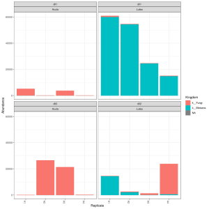

<style type="text/css">
.main-container {
  max-width: 1800px;
  margin-left: auto;
  margin-right: auto;
}
</style>

## [HOME](http://gzahn.github.io/) | [ABOUT ME](http://gzahn.github.io/about-me/) | [LAB](http://gzahn.github.io/lab/) | [RESEARCH](http://gzahn.github.io/pubs-and-pres/) | [BLOG](http://gzahn.github.io/blog-archive/)


___

<style>
div.gray { background-color:#aabdaf; border-radius: 5px; padding: 20px;}
</style>
<div class = "gray">

#### If you want to download my NCBI ITS1 database already formatted for RDP Classifier, [click here](https://github.com/gzahn/Protocols/blob/master/RDP_Training_Set_Outgroups.fasta.gz)!

#### But wait, there’s more!  Using ITS2 instead?  If so, [click here](https://github.com/gzahn/Protocols/blob/master/RDP_Training_Set_ITS2_Outgroups.fasta.gz) for those outgroups.

</div>

<style>
div.blue { background-color:#a89d82; border-radius: 5px; padding: 20px;}
</style>
<div class = "blue">

Real quick post…

If you are sequencing fungal ITS amplicons from the environment, you should think about whether you are likely amplifying any non-fungal sequences.

I have been switching over to [DADA2](https://benjjneb.github.io/dada2/) for all my fungal metabarcoding projects. This has the RDP Classifier functionality built in, which is really convenient.  However, the general UNITE fasta database used to train the RDP Classifier has exactly the same limitations as the QIIME version.  What this meant for me is that a lot of coral ITS1 sequences were being assigned to the Kingdom Fungi (Even after running all my seqs through [ITSx](https://anaconda.org/bioconda/itsxpress) and keeping only “fungal” ITS regions.

The format for the RDP training set is a bit different from the QIIME database and taxonomy files, but I added in a bunch of coral sequences and this fixed my problem… i.e., it gave RDP classifier some non-fungal sequences to train with.  Below I’ll quickly walk through how to add some outgroups to your UNITE database to use with DADA2 and the RDP classifier.

First off, I used my QIIME-compatible NCBI database ([see previous post](http://gzahn.github.io/blog-archive/limitations-of-the-unite-fungal-database/)), so I had ~450,000 Fungi, Metazoa, and Viridiplantae ITS1 sequences with associated taxonomy to play with.  All I had to do was get the taxonomic info into the sequence headers of the fasta database to make it work with RDP Classifier. I used [seqkit](https://github.com/shenwei356/seqkit) for this.

```{bash,, eval=FALSE, include=TRUE}
seqkit replace -p "(.+)" -r '$1|$1|$1|refs|{kv}' -k NCBI_ITS1_QIIME_Taxonomy_cleaned.fasta NCBI_ITS1_QIIME_DB_cleaned.fasta > RDP_Training_Set_Outgroups.fasta
```

Next, I wanted to select some outgroups that would be meaningful for the current system I was working with. Since this study was looking for coral-associated fungi, I wanted to add a bunch of corals to my training set (Class: Anthozoa). Here’s how I pulled them out of the full set (the sed command was necessary because my grep version was adding spacers between each read):

```{bash,eval=FALSE,include=TRUE}
grep -A1 "c__Anthozoa" RDP_Training_Set_Outgroups.fasta | sed '/^--$/d' > anthozoa.fasta
```

You can use whatever pattern works best for your data. Did you amplify fungi from cicadas and are worried that a bunch of cicada ITS amplified too? Then search the outgroup file for the Order Hemiptera with “o__Hemiptera” ... you get the idea.

Then, just concatenate them onto the end of your UNITE training set:

```{bash,eval=FALSE,include=TRUE}
cat sh_general_release_dynamic_s_01.12.2017.fasta anthozoa.fasta > sh_general_release_dynamic_s_01.12.2017_w_anthozoa.fasta
```

<div style= "float:right;position: relative;">
```{r, out.width = "300px",echo=FALSE}

```
</div>

And use this new training set to assign taxonomy!

In this plot, blue bars are corals, red are fungi…using the standard UNITE database gave the same figure, but it was ALL labeled as fungi. That is, like, REALLY wrong! 
<br><br><br><br><br><br><br><br><br><br><br><br>

</div>