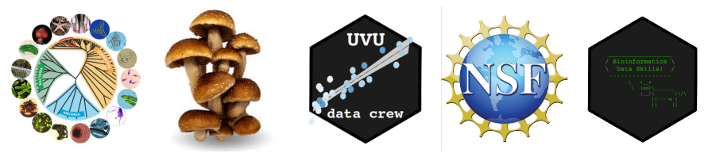

<style type="text/css">
.main-container {
  max-width: 1800px;
  margin-left: auto;
  margin-right: auto;
}
body {
text-align: justify
}

</style>


## [HOME](http://gzahn.github.io/) | [ABOUT ME](http://gzahn.github.io/about-me/) | [LAB](http://gzahn.github.io/lab/) | [RESEARCH](http://gzahn.github.io/pubs-and-pres/) | [TEACHING](http://gzahn.github.io/coursemap/) | [CV](https://docs.google.com/document/d/1f1DEO7XyHATpOhZWt7Rl-ELzte-SAOTww5uZnUXNTwM/edit?usp=sharing)

<br/><br/>

## These are links to the websites for courses I currently teach:

<br/><br/>


<div style= "float:center;position: relative;top:10px">
```{r, out.width = "1400",echo=FALSE}

```


# &nbsp;&nbsp;&nbsp;&nbsp;[INTRO BIO II](http://gzahn.github.io/BIOL1620/) &nbsp;&nbsp;&nbsp;&nbsp;&nbsp;&nbsp;&nbsp; [MYCOLOGY](https://gzahn.github.io/mycology) &nbsp;&nbsp;&nbsp;&nbsp;&nbsp; [DATA ANALYSIS](http://gzahn.github.io/data-course/) &nbsp;&nbsp;&nbsp;&nbsp;&nbsp;&nbsp; [S-STEM](http://gzahn.github.io/SSTEM/) &nbsp;&nbsp;&nbsp;&nbsp;&nbsp;&nbsp; [BIOINFORMATICS](http://gzahn.github.io/binf-data-skills)


</div>
