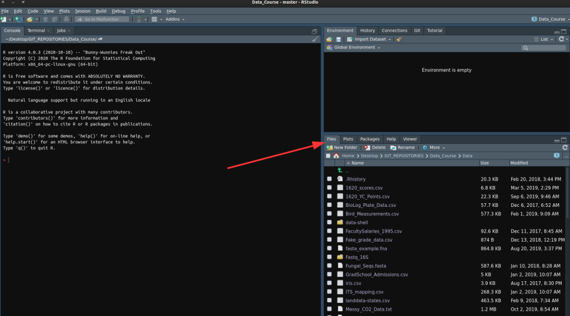

# **Assignment 2 - Learning about file paths via the command line**

In this assignment, you will use R language to:

+ Use relative file paths that are portable between computers sharing a Git repository
+ Demonstrate the use of "wildcards" and pattern matchingto perform actions on groups of files simultaneously
+ Inspect files
+ Explore the RStudio interface and "environment objects"
+ Use for-loops to automate repetitive tasks

**We will cover the commands used here, along with file paths, during class**

___

This assignment will be completed using RStudio working within an "RProject" in your "Data_Course_LASTNAME" directory.

**All file paths should be relative, starting from the main Data_Course directory**

___

## **For credit...**

1.  Copy and paste the full code used to accomplish tasks 4-10 into a txt file and upload to Canvas

2.  Make sure you include comment lines so it's easy to see which code sections do which tasks

____________


## Complete the following tasks:

1.  Open RStudio and then make a new RProject associated with the Data_Course_LASTNAME repository you created.

File > New Project > Existing Directory > Navigate to the new "Data_Course_LASTNAME" directory > Click "Open"

You will now be working in an RProject, meaning that all file paths will be relative and self-contained (we will talk about this)

```{r, out.width = "600px",echo=FALSE}

```

2.  In RStudio, look at the lower right window and click on the "Files" tab.  You should be looking at all the files associated with this RProject. You can navigate through them just like any file explorer. Look in the "Data" directory to see a bunch of data files (You copied these over from my repository).

3.  Open a new Rscript (will appear in the top left window) || File > New File > R script

4.  Write a command that lists all of the .csv files found in the Data/ directory and stores that list in an object called "csv_files"

5.  Find how many files match that description using the length() function

6.  Open the wingspan_vs_mass.csv file and store the contents as an R object named "df" using the read.csv() function

7.  Inspect the first 5 lines of this data set using the head() function

8.  Find any files (recursively) in the Data/ directory that begin with the letter "b" (lowercase)

9.  Write a command that displays the first line of each of those "b" files (this is tricky... use a for-loop)

10.  Do the same thing for all files that end in ".csv"

<br><br><br><br>
