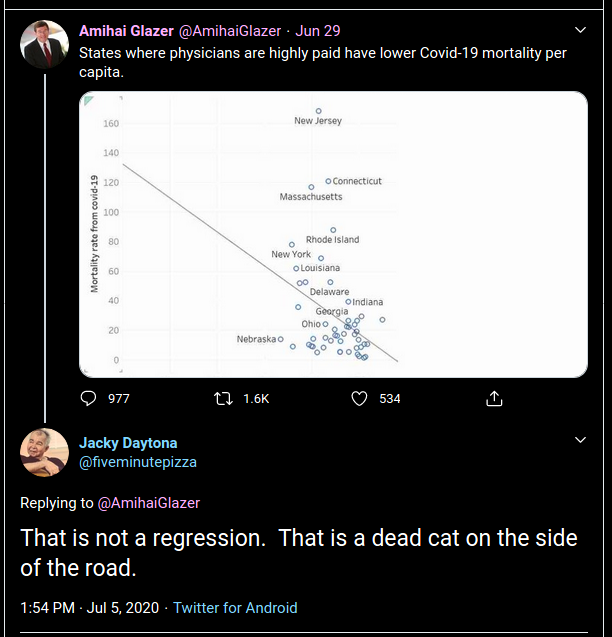
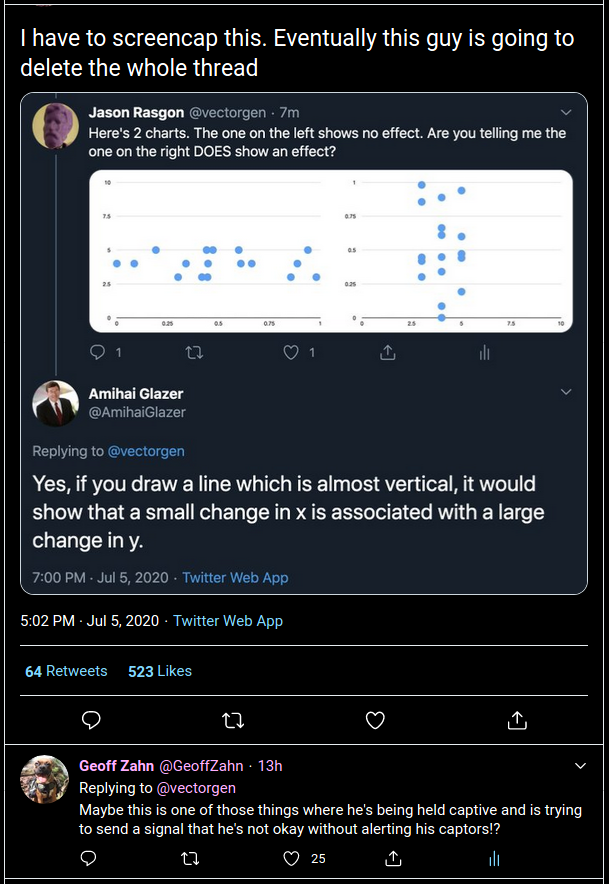
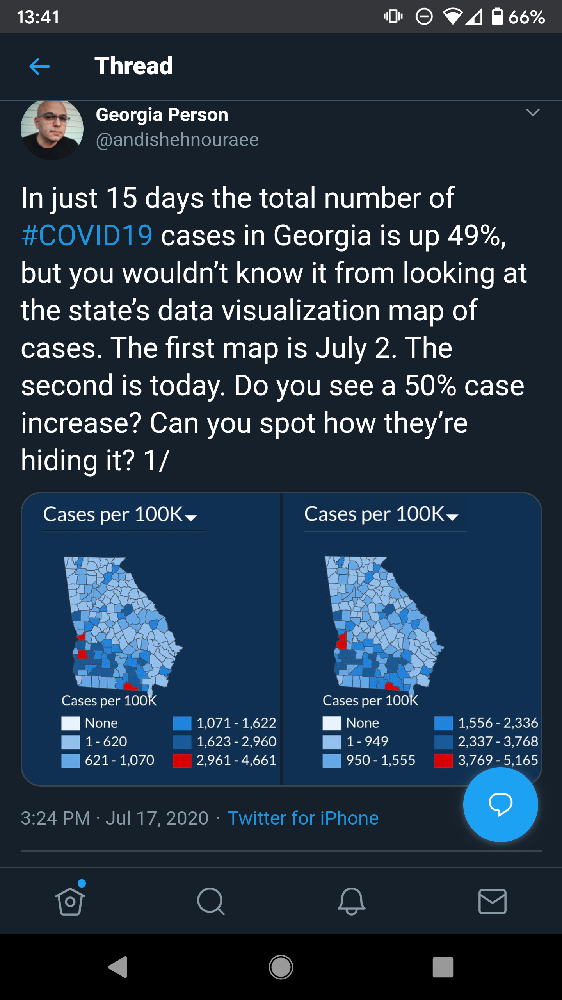
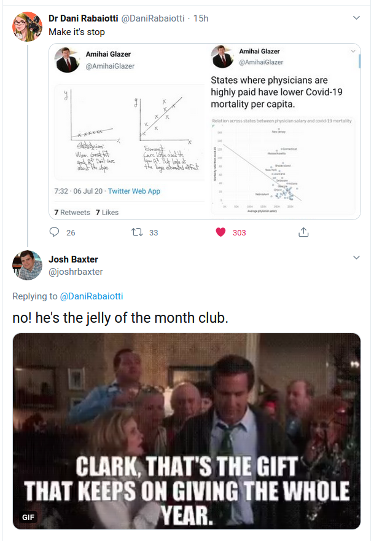

<style type="text/css">
.main-container {
  max-width: 1800px;
  margin-left: auto;
  margin-right: auto;
}
</style>


<style>
div.gray { background-color:#aabdaf; border-radius: 5px; padding: 20px;}
</style>
<div class = "gray">


## [HOME](http://gzahn.github.io/) | [ABOUT ME](http://gzahn.github.io/about-me/) | [LAB](http://gzahn.github.io/lab/) | [RESEARCH](http://gzahn.github.io/pubs-and-pres/) | [TEACHING](http://gzahn.github.io/coursemap/)

<div style= "float:right;position: relative;top:10px">
```{r, out.width = "500px",echo=FALSE}

```
</div>


## The links below take you to collections of truly horrible plots and deeply stupid "statistics" seen in the wild, as well as to resources for how to detect and avoid "statistical bullshit." Please study through these; you need to be aware of these types of errors.


## [Seriously!?](https://www.businessinsider.com/the-27-worst-charts-of-all-time-2013-6#unordered-perplexingly-circular-and-difficult-to-ascertain-any-information-from-this-globe-and-mail-chart-they-went-out-of-their-way-to-make-this-flashy-but-difficult-to-actually-read-we-get-what-they-were-going-for-but-this-chart-is-precisely-why-humanity-invented-tables-6){target="_blank"}

## [Why?](https://badvisualisations.tumblr.com/){target="_blank"}

## [Hall of Shame](https://getdolphins.com/blog/the-worst-graphs-of-2017/){target="_blank"}

## [Don't do this](http://livingqlikview.com/the-9-worst-data-visualizations-ever-created/){target="_blank"}

## [Serial offender](https://www.businessinsider.com/fox-news-charts-tricks-data-2012-11){target="_blank"}

## My favorite [graph](https://gzahn.github.io/data-course/media/badstats4.png){target="_blank"} so far. Look closely...

## Definitely [keep this in mind!](https://www.tylervigen.com/spurious-correlations){target="_blank"}


## Look, someone found the "fit trendline" function in Excel and made [national policy](https://www.vox.com/2020/5/8/21250641/kevin-hassett-cubic-model-smoothing){target="_blank"} based on it!

*Note: This seriously happened and people died because of it.

<div style= "float:right;position: relative;top:10px">
```{r, out.width = "500px",echo=FALSE}

```
</div>

## Just don't use [pie charts](https://blog.funnel.io/why-we-dont-use-pie-charts-and-some-tips-on-better-data-visualizations){target="_blank"}

## Do follow [these rules](https://guides.library.duke.edu/datavis/topten){target="_blank"}

</br></br></br>


Note: The guy embarrassing himself publicly on the right is a full professor of economics at UC Irvine. I honestly don't know how he has a job there, but he's already provided us with a wealth of lessons. 

</br></br></br></br></br></br></br></br></br></br></br></br></br></br></br>


<div style= "float:left;position: relative;top:10px">
```{r, out.width = "500px",echo=FALSE}

```
</div>


</br></br></br></br></br></br></br></br></br></br>

<div style= "float:right;position: relative;top:10px">
```{r, out.width = "500px",echo=FALSE}

```
</div>


</br></br></br></br>
</br></br></br></br></br></br></br></br></br></br></br></br>
</br></br></br></br></br></br></br></br></br></br></br></br>
</br></br></br></br></br></br></br></br></br></br></br></br>

</div>