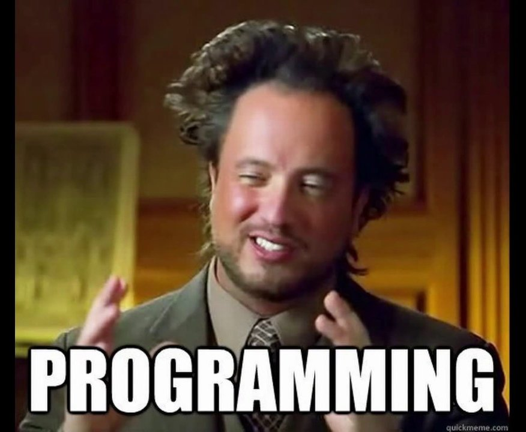

<style type="text/css">
.main-container {
  max-width: 1800px;
  margin-left: auto;
  margin-right: auto;
}
</style>


## [HOME](http://gzahn.github.io/) | [ABOUT ME](http://gzahn.github.io/about-me/) | [LAB](http://gzahn.github.io/lab/) | [RESEARCH](http://gzahn.github.io/pubs-and-pres/) | [TEACHING](http://gzahn.github.io/coursemap/)

<div style= "float:right;position: relative;top:10px">
```{r, out.width = "300px",echo=FALSE}
knitr::include_graphics("../media/sticker.png")
```
</div>

<style>
div.gray { background-color:#aabdaf; border-radius: 5px; padding: 20px;}
</style>
<div class = "gray">


# **Intro to Data Analysis**{#top}
Utah Valley University - BIOL3100


## Handy links:

#### [Course Syllabus](https://gzahn.github.io/data-course/Syllabus.html){target="_blank"}
#### Course [file repository](https://github.com/gzahn/Data_Course){target="_blank"}
#### [Shared Course Notes](https://docs.google.com/document/d/1Nnjv1RkdegUR3pOp8Jb81ryE-_C59T4dLWYyJqVSz9Y/edit?usp=sharing){target="_blank"}
(Anyone with link can edit)

#### [Exams GitHub Repository](https://github.com/gzahn/BIOL3100_Exams.git){target="_blank"} (Exams will be uploaded at the appropriate times)
#### [The philosophy of this course](http://gzahn.github.io/media/spocklogic.jpg)

#### R for Data Science [Website](https://r4ds.had.co.nz/){target="_blank"}
  
#### Collection of beginner R [resources](https://www.learnr4free.com/beginner.html){target="_blank"}

#### Amy Willis' Intro to R [course](https://github.com/adw96/biost509){target="_blank"} 
(for related alternative exercises/lessons)

#### Big Book of R [collection of free R books](https://www.bigbookofr.com/){target="_blank"} ...Whoa!


___


<style>
div.blue { background-color:#a89d82; border-radius: 5px; padding: 20px;}
</style>
<div class = "blue">

## The Command Line, File Paths, Git
<div style= "float:right;position: relative;top:10px">
```{r, out.width = "250px",echo=FALSE}
knitr::include_graphics("../media/git_2x.png")
```
</div>

### **Week 1**{#Week-1}
**Topics:** 

  - Installing Software | Command-line | Git version control 

**Assignments**  

  - Read: [What is Git all about?](https://github.com/gzahn/gzahn.github.io/blob/master/Readings/Bryan_2017_Excuse_me%2C_do_you_have_a_moment_to_talk_about_vers.pdf)
  - Install Git, R, and R-Studio on your laptop (part of Assignment 1)
  - Be ready to explain what Git, R, and R-Studio are.
  - Do [Assignment 1](https://gzahn.github.io/data-course/Repository/Assignments/Assignment_1/Assignment_1.html){target="_blank"} and upload a link to your new GitHub account to Canvas.
  - Take a look at [this document](https://gzahn.github.io/data-course/Repository/Code_Examples/iris_analysis.html){target="_blank"} to see where this class is going
  - Go through ALL the resources below. I put them here for a reason. Most are short web resources or videos (some that I made).

**Resources**

  - Recorded lesson [video](https://youtu.be/EvW_LofsjJw){target="_blank"} Part 1
  - Recorded lesson [video](https://youtu.be/7jcAuJupUk8){target="_blank"} Part 2
  - Video: Meet the [command line](https://youtu.be/cg115YYQYgc){target="_blank"} of your computer
  - [Download Git](https://git-scm.com/downloads){target="_blank"}
  - [Download R](https://cran.cnr.berkeley.edu/){target="_blank"}
  - [Download R-Studio](https://rstudio.com/products/rstudio/download/#download){target="_blank"}
  - [Navigating with the command line](https://computers.tutsplus.com/tutorials/navigating-the-terminal-a-gentle-introduction--mac-3855){target="_blank"} (great video!)
  - GitHub steps for Assignment 1 [video](https://youtu.be/M9430_eGttI){target="_blank"}
  - [Git Cheat Sheet](https://www.atlassian.com/git/tutorials/atlassian-git-cheatsheet){target="_blank"} (handy reference)
  - [Git tutorial](https://product.hubspot.com/blog/git-and-github-tutorial-for-beginners){target="_blank"} for beginners (another walkthrough, if you need it)
  - Best [Git Cheat Sheet Ever!](https://remembertheapi.com/products/git-cheat-sheet-black-mug-11oz){target="_blank"} (Excellent gift idea for a teacher...joking!)
  

**Practice**

  - Make 10 more separate changes and commits to your README.md file and push each one to GitHub 
  - Close and open your command line terminal 10 times
  - Open your command line terminal and navigate to your new personal GitHub repository for this course (Data_Course_LASTNAME) / Navigate back to your desktop / From your Desktop (without using "cd") display the contents of Data_Course_LASTNAME/README.md onto your computer screen.
  - Please view this short [video clip](https://gzahn.github.io/data-course/media/paint_the_fence.mp4){target="_blank"} from "Karate Kid" (Seriously)
    + When I tell you to close and open your command line 10 times, it's not because I hate you.
    + It's because I, too, have had to learn this stuff from scratch
    + It's because I know that repetition is crucial to learning this, especially at the beginning
    + And it's because if you don't spend the time to do this stuff over and over now, by week 6 you will be drowning and helpless.
    + When I say "push 10 separate commits to your GitHub repo," what I'm actually saying is "Show me 'Paint the Fence'!"
    + Because very soon, Mr. Miyagi will be attacking you with things like "Error in url[i] = paste(df[,2], gsub(" ", "_",  : 
  object of type 'closure' is not subsettable"

[Back to top of page](#top)

___

<div style= "float:right;position: relative;top:10px">
```{r, out.width = "350px",echo=FALSE}

```
</div>

### **Week 2**{#Week-2}
**Topics**

  - File paths | Pipes | Redirection | Wildcards | Essential Unix Commands | Parameters

**Assignments**

  - [Assignment 2](https://gzahn.github.io/data-course/Repository/Assignments/Assignment_2/Assignment_2.html){target="_blank"}

**Resources**
  
  - Recorded lesson [video](https://youtu.be/blDPSEYEpD8){target="_blank"} (Part 1)
  - Recorded lesson [video](https://youtu.be/MIPFLx7VgyI){target="_blank"} (Part 2)
  - [Remedial Unix Shell](https://github.com/gzahn/Data_Course/blob/master/Readings/Further_Reading_for_Shell_Tricks.pdf){target="_blank"}
  - [Basic Unix Commands](https://www.unixtutorial.org/basic-unix-commands?print=pdf){target="_blank"}
  - [Very Useful Tutorial](https://www.learnenough.com/command-line-tutorial/basics#sec-introduction){target="_blank"}
  - On the [Value of](https://medium.com/@eytanadar/on-the-value-of-command-line-bullshittery-94dc19ec8c61#.4qt0dd22r){target="_blank"} Command-Line Bullshittery
  - On the [Annoyance of](https://gzahn.github.io/archived_websites/command_line_bullshittery.html){target="_blank"} Command-Line Bullshittery
  - So is this stuff even useful for bioinformatics?  [YES!](https://github.com/stephenturner/oneliners){target="_blank"}
  - Video walkthroughs of some command line stuff:
    + [Part 1 - first commands](https://youtu.be/t5ovp3Iibl0){target="_blank"}
    + [Part 2 - pipes and wildcards](https://youtu.be/9YRwN2Tu1AM){target="_blank"}
    + [Part 3 - relative filepaths](https://youtu.be/2UsV3xva_Lk){target="_blank"}
    + Command line program [flags/parameters](https://youtu.be/sLayockzACQ){target="_blank"}
    + How to avoid two potentially dangerous [command line errors](https://youtu.be/_31MXNlHU_E){target="_blank"}
    + For-loops [video](https://youtu.be/aMmG4iXTBYk){target="_blank"} walkthrough in BASH
  - Bonus tips: 
    + BASH aliases [video](https://youtu.be/21LpBiQVDhM){target="_blank"}
    + BASH alias [examples](https://gzahn.github.io/data-course/Repository/Code_Examples/handy_bash_aliases.txt){target="_blank"}

**Practice**

  - [Exercise 1](https://gzahn.github.io/data-course/Repository/Exercises/shell_detective.txt)
  - [Exercise 2](https://gzahn.github.io/data-course/Repository/Exercises/out-of-order_unicorn_code.txt)
  - Shell *find* [exercise](https://gzahn.github.io/data-course/Repository/Exercises/shell_find_example.txt)
  - Pick some random files in our Data/ directory and practice (a bunch of times) using the following commands (with various flags and linking them with pipes):
    + head
    + tail
    + wc
    + ls
    + sort
    + uniq
  - Practice using wildcards (*) to show the contents of random files
    + Write a command using wildcard(s) that lists *only* the files "ethane.pbd" and "methane.pbd" in the Data/data-shell/molecules/ directory
    + Pick a few random files in a directory and try to write a wildcard expression that shows ONLY those files (wash, rinse, repeat)
  - find out what the following shell commands do and how to use them (then practice using them):
    + touch
    + cp
    + mv
  
[Back to top of page](#top)


</div>

<style>
div.gray { background-color:#aabdaf; border-radius: 5px; padding: 20px;}
</style>
<div class = "gray">

## Getting to Know R

<div style= "float:right;position: relative;top:10px">
```{r, out.width = "350px",echo=FALSE}
knitr::include_graphics("../media/Rvariablesdata.jpg")
```
</div>


### **Week 3**{#Week-3}
**Topics**

  - R Data types and conversions | Reading and Writing Files | Packages and Projects

**Assignments**

  - Watch [this video](https://youtu.be/MokZ4OQVuu4){target="_blank"} on how to set up your personal Git Directory and R-Projects for completing assignments
  - Read [this chapter](https://www.datacamp.com/community/tutorials/r-packages-guide){target="_blank"} on what a "package" is in R
  - Read [this chapter](https://r4ds.had.co.nz/workflow-projects.html){target="_blank"} on R-Projects (We will **ALWAYS** work from within R-Projects from now on)
  - Do [Assignment 3](https://gzahn.github.io/data-course/Repository/Assignments/Assignment_3/Assignment_3.html){target="_blank"} (We will start this one together during live class)
  - Do [Assignment 4](https://gzahn.github.io/data-course/Repository/Assignments/Assignment_4/Assignment_4.html){target="_blank"}

**Resources**

  - Recorded lesson [video](https://youtu.be/GUXF1lwxRTU){target="_blank"} (Part 1)
  - Recorded lesson [video](){target="_blank"} (Part 2)
  - Intro to what RStudio is [video](https://youtu.be/cnQ-v1UUWyE){target="_blank"}
  - [Data Types in R](https://swcarpentry.github.io/r-novice-inflammation/13-supp-data-structures/){target="_blank"}
  - [For-Loops](https://www.datamentor.io/r-programming/for-loop/){target="_blank"}
  - [Reading data into R](https://www.datacamp.com/community/tutorials/r-data-import-tutorial){target="_blank"}
  - Using 'pipes' in R [chapter](https://r4ds.had.co.nz/pipes.html#introduction-11){target="_blank"}
  - For-loops in R [chapter](https://r4ds.had.co.nz/iteration.html){target="_blank"}

**Practice**

  - [Vectors](https://github.com/gzahn/Data_Course/blob/master/Exercises/01_Vectors.pdf)
  - [Factors](https://github.com/gzahn/Data_Course/blob/master/Exercises/07_Factors.pdf)
  - [Characters](https://github.com/gzahn/Data_Course/blob/master/Exercises/04_Characters.pdf)
  - [Regular Sequences](https://github.com/gzahn/Data_Course/blob/master/Exercises/02_Regular_Sequences.pdf)
  - [Indexing](https://github.com/gzahn/Data_Course/blob/master/Exercises/03_Indexing.pdf)
  - [Missing Values](https://github.com/gzahn/Data_Course/blob/master/Exercises/05_Missing_Values.pdf)
  - [Loops in R](https://github.com/gzahn/Data_Course/blob/master/Exercises/08_Loops.pdf)
  
[Back to top of page](#top)

___

  
<div style= "float:right;position: relative;top:10px">
```{r, out.width = "350px",echo=FALSE}
knitr::include_graphics("../media/operators.png")
```
</div>
  
  
### **Week 4**{#Week-4}
**Topics**

  - Logical Operations | Subsetting | "Grammar of Graphics" ggplot Intro

**Assignments**

  - Read through the materials in the Resources section below
  - Make sure you have the following packages installed if you don't already:
    + *tidyverse*
    + *carData*
    + *RColorBrewer*
    + [*colorblindr*](https://github.com/clauswilke/colorblindr/blob/master/README.md){target="_blank"} This one is "special" and not found on CRAN so click the link for install instructions.

  - [Assignment 5](https://gzahn.github.io/data-course/Repository/Assignments/Assignment_5/Assignment_5.html){target="_blank"}
  - #### **Exam 1** (Link at top of page)

**Resources**

  - Recorded lesson [video](https://youtu.be/QFgO9L-w8sQ){target="_blank"} Part 1
  - Recorded lesson [video](https://youtu.be/cVKBDPMj3Ow){target="_blank"} Part 2
  - [Subsetting](http://adv-r.had.co.nz/Subsetting.html){target="_blank"}
  - [More Subsetting](https://www.r-bloggers.com/5-ways-to-subset-a-data-frame-in-r/){target="_blank"} (It's important!)
  - [Operators](https://www.statmethods.net/management/operators.html){target="_blank"}
  - [ggplot Introduction](https://r4ds.had.co.nz/data-visualisation.html){target="_blank"}


**Practice**

  - [Logical Operations](https://github.com/gzahn/Data_Course/blob/master/Exercises/06_Logical_Operations.pdf){target="_blank"}
  - Find a **new** built-in data set in R. Use several methods to subset it over and over until you are an expert!
  - [Out-of-order Code](https://github.com/gzahn/Data_Course/blob/master/Exercises/data_frame_subsets_out-of-order.R)
  
[Back to top of page](#top)


</div>

<style>
div.blue { background-color:#a89d82; border-radius: 5px; padding: 20px;}
</style>
<div class = "blue">

## Visualizing a Data Set

<div style= "float:right;position: relative;top:10px">
```{r, out.width = "350px",echo=FALSE}

```
</div>

### **Week 5**{#Week-5}
**Topics**

  - ggplot | patchwork | ggforce

**Assignments**

  - [Assignment 6](https://gzahn.github.io/data-course/Repository/Assignments/Assignment_6/Assignment_6.html){target="_blank"}
  - [Ugly plot contest!](https://gzahn.github.io/data-course/uglyplotcontest.html){target="_blank"}
  - Prevent embarrassment... see how [NOT to make a chart](https://gzahn.github.io/data-course/embarrassment.html){target="_blank"}, except for the Ugly Plot Contest, of course, where you should try to upend good sense.
  - Ugly plot contest [entries](https://gzahn.github.io/data-course/media/Ugly_Plots/Fa_2020/Fa_2020.html){target="_blank"}

**Resources**

  - Recorded lesson [video](https://youtu.be/aa7Rr87FsV0){target="_blank"} Part 1
  - Recorded lesson [video](https://youtu.be/jdrJjMiw4HM){target="_blank"} Part 2
  - [More ggplot](https://ggplot2.tidyverse.org/){target="_blank"}
  - [ggforce](https://ggforce.data-imaginist.com/){target="_blank"}
  - [patchwork](https://github.com/thomasp85/patchwork){target="_blank"}
  - [Extensive ggplot2 Tutorial](http://r-statistics.co/Complete-Ggplot2-Tutorial-Part1-With-R-Code.html){target="_blank"}
  - How to plot anything in ggplot [part 1](https://t.co/LxwwSsESQM?amp=1){target="_blank"} | [part 2](https://t.co/uZda0KRAgp?amp=1){target="_blank"} (This is a **GOOD** thing to watch!)
  - Evolution of a ggplot [tutorial](https://cedricscherer.netlify.app/2019/05/17/the-evolution-of-a-ggplot-ep.-1/){target="_blank"}
  - Catalog of [visualization types](https://flowingdata.com/chart-types) (Awesome source of inspiration for your plots...but memberhip fee required to see code. Booooo)

**Practice**

  - [Out-of-order Plotting Code](https://github.com/gzahn/Data_Course/blob/master/Exercises/out-of-order_CO2_plot.R){target="_blank"}
  - [ggplot Examples](https://github.com/gzahn/Data_Course/blob/master/Code_Examples/ggplot_intro.R){target="_blank"}
  - ggplot [Shiny App](https://huygens.science.uva.nl/ggPlotteR/){target="_blank"} Lets you use GUI to see ggplot code.
  
[Back to top of page](#top)


</div>

<style>
div.gray { background-color:#aabdaf; border-radius: 5px; padding: 20px;}
</style>
<div class = "gray">

## Clean and Transform Data

<div style= "float:right;position: relative;top:10px">
```{r, out.width = "350px",echo=FALSE}
knitr::include_graphics("../media/sepalwidth.jpg")
```
</div>

### **Week 6**{#Week-6}
**Topics**

  - Tidy Data | dplyr verbs | tidyr verbs

**Assignments**

  - Read this paper: [Tidy Data](https://github.com/gzahn/Data_Course/blob/master/Readings/tidy-data_Wickham.pdf){target="_blank"}
  - [Assignment 7](https://gzahn.github.io/data-course/Repository/Assignments/Assignment_7/Assignment_7.html){target="_blank"}

**Resources**

  - Recorded lesson [video](https://youtu.be/XRv0el4z7j0){target="_blank"} Part 1
  - Recorded lesson [video](https://youtu.be/Qkv7V2ZYX4Y){target="_blank"} Part 2
  - [Tidy Data Chapter](https://r4ds.had.co.nz/tidy-data.html#tidy-data-1){target="_blank"}
  - [Transforming Data Frames](https://r4ds.had.co.nz/transform.html){target="_blank"}
  - [dplyr Verbs](https://dplyr.tidyverse.org/){target="_blank"}
  - [tidyr Verbs](https://tidyr.tidyverse.org/){target="_blank"}
  - [tidyverse Cheat Sheet](https://rstudio.com/wp-content/uploads/2015/02/data-wrangling-cheatsheet.pdf){target="_blank"}

**Practice**

  - [BioLog Challenge](https://gzahn.github.io/data-course/Repository/Exercises/BioLog_Challenge.R){target="_blank"}
  - [Out-of-order Code](https://gzahn.github.io/data-course/Repository/Exercises/out-of-order_CO2_plot.R){target="_blank"}
  - [Out-of-order Code2](https://gzahn.github.io/data-course/Repository/Exercises/out-of-order_grading_code.R){target="_blank"}

[Back to top of page](#top)


___


<div style= "float:right;position: relative;top:10px">
```{r, out.width = "350px",echo=FALSE}
knitr::include_graphics("../media/real_world_data.jpg")
```
</div>

### **Week 7**{#Week-7}
**Topics**

  - Data Wrangling | Joins | [The Curse of Other Peoples' Data](https://gzahn.github.io/media/data_science_workflow.png){target="_blank"}

**Assignments**

  - Read [This Handout](https://gzahn.github.io/data-course/Readings/Excel_Advice_Handout.pdf)
  - Read [This Paper](https://gzahn.github.io/data-course/Readings/Broman_and_Woo_2017_Data_organization_in_spreadsheets.pdf)
  - Create a validated Excel Spreadsheet for data collection for the experiment we design in class
  - Exam 2 is open...

**Resources**

  - Recorded lesson [video](https://youtu.be/Fu8ewe-d-34){target="_blank"} Part 1 (dplyr verbs)
  - Recorded lesson [video](https://youtu.be/HrtwYstQFoM){target="_blank"} Part 2 (dplyr verbs in action)
  - [Data Wrangling Chapter](https://r4ds.had.co.nz/wrangle-intro.html){target="_blank"}
  - [Wrangling Cheat Sheet](https://rstudio.com/wp-content/uploads/2015/02/data-wrangling-cheatsheet.pdf){target="_blank"}
  - [Visual Explanations of Joins](https://github.com/gadenbuie/tidyexplain){target="_blank"}
  - Janitor package on [CRAN](https://cran.r-project.org/web/packages/janitor/index.html){target="_blank"}
  - Rstats [illustrations](https://github.com/allisonhorst/stats-illustrations){target="_blank"}
  - Working with [strings and regular expressions](https://craig.rbind.io/post/2020-06-28-asgr-2-3-string-manipulation/){target="_blank"} using the *stringr* package
  - How Excel actually *killed* people [news article](https://www.theguardian.com/politics/2020/oct/05/how-excel-may-have-caused-loss-of-16000-covid-tests-in-england){target="_blank"}
  


**Practice**

  - Download [this spreadsheet](https://github.com/gzahn/Tidy_Data_Workshop/raw/master/Worst%20Data%20Storage%20Ever.xlsx){target="_blank"}. See if you figure out all the things wrong with it.
  - [Error Sleuth Practice](https://gzahn.github.io/data-course/Repository/Exercises/error_sleuth_pt1.R){target="_blank"}
  - [Data Entry Case Study](https://gzahn.github.io/data-course/Repository/Exercises/Data_Entry_Case_Study.txt){target="_blank"}
  
[Back to top of page](#top)


</div>

<style>
div.blue { background-color:#a89d82; border-radius: 5px; padding: 20px;}
</style>
<div class = "blue">

## Getting More From R

<div style= "float:right;position: relative;top:10px">
```{r, out.width = "350px",echo=FALSE}
knitr::include_graphics("../media/function.png")
```
</div>


### **Week 8**{#Week-8}
**Topics**

  - Writing Functions | Conditional Execution | source()

**Assignments**

  - Watch [this video](https://resources.rstudio.com/rstudio-conf-2020/object-of-type-closure-is-not-subsettable-jenny-bryan){target="_blank"} from Jenny Bryan about debugging
  - Read [this chapter](https://r4ds.had.co.nz/functions.html){target="_blank"} and do all the exercises in it as you read
  - #### **Exam 2** (Link at top of page)
  
**Resources**

  - Recorded lesson [video](https://youtu.be/Q-VaIuUs5IM){target="_blank"} Part 1 (Designing an experiment)
  - Recorded lesson [video](https://youtu.be/zb3jl4oaP70){target="_blank"} Part 2 (Analysis of experiment data - live coding)
  - [Functions](https://r4ds.had.co.nz/functions.html){target="_blank"}
  - [Conditional Execution](https://r4ds.had.co.nz/functions.html#conditional-execution){target="_blank"}
  - Functionals and the *purrr* package [chapter](https://adv-r.hadley.nz/functionals.html){target="_blank"}

**Practice**

  - Write a function that returns the min, max, and mean of any set of real numbers
  - Write a function that takes a data frame and returns a new data frame with one **random** column removed
  - Fix my out-of-order [code](https://gzahn.github.io/data-course/Repository/Exercises/out_of_order_function.R){target="_blank"} for a summarizing function
  - Write a function that takes a data frame... if there are more than 3 columns, your function should return the column names as-is; if there are 3 or fewer columns, your function should return the column names in **reverse order.**
  - Write a **useful** function that you might want to use in the future (your choice)
  - Put all of these functions into a new R script and save it in **your** main data course repository
  - In a new empty R script, call your functions with source() and test them out
  - There's a stupid function I wrote in "/Code_Examples/thlayli.R"
    + It takes a data.frame as an input and does *WHAT* to it?
  - What's the difference between '|' and '||' or '&' and '&&' ? Why should you always use the double-form in a conditional expression?
  

[Back to top of page](#top)


</div>


<style>
div.gray { background-color:#aabdaf; border-radius: 5px; padding: 20px;}
</style>
<div class = "gray">


<div style= "float:right;position: relative;top:10px">
```{r, out.width = "350px",echo=FALSE}

```
</div>

## Model Building and Testing

### **Week 9**{#Week-9}
**Topics**

  - Building and Testing Models

**Assignments**

  - [Assignment 8](https://gzahn.github.io/data-course/Repository/Assignments/Assignment_8/Assignment_8.html){target="_blank"}

**Resources**

  - Recorded lesson [video](https://youtu.be/tjJZVUwLxOs){target="_blank"} (Part 1 - Intro to linear models)
  - What is a [statistical model?](https://help.xlstat.com/s/article/what-is-statistical-modeling?language=en_US){target="_blank"}
  - [Modeling Intro](https://r4ds.had.co.nz/model-intro.html){target="_blank"}
  - [Model Basics](https://r4ds.had.co.nz/model-basics.html){target="_blank"}
  - [Model Fitting](https://r4ds.had.co.nz/model-building.html){target="_blank"}

**Practice**

  - [Building Models Example](https://github.com/gzahn/Data_Course/blob/master/Code_Examples/building_basic_models.R)
  - [Intro to Hypothesis Testing](https://github.com/gzahn/Data_Course/blob/master/Code_Examples/hyp_testing_intro.R)
  - [Cross-Validation and Logistic Regression](https://github.com/gzahn/Data_Course/blob/master/Code_Examples/simple_regression.R)
  
  
<div style= "float:right;position: relative;top:10px">
```{r, out.width = "350px",echo=FALSE}
knitr::include_graphics("../media/logistic.jpg")
```
</div>

[Back to top of page](#top)  


___

### **Week 10**{#Week-10}
**Topics**

  - More models | Statistical Tests

**Assignments**

  - Show up to class. Models are confusing at first and there's a lot to learn.
  - Ask questions during class.

**Resources**

  - Recorded lesson [video](){target="_blank"} (Recorded during class and posted after)
  - [Linear Regression](http://r-statistics.co/Linear-Regression.html){target="_blank"}
  - [More Linear Regression](https://www.dataquest.io/blog/statistical-learning-for-predictive-modeling-r/){target="_blank"}
  - [Common Statistical Tests](http://r-statistics.co/Statistical-Tests-in-R.html){target="_blank"}
  - Most stats test are really [just linear regression models!](https://lindeloev.github.io/tests-as-linear/){target="_blank"}
  - [Mixed-effect Models](https://peerj.com/articles/4794/){target="_blank"}
  - [Everything is a Regression](https://towardsdatascience.com/everything-is-just-a-regression-5a3bf22c459c){target="_blank"}
  - [Introduction to mixed effects models](https://peerj.com/articles/4794/){target="_blank"} This is a VERY good paper!
  - How to use [lmer](https://rstudio-pubs-static.s3.amazonaws.com/63556_e35cc7e2dfb54a5bb551f3fa4b3ec4ae.html){target="_blank"}
  - Comparing multiple models with [regression tables](https://evalsp20.classes.andrewheiss.com/reference/regtables/){target="_blank"}
  - Intro to Machine Learning [online text](https://lgatto.github.io/IntroMachineLearningWithR/an-introduction-to-machine-learning-with-r.html){target="_blank"}
  - Free case studies using [Machine Learning in R](https://supervised-ml-course.netlify.app/){target="_blank"}
  - Awesome student-made [repository](https://github.com/austenapigo/GLAMM-Generalized-Linear-Additive-Mixed-Models){target="_blank"} featuring good explanations of different models
  
 
**Practice**

  - Go through the R script [more_models.R](https://gzahn.github.io/data-course/Repository/Exercises/more_models.R){target="_blank"}
    + Follow along with my analyses of the first two data sets
    + Complete an analysis of the third data set

[Back to top of page](#top)


</div>

<style>
div.blue { background-color:#a89d82; border-radius: 5px; padding: 20px;}
</style>
<div class = "blue">


## Communicating Your Results


<div style= "float:right;position: relative;top:10px">
```{r, out.width = "350px",echo=FALSE}

```
</div>

### **Week 11**{#Week-11}
**Topics**

  - R-Markdown | Reproducible Reports

**Assignments**

  - [Assignment 9](https://gzahn.github.io/data-course/Repository/Assignments/Assignment_9/Assignment_9.html){target="_blank"}

**Resources**

  - Recorded lesson [video](https://youtu.be/rmt3Obdzg1s){target="_blank"} (Part 1)
  - Recorded lesson [video](https://youtu.be/reKuO7dCHX4){target="_blank"} (Part 2)
  - [Intro to R Markdown](https://github.com/cbwall/Intro-to-Rmarkdown){target="_blank"}
  - [Markdown Live Preview Generator](https://dillinger.io/){target="_blank"}
  - Expert-Level [Markdown Project](https://github.com/cbwall/Coral-isotopes-across-space-and-time){target="_blank"}
  - Example data analysis (easy version) [webpage](https://gzahn.github.io/example_project/){target="_blank"}

**Practice**

  - Using the resources above, generate a markdown document that analyzes the "iris" data set and push it to a new GitHub repository named Iris_Markdown
  - Play with options and code to create a document that looks good and presents your analysis and results clearly
  - This is similar to Assignment_9, but I'm asking for a brand new "Iris_Markdown" repository that is a self-contained report of Iris analyses

[Back to top of page](#top)

___

<div style= "float:right;position: relative;top:10px">
```{r, out.width = "350px",echo=FALSE}
knitr::include_graphics("../media/jennybryan.jpeg")
```
</div>

### **Week 12**{#Week-12}
**Topics**

  - Proper Project Organization | Collaboration 

**Assignments**

  - Peer evaluation of Assignment 9 HTML reports (Organization, Portability, Accuracy, Understandablity)
  - #### **Exam 3** (Link at top of page)

**Resources**

  - Recorded lesson [video](https://youtu.be/EpgfmrZp2-E){target="_blank"} (Part 1)
  - [Project-oriented Workflows](https://www.tidyverse.org/blog/2017/12/workflow-vs-script/){target="_blank"}
  - [Reproducible, Portable, Self-Contained](https://ptds2018.netlify.com/tutorials/workflow/){target="_blank"}
  - [Proper Project Organization Example](https://github.com/gzahn/Data_Course/tree/master/Code_Examples/Example_Project){target="_blank"}
  - [Another, More Detailed Example](https://www.britishecologicalsociety.org/wp-content/uploads/2017/12/guide-to-reproducible-code.pdf){target="_blank"}
  - [Project organization part 1](https://www.youtube.com/watch?v=dSHGfoHTTko){target="_blank"} video
  - [Project organization part 2](https://www.youtube.com/watch?v=1ntfdvkQZFg){target="_blank"} video

**Practice**

  - Peer evaluations of Iris_Markdown repositories (from last week); Clean them up and make them more organized
  
  
[Back to top of page](#top)


</div>


<style>
div.gray { background-color:#aabdaf; border-radius: 5px; padding: 20px;}
</style>
<div class = "gray">


<div style= "float:right;position: relative;top:10px">
```{r, out.width = "350px",echo=FALSE}

```
</div>

## Putting it all together

### **Week 13**{#Week-13}
**Topics**

  - Data Analysis from raw to report

**Assignments**

  - We will work together in class to do a complete analysis in real-time

**Resources**

  - Recorded lesson [video](){target="_blank"} (Recorded during class and posted after)
  - [Benefits of Live Coding](https://gzahn.github.io/Readings/LiveCoding.pdf){target="_blank"}

**Practice**

  - Analyze the "esoph" data set and generate a markdown report


[Back to top of page](#top)

___


<div style= "float:right;position: relative;top:10px">
```{r, out.width = "350px",echo=FALSE}
knitr::include_graphics("../media/404.PNG")
```
</div>

### **Week 14**{#Week-14}
**Topics**

  - Building a website with GitHub and R-Markdown

**Assignments**

  - Work on Final Project
  - Create a GitHub Personal Website
  - Upload a brief CV and the updated (improved) html of Assignment 9 to your new website

**Resources**

  - Recorded lesson [video](){target="_blank"} (Recorded during class and posted after)
  - [GitHub Pages](https://pages.github.com/){target="_blank"}
  - Here's the [GitHub repository for this course website](https://github.com/gzahn/gzahn.github.io/){target="_blank"}
  - Rmarkdown to web page walkthrough [video](https://www.youtube.com/watch?v=2-8-L1ltdx0){target="_blank"}
  - Reproducible workflow [video](https://youtu.be/s3JldKoA0zw){target="_blank"}

**Practice**

  - Go through my course website repository (link above) and try to relate the code there to the html version of the website your internet browser displays
  - Work on your personal website:
    + Add multiple pages with internal links
    + Be sure to have a "Projects" page that links to HTML reports you've made, including your final project
    + Be careful not to push any files larger than 50Mb to GitHub or it will break your repository!

[Back to top of page](#top)

___


<div style= "float:right;position: relative;top:10px">
```{r, out.width = "350px",echo=FALSE}
knitr::include_graphics("../media/final.png")
```
</div>

### **Week 15**{#Week-15}
**Topics**

  - Intro to genetic data in R

**Assignments**

  - Work on Final Project
  - [Assignment 10](https://gzahn.github.io/data-course/Repository/Assignments/Assignment_10/Assignment_10.html){target="_blank"} (Draft of final code)


[Back to top of page](#top)

___

### **Week 16**{#Week-16}
**Topics**

  - TBD

**Assignments**

  - #### **Exam 4** (Redo any previous exam to replace it's score)

[Back to top of page](#top)

___

<br/>

**'Luck is statistics taken personally.' -- Penn Jillette**

</div>

