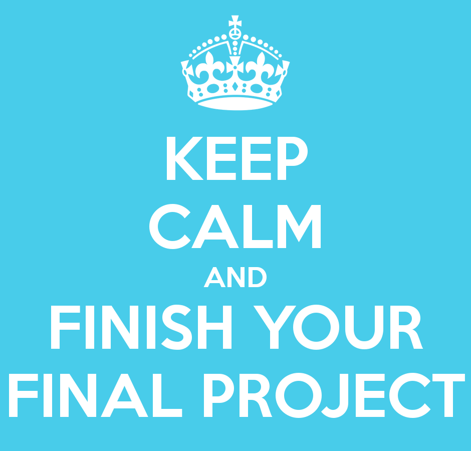

<style type="text/css">
.main-container {
  max-width: 1800px;
  margin-left: auto;
  margin-right: auto;
}
</style>

## [HOME](http://gzahn.github.io/) | [ABOUT ME](http://gzahn.github.io/about-me/) | [LAB](http://gzahn.github.io/lab/) | [RESEARCH](http://gzahn.github.io/pubs-and-pres/) | [BLOG](http://gzahn.github.io/blog-archive/) | [DATA COURSE](http://gzahn.github.io/data-course/) | [INTRO BIO II](http://gzahn.github.io/BIOL1620/) | [MYCOLOGY](http://gzahn.github.io/mycology/)

<div style= "float:right;position: relative;top:10px">
```{r, out.width = "300px",echo=FALSE}

```
</div>

<style>
div.gray { background-color:#aabdaf; border-radius: 5px; padding: 20px;}
</style>
<div class = "gray">


# **Intro to Data Analysis**{#top}
Utah Valley University - BIOL3100


## Quick links:

#### [Course GitHub Repository](https://github.com/gzahn/Data_Course)
#### [Course Syllabus](https://github.com/gzahn/Data_Course/blob/master/Syllabus.pdf)
#### [Shared Course Notes](https://docs.google.com/document/d/1Nnjv1RkdegUR3pOp8Jb81ryE-_C59T4dLWYyJqVSz9Y/edit?usp=sharing)
(Anyone with link can edit)

#### [The philosophy of this course](http://gzahn.github.io/media/spocklogic.jpg)

___

#### Table of Contents

[Week 1](#Week-1)    |    [Week 5](#Week-5)    |    [Week 9](#Week-9) | [Week 13](#Week-13)

[Week 2](#Week-2)    |    [Week 6](#Week-6)    |    [Week 10](#Week-10) | [Week 14](#Week-14)

[Week 3](#Week-3)    |    [Week 7](#Week-7)    |    [Week 11](#Week-11) | [Week 15](#Week-15)

[Week 4](#Week-4)    |    [Week 8](#Week-8)    |    [Week 12](#Week-12) | [Week 16](#Week-16)


</div>

___

<style>
div.blue { background-color:#a89d82; border-radius: 5px; padding: 20px;}
</style>
<div class = "blue">

## The Command Line, File Paths, Git
<div style= "float:right;position: relative;top:10px">
```{r, out.width = "250px",echo=FALSE}
knitr::include_graphics("../media/git_2x.png")
```
</div>

### **Week 1**{#Week-1}
**Topics:** 

  - Installing Software | Command-line | Git version control 

**Assignments**  

  - Read: [What is Git all about?](https://github.com/gzahn/gzahn.github.io/blob/master/Readings/Bryan_2017_Excuse_me%2C_do_you_have_a_moment_to_talk_about_vers.pdf)
  - Install Git, R, and R-Studio on your laptop (part of Assignment 1)
  - Be ready to explain what Git, R, and R-Studio are.
  - Do [Assignment 1](https://github.com/gzahn/Data_Course/blob/master/Assignments/Assignment_1/Assignment_1.pdf) and upload a link to your new GitHub account to Canvas.

**Resources**

  - [Download Git](https://git-scm.com/downloads){target="_blank"}
  - [Download R](https://cran.cnr.berkeley.edu/){target="_blank"}
  - [Download R-Studio](https://rstudio.com/products/rstudio/download/#download){target="_blank"}
  - [Navigating with the command line](https://computers.tutsplus.com/tutorials/navigating-the-terminal-a-gentle-introduction--mac-3855){target="_blank"}
  - [Basic Git Commands](https://confluence.atlassian.com/bitbucketserver/basic-git-commands-776639767.html){target="_blank"}
  - [Git Cheat Sheet](https://www.atlassian.com/git/tutorials/atlassian-git-cheatsheet){target="_blank"}
  - [Git tutorial](https://product.hubspot.com/blog/git-and-github-tutorial-for-beginners){target="_blank"} for beginners
  - Best [Git Cheat Sheet Ever!](https://remembertheapi.com/products/git-cheat-sheet-black-mug-11oz){target="_blank"}
  

**Practice**

  - Make 10 separate changes and commits to your README.md file and push each one to GitHub 

[Back to top of page](#top)

<div style= "float:right;position: relative;top:10px">
```{r, out.width = "350px",echo=FALSE}
knitr::include_graphics("../media/file_tree.png")
```
</div>

### **Week 2**{#Week-2}
**Topics**

  - File paths | Pipes | Redirection | Wildcards | Essential Unix Commands | Parameters

**Assignments**

  - [Assignment 2](https://github.com/gzahn/Data_Course/blob/master/Assignments/Assignment_2/Assignment_2.pdf)

**Resources**
  
  - The [Two Cultures of Computing](http://www.pgbovine.net/two-cultures-of-computing.htm){target="_blank"} and how to get over your fear of coding 
  - [Remedial Unix Shell](https://github.com/gzahn/Data_Course/blob/master/Readings/Further_Reading_for_Shell_Tricks.pdf){target="_blank"}
  - [Basic Unix Commands](https://www.unixtutorial.org/basic-unix-commands?print=pdf){target="_blank"}
  - [Very Useful Tutorial](https://www.learnenough.com/command-line-tutorial/basics#sec-introduction){target="_blank"}
  - On the [Annoyance of](http://www.pgbovine.net/command-line-bullshittery.htm){target="_blank"} Command-Line Bullshittery
  - On the [Value of](https://medium.com/@eytanadar/on-the-value-of-command-line-bullshittery-94dc19ec8c61#.4qt0dd22r){target="_blank"} Command-Line Bullshittery
  - So is this stuff even useful for bioinformatics?  [YES!](https://github.com/stephenturner/oneliners){target="_blank"}

**Practice**

  - [Exercise 1](https://github.com/gzahn/Data_Course/blob/master/Exercises/shell_detective.txt)
  - [Exercise 2](https://github.com/gzahn/Data_Course/blob/master/Exercises/out-of-order_unicorn_code.txt)
  - [Shell *find* exercise](https://raw.githubusercontent.com/gzahn/Data_Course/master/Exercises/shell_find_example.txt)
  - 
  
[Back to top of page](#top)

___

## Getting to Know R

<div style= "float:right;position: relative;top:10px">
```{r, out.width = "350px",echo=FALSE}
knitr::include_graphics("../media/Rvariablesdata.jpg")
```
</div>


### **Week 3**{#Week-3}
**Topics**

  - R Data types and conversions | Reading and Writing Files | For-Loops | Packages and Projects

**Assignments**

  - [Assignment 3](https://github.com/gzahn/Data_Course/blob/master/Assignments/Assignment_3/Assignment_3.pdf)
  - [Assignment 4](https://github.com/gzahn/Data_Course/blob/master/Assignments/Assignment_4/Assignment_4.pdf)

**Resources**

  - [Data Types in R](https://swcarpentry.github.io/r-novice-inflammation/13-supp-data-structures/){target="_blank"}
  - [For-Loops](https://www.datamentor.io/r-programming/for-loop/){target="_blank"}
  - [Reading data into R](https://www.datacamp.com/community/tutorials/r-data-import-tutorial){target="_blank"}
  - [R Projects](https://r4ds.had.co.nz/workflow-projects.html){target="_blank"}

**Practice**

  - [Vectors](https://github.com/gzahn/Data_Course/blob/master/Exercises/01_Vectors.pdf)
  - [Factors](https://github.com/gzahn/Data_Course/blob/master/Exercises/07_Factors.pdf)
  - [Characters](https://github.com/gzahn/Data_Course/blob/master/Exercises/04_Characters.pdf)
  - [Regular Sequences](https://github.com/gzahn/Data_Course/blob/master/Exercises/02_Regular_Sequences.pdf)
  - [Indexing](https://github.com/gzahn/Data_Course/blob/master/Exercises/03_Indexing.pdf)
  - [Missing Values](https://github.com/gzahn/Data_Course/blob/master/Exercises/05_Missing_Values.pdf)
  - [Loops in R](https://github.com/gzahn/Data_Course/blob/master/Exercises/08_Loops.pdf)
  
[Back to top of page](#top)
  
<div style= "float:right;position: relative;top:10px">
```{r, out.width = "350px",echo=FALSE}

```
</div>
  
  
### **Week 4**{#Week-4}
**Topics**

  - Logical Operations | Subsetting | "Grammar of Graphics" ggplot Intro

**Assignments**

  - Read through the materials in the Resources section below
  - [Assignment 5](https://github.com/gzahn/Data_Course/blob/master/Assignments/Assignment_5/Assignment_5.pdf)
  - Exam 1

**Resources**

  - [Subsetting](http://adv-r.had.co.nz/Subsetting.html){target="_blank"}
  - [More Subsetting](https://www.r-bloggers.com/5-ways-to-subset-a-data-frame-in-r/){target="_blank"} (It's important!)
  - [Operators](https://www.statmethods.net/management/operators.html){target="_blank"}

**Practice**

  - [Logical Operations](https://github.com/gzahn/Data_Course/blob/master/Exercises/06_Logical_Operations.pdf){target="_blank"}
  - Find a **new** built-in data set in R. Use several methods to subset it over and over until you are an expert!
  - [Out-of-order Code](https://github.com/gzahn/Data_Course/blob/master/Exercises/data_frame_subsets_out-of-order.R)
  
[Back to top of page](#top)

___

## Visualizing a Data Set

<div style= "float:right;position: relative;top:10px">
```{r, out.width = "350px",echo=FALSE}
knitr::include_graphics("../media/ggplot_example.png")
```
</div>

### **Week 5**{#Week-5}
**Topics**

  - ggplot | patchwork | ggforce

**Assignments**

  - [Assignment 6](https://github.com/gzahn/Data_Course/blob/master/Assignments/Assignment_6/Assignment_6new.pdf)
  - [Ugly plot contest!](https://gzahn.github.io/data-course/uglyplotcontest.html)

**Resources**

  - [ggplot Introduction](https://r4ds.had.co.nz/data-visualisation.html){target="_blank"}
  - [More ggplot](https://ggplot2.tidyverse.org/){target="_blank"}
  - [ggforce](https://ggforce.data-imaginist.com/){target="_blank"}
  - [patchwork](https://github.com/thomasp85/patchwork){target="_blank"}
  - [Extensive ggplot2 Tutorial](http://r-statistics.co/Complete-Ggplot2-Tutorial-Part1-With-R-Code.html){target="_blank"}

**Practice**

  - [Out-of-order Plotting Code](https://github.com/gzahn/Data_Course/blob/master/Exercises/out-of-order_CO2_plot.R){target="_blank"}
  - [ggplot Examples](https://github.com/gzahn/Data_Course/blob/master/Code_Examples/ggplot_intro.R){target="_blank"}
  - ggplot [Shiny App](https://huygens.science.uva.nl/ggPlotteR/){target="_blank"} Lets you use GUI to see ggplot code.
  
[Back to top of page](#top)

___

## Clean and Transform Data

<div style= "float:right;position: relative;top:10px">
```{r, out.width = "350px",echo=FALSE}

```
</div>

### **Week 6**{#Week-6}
**Topics**

  - Tidy Data | dplyr verbs | tidyr verbs

**Assignments**

  - Read this paper: [Tidy Data](https://github.com/gzahn/Data_Course/blob/master/Readings/tidy-data_Wickham.pdf){target="_blank"}
  - [Assignment 7](https://github.com/gzahn/Data_Course/blob/master/Assignments/Assignment_7/Assignment_7new.pdf)

**Resources**

  - [Tidy Data Chapter](https://r4ds.had.co.nz/tidy-data.html#tidy-data-1){target="_blank"}
  - [Transforming Data Frames](https://r4ds.had.co.nz/transform.html){target="_blank"}
  - [dplyr Verbs](https://dplyr.tidyverse.org/){target="_blank"}
  - [tidyr Verbs](https://tidyr.tidyverse.org/){target="_blank"}
  - [tidyverse Cheat Sheet](https://github.com/gzahn/Data_Course/blob/master/Readings/Tidyverse%2BCheat%2BSheet.pdf){target="_blank"}

**Practice**

  - [BioLog Challenge](https://github.com/gzahn/Data_Course/blob/master/Exercises/BioLog_Challenge.R)
  - [Out-of-order Code](https://github.com/gzahn/Data_Course/blob/master/Exercises/out-of-order_CO2_plot.R)
  - [Out-of-order Code2](https://github.com/gzahn/Data_Course/blob/master/Exercises/out-of-order_grading_code.R)

[Back to top of page](#top)

<div style= "float:right;position: relative;top:10px">
```{r, out.width = "350px",echo=FALSE}
knitr::include_graphics("../media/real_world_data.jpg")
```
</div>

### **Week 7**{#Week-7}
**Topics**

  - Data Wrangling | Joins | [The Curse of Other Peoples' Data](https://gzahn.github.io/media/data_science_workflow.png){target="_blank"}

**Assignments**

  - Read [This Handout](https://github.com/gzahn/Data_Course/blob/master/Readings/Excel_Advice_Handout.pdf)
  - Read [This Paper](https://github.com/gzahn/Data_Course/blob/master/Readings/Broman_and_Woo_2017_Data_organization_in_spreadsheets.pdf)
  - Create a validated Excel Spreadsheet for data collection for the experiment we design in class
  - Exam 2

**Resources**

  - [Data Wrangling Chapter](https://r4ds.had.co.nz/wrangle-intro.html){target="_blank"}
  - [Wrangling Cheat Sheet](https://rstudio.com/wp-content/uploads/2015/02/data-wrangling-cheatsheet.pdf){target="_blank"}
  - [Visual Explanations of Joins](https://github.com/gadenbuie/tidyexplain){target="_blank"}

**Practice**

  - Download [this spreadsheet](https://github.com/gzahn/Tidy_Data_Workshop/raw/master/Worst%20Data%20Storage%20Ever.xlsx). See if you figure out all the things wrong with it.
  - [Error Sleuth Practice](https://github.com/gzahn/Data_Course/blob/master/Exercises/error_sleuth_pt1.R)
  - [Data Entry Case Study](https://github.com/gzahn/Data_Course/blob/master/Exercises/Data_Entry_Case_Study.txt)
  
[Back to top of page](#top)

___

## Getting More From R

<div style= "float:right;position: relative;top:10px">
```{r, out.width = "350px",echo=FALSE}
knitr::include_graphics("../media/function.png")
```
</div>


### **Week 8**{#Week-8}
**Topics**

  - Writing Functions | Conditional Execution | source()

**Assignments**
  - Watch [this video](https://resources.rstudio.com/rstudio-conf-2020/object-of-type-closure-is-not-subsettable-jenny-bryan){target="_blank"} from Jenny Bryan about debugging
  
**Resources**

  - [Functions](https://r4ds.had.co.nz/functions.html){target="_blank"}
  - [Conditional Execution](https://r4ds.had.co.nz/functions.html#conditional-execution){target="_blank"}

**Practice**

  - Write a function that returns the min, max, and mean of any set of real numbers
  - Write a function that takes a data frame and returns a new data frame with one **random** column removed
  - Write a function that takes a data frame... if there are more than 3 columns, your function should return the column names as-is; if there are 3 or fewer columns, your function should return the column names in **reverse order.**
  - Write a **useful** function that you might want to use in the future (your choice)
  - Put all of these functions into a new R script and save it in **your** main data course repository
  - In a new empty R script, call your functions with source() and test them out

[Back to top of page](#top)

___

<div style= "float:right;position: relative;top:10px">
```{r, out.width = "350px",echo=FALSE}
knitr::include_graphics("../media/model1.png")
```
</div>

## Model Building and Testing

### **Week 9**{#Week-9}
**Topics**

  - Building and Testing Models

**Assignments**

  - [Assignment 8](https://github.com/gzahn/Data_Course/blob/master/Assignments/Assignment_8/Assignment_8new.pdf)

**Resources**

  - [Modeling Intro](https://r4ds.had.co.nz/model-intro.html){target="_blank"}
  - [Model Basics](https://r4ds.had.co.nz/model-basics.html){target="_blank"}
  - [Model Fitting](https://r4ds.had.co.nz/model-building.html){target="_blank"}

**Practice**

  - [Building Models Example](https://github.com/gzahn/Data_Course/blob/master/Code_Examples/building_basic_models.R)
  - [Intro to Hypothesis Testing](https://github.com/gzahn/Data_Course/blob/master/Code_Examples/hyp_testing_intro.R)
  - [Cross-Validation and Logistic Regression](https://github.com/gzahn/Data_Course/blob/master/Code_Examples/simple_regression.R)
  
  
<div style= "float:right;position: relative;top:10px">
```{r, out.width = "350px",echo=FALSE}

```
</div>

[Back to top of page](#top)  


### **Week 10**{#Week-10}
**Topics**

  - More models | Statistical Tests

**Assignments**

**Resources**

  - [Linear Regression](http://r-statistics.co/Linear-Regression.html){target="_blank"}
  - [More Linear Regression](https://www.dataquest.io/blog/statistical-learning-for-predictive-modeling-r/){target="_blank"}
  - [Common Statistical Tests](http://r-statistics.co/Statistical-Tests-in-R.html){target="_blank"}
  - [Mixed-effect Models](https://peerj.com/articles/4794/){target="_blank"}
  - [Everything is a Regression](https://towardsdatascience.com/everything-is-just-a-regression-5a3bf22c459c){target="_blank"}
  _ [Introduction to mixed effects models](https://peerj.com/articles/4794/){target="_blank"} This is a VERY good paper.
 
**Practice**

[Back to top of page](#top)

___

## Communicating Your Results


<div style= "float:right;position: relative;top:10px">
```{r, out.width = "350px",echo=FALSE}
knitr::include_graphics("../media/rmd.png")
```
</div>

### **Week 11**{#Week-11}
**Topics**

  - R-Markdown | Reproducible Reports

**Assignments**

  - [Assignment 9](https://github.com/gzahn/Data_Course/blob/master/Assignments/Assignment_9/Assignment_9new.pdf)

**Resources**

  - [Intro to R Markdown](https://github.com/cbwall/Intro-to-Rmarkdown)
  - [Markdown Live Preview Generator](https://dillinger.io/)
  - Expert-Level [Markdown Project](https://github.com/cbwall/Coral-isotopes-across-space-and-time)

**Practice**

  - Using the resources above, generate a markdown document that analyzes the "iris" data set and push it to a new GitHub repository named Iris_Markdown
  - Play with options and code to create a document that looks good and presents your analysis and results clearly
  - This is similar to Assignment_9, but I'm asking for a brand new "Iris_Markdown" repository that is self-contained.

[Back to top of page](#top)


<div style= "float:right;position: relative;top:10px">
```{r, out.width = "350px",echo=FALSE}
knitr::include_graphics("../media/jennybryan.jpeg")
```
</div>

### **Week 12**{#Week-12}
**Topics**

  - Proper Project Organization | Collaboration 

**Assignments**

  - Peer evaluation of Assignment 9 (Organization, Portability, Accuracy, Understandablity)
  - Exam 3

**Resources**

  - [Project-oriented Workflows](https://www.tidyverse.org/blog/2017/12/workflow-vs-script/)
  - [Reproducible, Portable, Self-Contained](https://ptds2018.netlify.com/tutorials/workflow/)
  - [Proper Project Organization Example](https://github.com/gzahn/Data_Course/tree/master/Code_Examples/Example_Project)
  - [Another, More Detailed Example](https://www.britishecologicalsociety.org/wp-content/uploads/2017/12/guide-to-reproducible-code.pdf)
  - [Project organization part 1](https://www.youtube.com/watch?v=dSHGfoHTTko){target="_blank"} video
  - [Project organization part 2](https://www.youtube.com/watch?v=1ntfdvkQZFg){target="_blank"} video

**Practice**

  - Peer evaluations of Iris_Markdown repositories (from last week); Clean them up and make them more organized
  
  
[Back to top of page](#top)

___

<div style= "float:right;position: relative;top:10px">
```{r, out.width = "350px",echo=FALSE}
knitr::include_graphics("../media/aliens.jpg")
```
</div>

## Putting it all together

### **Week 13**{#Week-13}
**Topics**

  - Data Analysis from raw to report

**Assignments**

  - We will work together in class to do a complete analysis in real-time

**Resources**

  - [Benefits of Live Coding](https://gzahn.github.io/Readings/LiveCoding.pdf)

**Practice**

  - Analyze the "esoph" data set and generate a markdown report


[Back to top of page](#top)

___


<div style= "float:right;position: relative;top:10px">
```{r, out.width = "350px",echo=FALSE}

```
</div>

### **Week 14**{#Week-14}
**Topics**

  - Building a website with GitHub and R-Markdown

**Assignments**

  - Work on Final Project
  - Create a GitHub Personal Website
  - Upload a brief CV and the updated (improved) html of Assignment 9 to your new website

**Resources**

  - [GitHub Pages](https://pages.github.com/)
  - Here's the [GitHub repository for this course website](https://github.com/gzahn/gzahn.github.io/)
  - Rmarkdown to web page walkthrough [video](https://www.youtube.com/watch?v=2-8-L1ltdx0){target="_blank"}
  - Reproducible workflow [video](https://youtu.be/s3JldKoA0zw){target="_blank"}

**Practice**

  - Go through my course website repository (link above) and try to relate the code there to the html version of the website your internet browser is displays

[Back to top of page](#top)

___


<div style= "float:right;position: relative;top:10px">
```{r, out.width = "350px",echo=FALSE}

```
</div>

### **Week 15**{#Week-15}
**Topics**

  - TBD

**Assignments**

  - Work on Final Project


[Back to top of page](#top)

___

### **Week 16**{#Week-16}
**Topics**

  - TBD

**Assignments**

  - Exam 4 (Redo any previous exam to replace it's score)

[Back to top of page](#top)

___

</div>
