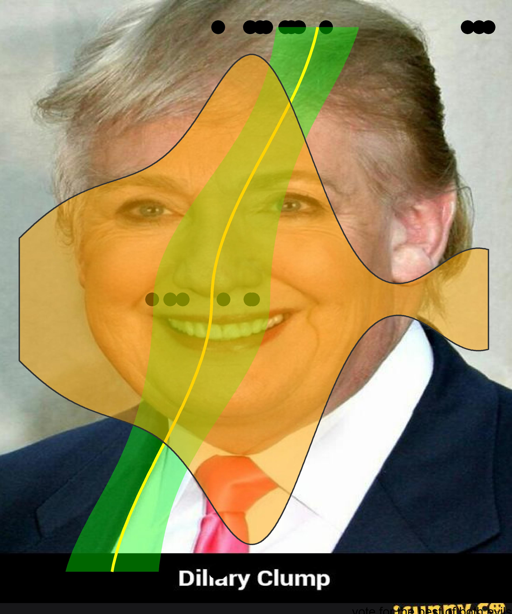
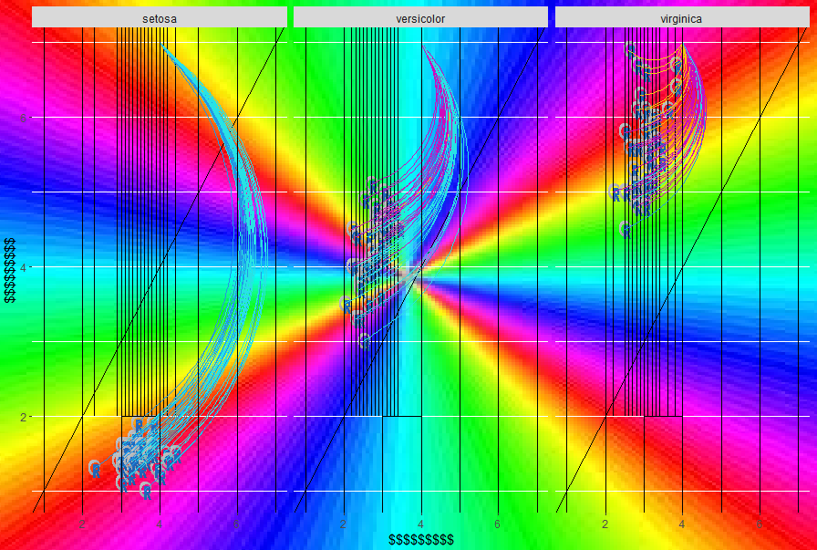
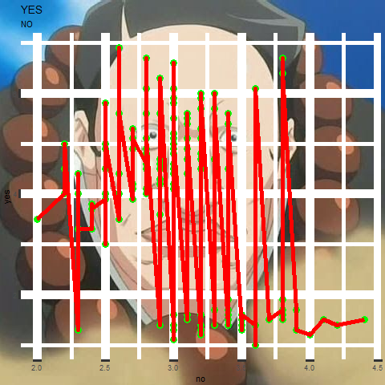
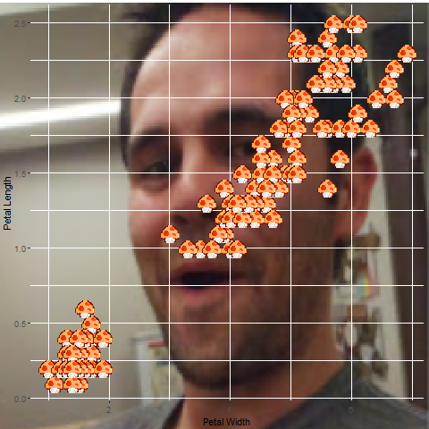
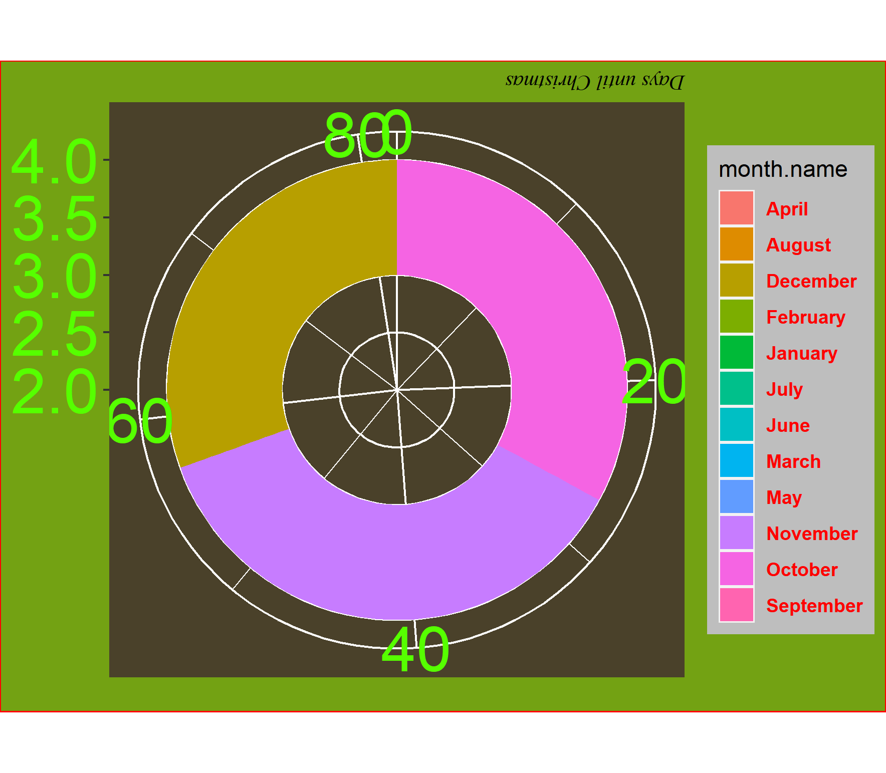
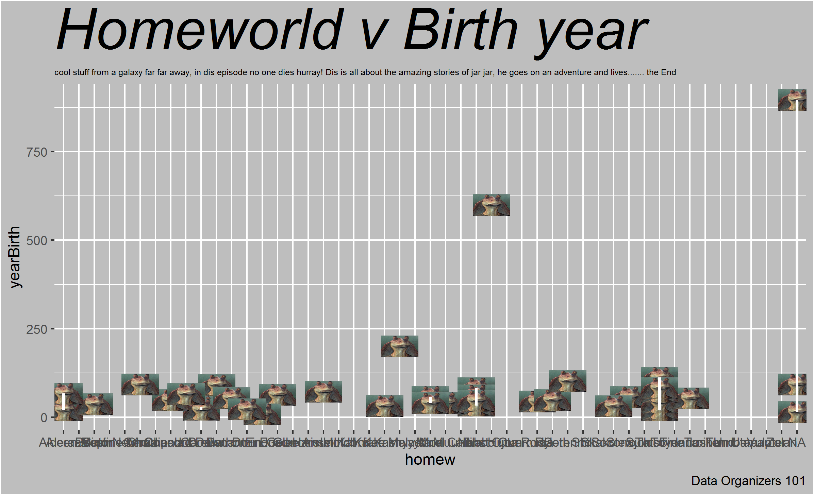
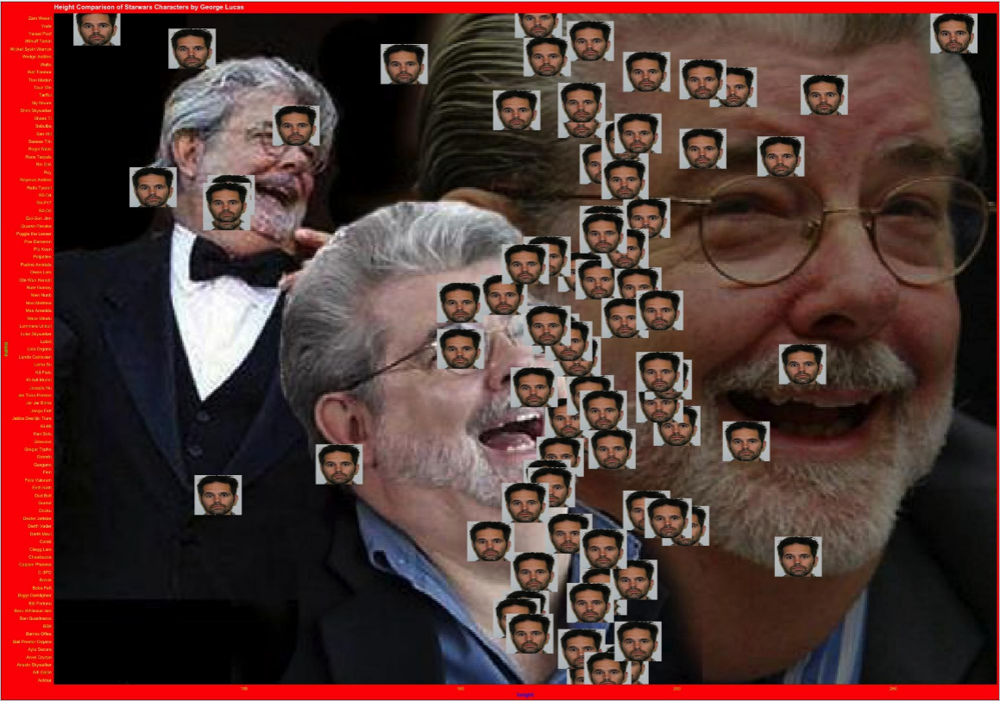

# The Fall 2020 Ugly ggplot Contestants...

Presented in alphabetical order

___

## Baldwin

<div style= "float:center;position: relative;top:10px">
```{r, out.width = "500px",echo=FALSE}

```
</div>

___

## Hall

<div style= "float:center;position: relative;top:10px">
```{r, out.width = "500px",echo=FALSE}

```
</div>

___

## Jones

<div style= "float:center;position: relative;top:10px">
```{r, out.width = "500px",echo=FALSE}

```
</div>

___


## Millar

<div style= "float:center;position: relative;top:10px">
```{r, out.width = "500px",echo=FALSE}

```
</div>

___


## Naylor

<div style= "float:center;position: relative;top:10px">
```{r, out.width = "500px",echo=FALSE}

```
</div>

___

## Nuñez

<div style= "float:center;position: relative;top:10px">
```{r, out.width = "500px",echo=FALSE}

```
</div>

___


## Vilela

<div style= "float:center;position: relative;top:10px">
```{r, out.width = "500px",echo=FALSE}

```
</div>

___

