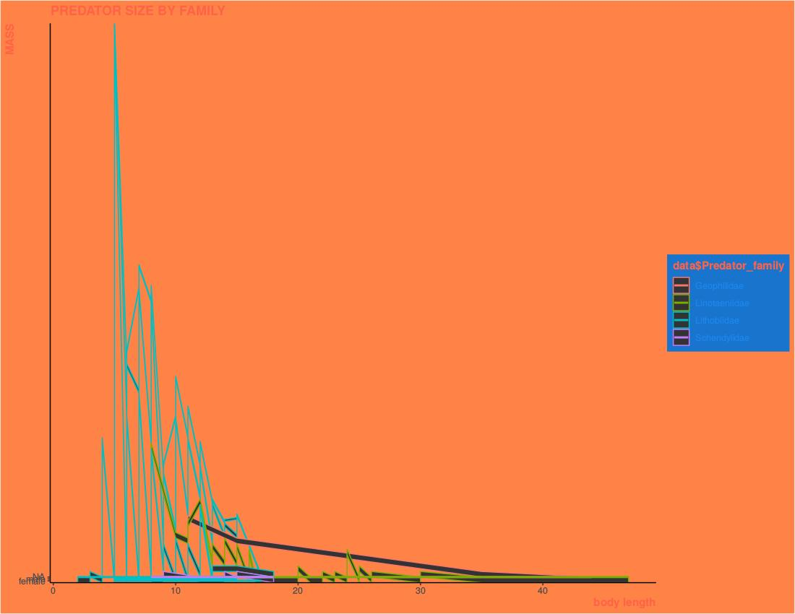

# The Ugly Plot Contest

#### The goal is to create a ggplot figure that breaks all the rules of sound figure design.

___

#### A good plot has the following:
+ **Easily distinguishable colors (colorblind-friendly) or grayscale**
+ **Properly labeled axes with appropriate scales**
+ **Legible font size**
+ **If a legend is present, it is easy to read and uses intuitive labels**
+ **The correct geoms for the data types**
+ **Doesn't hide data distributions by simplifying into a single meaningless geom**
+ **Facets that contain more than one data point, if there are facets at all**
+ **Proper aesthetic scales ... i.e., not a color gradient if a variable is discrete**

##### See [this very good site](https://rafalab.github.io/dsbook/data-visualization-principles.html) for a detailed look at what makes a good graph.

<br/><br/>

##### Making a truly bad graph can be automatic, but it takes a lot of skill to really tweak ggplot to get it to do what you want.  That's the point of this exercise; you will get practice at manipulating all aspects of how your plot is printed.

___

##### Here are some ugly plots from previous students:


<div style= "float:center;position: relative;top:10px">
```{r, out.width = "500px",echo=FALSE}

```
</div>

Iris, like you've never seen it before. Wonderfully unacceptable colors and point sizes.


<div style= "float:center;position: relative;top:10px">
```{r, out.width = "500px",echo=FALSE}
knitr::include_graphics("../media/badplot2.png")
```
</div>

Nice, horrible work with custom point images and annotation.


<div style= "float:center;position: relative;top:10px">
```{r, out.width = "500px",echo=FALSE}
knitr::include_graphics("../media/badplot3.jpeg")
```
</div>

Horrible legend labels, low resolution, truly foul all around.


<div style= "float:center;position: relative;top:10px">
```{r, out.width = "500px",echo=FALSE}

```
</div>

I have no idea. I just don't understand.


<div style= "float:center;position: relative;top:10px">
```{r, out.width = "500px",echo=FALSE}

```
</div>

I think it's kind of a line plot without grouping. I also think "mass" and "gender" somehow share the y-axis. I hate it.


<div style= "float:center;position: relative;top:10px">
```{r, out.width = "500px",echo=FALSE}

```
</div>

The double meaningless legends take this to a new level of greatness. Bonus points for low-res export.


## Think you can beat these?!