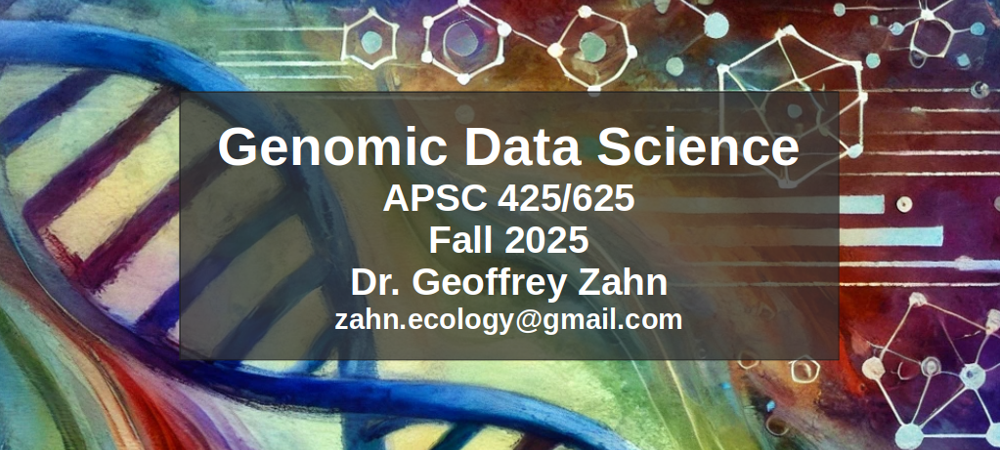

```{r setup, include=FALSE}
knitr::opts_chunk$set(echo = FALSE,warning = FALSE,message = FALSE)
library(knitr)
library(kableExtra)
```


```{r}

```

# **Course Description**

This course provides an introduction to genomic data science, integrating computational tools, analytical techniques, and biological knowledge to interpret and analyze genomic datasets. The course emphasizes the application of genomic data science to current issues, ethical considerations, and emerging challenges in the field. Students will develop skills in programming, bioinformatics, and data analysis while exploring the societal implications and future frontiers of genomic science.

___

# **Learning Objectives**

By the end of this course, students will be able to:

  1. Understand the fundamental principles of genomics and the computational
challenges associated with genomic data.
  2. Apply programming languages (e.g., Python, R) and bioinformatics tools to analyze genomic data.
  3. Interpret data from high-throughput sequencing technologies such as RNA-seq, ChIP-seq, and metagenomics.
  4. Identify and evaluate ethical concerns, including privacy, data sharing, and the impact of genomic research on individuals and society.
Analyze current issues in genomics, such as precision medicine, pathogen surveillance, and climate change adaptation.
  5. Explore future challenges and frontiers in genomic data science, including AI-driven genomics, synthetic biology, and pan-genomics.

___

# **Course Materials**

**Textbook:**
Bioinformatics Data Skills.  Vince Buffalo. 2015. O'Reilly Media, Inc. ISBN: [9781449367503](https://www.oreilly.com/library/view/bioinformatics-data-skills/9781449367480/){target="_blank"}

**Software:**
Python v.3.12+, R v.4.4+, bash v.5.1+, and other bioinformatics tools

**Readings:**
Peer-reviewed articles and media on genomics-related current issues

___

# **Course structure**

The course combines **lectures**, **readings & discussions**, and **computational lab work**. _Graduate students will additionally be required to complete a cumulative project_ that addresses one of the future challenges in genomic data science (see below). The planned timeline will spend approximately 2 weeks on each of the topics below.

## **Lecture topics:**

    1. Introduction to Genomics and Big Data
        - Scope and challenges of genomic data science
        - Overview of omics technologies (genomics, transcriptomics, proteomics, epigenomics)
        - Data generation, acquisition, and integration
    2. High-Throughput Sequencing Technologies
        - Principles and workflows of DNA, RNA, and single-cell sequencing
        - Platforms (Illumina, PacBio, Nanopore)
        - Quality assessment, read mapping, and preprocessing
    3. Genome Assembly and Annotation
        - De novo assembly and reference-guided assembly
        - Tools and pipelines (SPAdes, Canu, Prokka)
        - Structural annotation and functional annotation (e.g., GO terms, KEGG pathways)
    4. Transcriptomics
        - RNA-Seq analysis: differential expression, isoform analysis
        - Tools and pipelines (e.g., STAR, DESeq2, edgeR)
        - Single-cell transcriptomics and spatial transcriptomics
    5. Variant Calling and Genomic Diversity
        - SNP and indel detection
        - Population genomics and genome-wide association studies (GWAS)
        - Structural variants and their implications
    6. Metagenomics and Microbiome Analysis
        - Taxonomic profiling and functional analysis of microbial communities
        - Comparative metagenomics and metatranscriptomics
        - Tools and pipelines(MetaPhlAn, Kraken, HUMAnN)
    7. Epigenomics
        - DNA methylation, histone modifications, and chromatin accessibility
        - Experimental techniques (ChIP-seq, ATAC-seq, bisulfite sequencing)
        - Data analysis and interpretation
    8. Machine Learning and AI in Genomics
        - Supervised and unsupervised learning for genomic data
        - Deep learning applications (e.g., predicting regulatory regions, variant effects)
        - Tools and frameworks (e.g., TensorFlow, scikit-learn, PyTorch)
        
___

## **Lab challenges:**

As we build a foundation of understanding throughout the term, we will apply our knowledge using computational tools on real genomic data sets. Labs will employ common bioinformatics tools to build pipelines that solve problems related to lecture topics. We will cover theory and build computational skills in class during lab days, but each lab will require significant individual work outside of class. There will be a lab challenge associated with each of the topics above.

**Example lab: High-Throughput Sequencing Technologies and data pre-processing**

Given an understanding of the data properties of various sequencing technologies, we will build and evaluate a series of data preprocessing pipelines using a variety of command line tools. Each of these pipelines will be deployed on data sets generated by a range of 5 common sequencing platforms (Illumina MiSeq/NextSeq/NovaSeq, PacBio, Oxford Nanopore). Each student will be responsible for running a set of pipelines outside of class, and reporting pre-and post-processing statistics.
Back in the classroom, we will compile the results from each experiment. Finally, we will compare the outcomes and build a “best-practices flowchart” of the current best tools and parameters for each data type. 

## **Readings & discussions:**

Seminar-style discussions of literature will be incorporated that address cross-cutting themes in genomic data science. These are intended to expand your awareness of current issues in GDS and to spark discussion about improvements that can be made and the implications of GDS in the real world.

**Tentative discussion themes:**

    1. Data Management and Integration
        - FAIR principles (Findable, Accessible, Interoperable, Reusable)
        - Cloud computing and data storage (e.g., AWS, Google Cloud, HPC clusters)
        - Workflow management systems (e.g., Nextflow, Snakemake)
    2. Statistical Methods for Genomics
        - Bayesian inference and advanced regression models
        - Hypothesis testing in high-dimensional data
        - Statistical challenges in multi-omics studies
    3. Ethics and Policy in Genomics
        - Privacy and security of genomic data
        - Equity in access to genomic technologies
        - Implications of genomic studies for public policy
    4. Emerging Technologies
        - Advances in long-read sequencing
        - Quantum computing in genomics
        - Real-time sequencing applications
    5. Applications of Genomics to Current Issues
        - Precision medicine and pharmacogenomics
        - Genomics in agriculture and climate adaptation
        - Pathogen surveillance and pandemic preparedness

## **Cumulative projects:**

**Students enrolled in graduate credit will also be required to complete a synthesis project on a future challenge in genomic data science (topics identified below).** You will write a journal article in the *Perspectives* format for PLOS Computational Biology that addresses one of the topics below and identifies current progress being made in that challenging area. The article should also make supported recommendations for future directions and identify how making progress in this area will improve scientific/societal outcomes for genomic data.

Perspectives in PLOS Computational Biology typically reflect an author's viewpoint on a particular development in science and how, based on current knowledge of the field and the progress in it, this development evidences, or can lead to change in how science is conducted or interpreted. Perspectives are intended to be more prospective than retrospective but require sufficient background to place the points made in context. Perspectives are intended to invite debate and further comment as appropriate. The length should be no more than 2500 words.

**Example Perspectives:**

Markowetz F (2015) You Are Not Working for Me; I Am Working with You. PLoS Comput Biol 11(9): e1004387. (https://doi.org/10.1371/journal.pcbi.1004387)[https://doi.org/10.1371/journal.pcbi.1004387]

Cerullo MA (2015) The Problem with Phi: A Critique of Integrated Information Theory. PLoS Comput Biol 11(9): e1004286. (https://doi.org/10.1371/journal.pcbi.1004286)[https://doi.org/10.1371/journal.pcbi.1004387]

Your “perspective” manuscripts will undergo peer review throughout the semester. They will be graded pass/fail after multiple rounds of revisions. The projects are required to pass in order to receive a grade in the course, though they will not be factored into the final grade. See “Assessment” section below.

### **Pressing challenges in genomic data science (potential topics):**

  **1. Managing and Interpreting the Deluge of Genomic Data**

  - **Challenge:** High-throughput sequencing technologies generate vast quantities of genomic data. Managing, storing, and processing these datasets in an efficient, scalable, and cost-effective way is a critical issue.
  - **Needs:**
      - Development of better compression algorithms and storage solutions.
      - Enhanced computational tools for analyzing multi-petabyte-scale datasets.
      - Streamlined pipelines for integrating and harmonizing heterogeneous data types (e.g., genomics, transcriptomics, epigenomics).

  **2. Interpreting Noncoding and Complex Genomic Regions**

  - **Challenge:** A significant portion of the genome remains poorly understood, including noncoding regions that regulate gene expression and structural variations with potential functional impacts.
  - **Needs:**
      - Improved annotation of noncoding regions and understanding their role in gene regulation and disease.
      - Enhanced computational methods for analyzing structural variants and repetitive elements.
      - Insights into the 3D structure of the genome and its role in cellular function.

  **3. Precision Medicine and Individualized Genomics**

  - **Challenge:** Translating genomic discoveries into actionable insights for individualized healthcare remains difficult due to the complexity of genotype-phenotype relationships.
  - **Needs:**
      - More accurate tools for predicting the functional impact of genetic variants.
      - Integration of genomic data with other health data (e.g., electronic health records, proteomics, metabolomics).
      - Broad population-level studies to ensure equitable representation in genomic medicine.

  **4. Real-Time Genomics for Global Health**

  - **Challenge:** Genomics is increasingly used for pathogen surveillance and outbreak response (e.g., COVID-19), but real-time genomics is not yet universally feasible.
  - **Needs:**
      - Scalable pipelines for near real-time pathogen sequencing and variant tracking.
      - Global infrastructure for sharing genomic data quickly and securely.
      - Better predictive models for anticipating the evolution of pathogens.

  **5. Ethical and Societal Challenges**

  - **Challenge:** The ethical and societal implications of genomic data science are profound, particularly in privacy, data sharing, and equitable access to technologies.
  - **Needs:**
    - Development of robust data privacy frameworks that protect individuals while enabling research.
    - Policies to prevent misuse of genomic data, including discrimination and bioterrorism.
    - Addressing disparities in access to genomic technologies across low- and middle-income countries.

  **6. Data Integration and Multi-Omics Analysis**
  
  - **Challenge:** Integrating genomic data with other omics layers (e.g., transcriptomics, proteomics, epigenomics) and environmental factors to create a holistic view of biological systems is still in its infancy.
  - **Needs:**
    - Advanced statistical and machine learning methods for multi-omics integration.
    - Development of standardized data formats and tools for cross-platform compatibility.
    - Visualization tools that can handle complex, multi-layered datasets effectively.

  **7. Democratizing Genomic Data Science**
  
  - **Challenge:** Many genomic tools and resources are inaccessible due to technical complexity, lack of infrastructure, or costs.
  - **Needs:**
    - Cloud-based platforms and tools that lower the technical barrier to entry.
    - Training programs to build capacity in underrepresented and underserved communities.
    - Open-source solutions to make genomic tools and datasets freely available.

  **8. Expanding Genomics Beyond Model Organisms**
  
  - **Challenge:** The vast majority of genomic data comes from a limited number of species, leaving significant gaps in our understanding of global biodiversity.
  - **Needs:**
    - High-quality reference genomes for underrepresented species, especially in non-model organisms and endangered species.
    - Advances in sequencing and assembly technologies for complex genomes.
    - Tools for comparative analysis across diverse species and ecosystems.

  **9. AI and Machine Learning in Genomics**
  
  - **Challenge:** While AI and machine learning show great promise in genomics, their full potential is not yet realized due to challenges like model interpretability and data bias.
  - **Needs:**
    - Transparent and interpretable AI models that can explain biological mechanisms.
    - Addressing biases in training datasets to ensure fair and accurate predictions.
    - Development of hybrid models that combine machine learning with biological knowledge.

  **10. Understanding Polygenic and Multifactorial Traits**
  
  - **Challenge:** Many traits and diseases are influenced by the interaction of multiple genes and environmental factors, making their analysis highly complex.
  - **Needs:**
    - Better statistical models for studying polygenic risk scores.
    - Integration of environmental and lifestyle factors with genomic data.
    - Large-scale longitudinal studies to capture dynamic interactions.

  **11. Applications in Synthetic Biology and Genome Engineering**
  
  - **Challenge:** Genomic data is critical for synthetic biology and genome editing, but predictive tools and ethical frameworks are lacking.
  - **Needs:**
      - Improved models for designing synthetic genes and pathways.
      - High-throughput tools for validating synthetic constructs.
      - Ethical frameworks to govern the use of genome editing technologies like CRISPR.

  **12. Climate Change and Environmental Genomics**
  
  - **Challenge:** Understanding how genomes adapt to changing environments is essential for conservation and agriculture in the face of climate change.
  - **Needs:**
      - Genomic studies on stress resilience in plants, animals, and microbes.
      - Application of genomic tools for conservation biology and habitat restoration.
      - Predictive models for evolutionary adaptation under climate change scenarios.

___

# **Course Schedule**

Week 1: Introduction to Genomic Data Science

    • Overview of genomics and bioinformatics
    • Relevance of genomics to contemporary issues (e.g., precision medicine, agriculture, global health)
    • Computational tools for genomic data

Week 2: Biological Foundations for Genomic Data Science

    • DNA, RNA, proteins, and the central dogma
    • Genome structure and variation
    • Case study: Genomics in vaccine development (e.g., mRNA technology)

Week 3: Introduction to Python and R for Genomics

    • Basics of Python and R programming
    • Biological data handling in programming
    • Ethical considerations in data processing

Week 4: High-Throughput Sequencing (HTS) Technologies

    • DNA sequencing technologies (e.g., Illumina, PacBio, Nanopore)
    • Quality control and preprocessing
    • Current issue: Challenges in equitable access to sequencing technologies

Week 5: Genome Assembly and Annotation

    • De novo assembly and reference-guided assembly
    • Functional annotation tools and databases
    • Future challenge: Creating high-quality genome assemblies for non-model organisms
    
Week 6: RNA-Seq Data Analysis

    • Transcriptomics workflow and differential gene expression
    • Applications in disease research and personalized medicine
    • Ethical concerns in transcriptomic studies
    
Week 7: Metagenomics and Microbial Community Analysis

    • Metagenomic sequencing and taxonomic profiling
    • Case study: Genomics in pathogen surveillance (e.g., SARS-CoV-2 variants)
    • Challenges in data sharing during pandemics
    
Week 8: Midterm Review and Exam

    • In-class review session
    • Midterm exam
    
Week 9: Variant Calling and Genotype Analysis

    • SNP and indel detection
    • Population genomics and GWAS basics
    • Ethical issues in genetic testing and ancestry tracing
    
Week 10: Epigenomics and ChIP-Seq Analysis

    • DNA methylation, histone modifications, and their roles in disease
    • Applications in cancer research and environmental epigenetics
    • Discussion: Privacy risks in epigenetic data
    
Week 11: Structural Genomics and 3D Genome Organization

    • Structural variation detection and Hi-C analysis
    • Current frontier: Understanding 3D genome structure in evolution and development
    
Week 12: Machine Learning in Genomics

    • Basics of machine learning for genomic data
    • Applications: Predicting disease risk and drug response
    • Ethical considerations: Bias and transparency in AI-driven genomics

Week 13: Functional Genomics and Pathway Analysis

    • Gene ontology and pathway enrichment analysis
    • Applications in agricultural genomics and climate change adaptation
    • Future frontier: Synthetic biology and genome engineering

Week 14: Ethical and Societal Implications in Genomics

    • Privacy and security in genomic research
    • Genomic data sharing and equity in access
    • Discussion: Potential misuse of genomic data (e.g., bioweapons)

Week 15: Future Challenges and Frontiers in Genomics

    • Pan-genomics and the study of genetic diversity
    • Synthetic biology and editing technologies (e.g., CRISPR)
    • AI-driven genomics and systems biology
    • Student-led discussion on the most promising and concerning frontiers

Week 16: Final Project Presentations and Exam

    • Presentations of final projects addressing a current genomic issue
    • Peer feedback and discussion
    • Comprehensive final exam

___

# **Assessment**

  - Weekly lab challenge assignments (40%)
  - Weekly quizzes on lecture material (30%)
  - Participation in discussions (10%)
  - Midterm and final exams (20%)
  - Final project (grad students only): Perspective exploring a current genomic issue (Pass/Fail)

