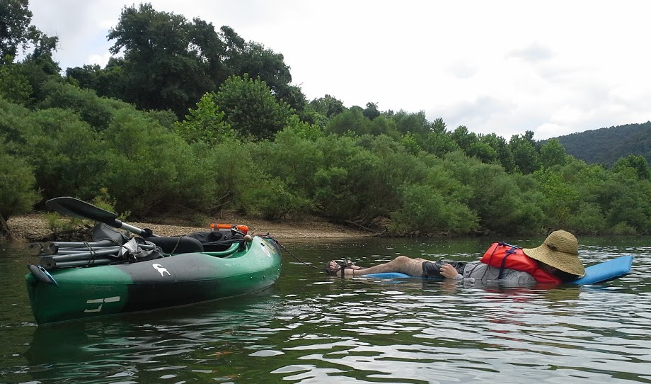

<head>

<!-- Global site tag (gtag.js) - Google Analytics -->
<script async src="https://www.googletagmanager.com/gtag/js?id=UA-61759609-2"></script>
<script>
  window.dataLayer = window.dataLayer || [];
  function gtag(){dataLayer.push(arguments);}
  gtag('js', new Date());

  gtag('config', 'UA-61759609-2');
</script>

</head>


<style type="text/css">
.main-container {
  max-width: 1800px;
  margin-left: auto;
  margin-right: auto;
}
</style>

<style>
div.gray { background-color:#aabdaf; border-radius: 5px; padding: 20px;}
</style>
<div class = "gray">


<style>
div.blue { background-color:#a89d82; border-radius: 5px; padding: 20px;}
</style>
<div class = "blue">

## [HOME](http://gzahn.github.io/) | [ABOUT ME](http://gzahn.github.io/about-me/) | [LAB](http://gzahn.github.io/lab/) | [RESEARCH](http://gzahn.github.io/pubs-and-pres/) | [TEACHING](http://gzahn.github.io/coursemap/) | [CV](http://gzahn.github.io/about-me/CV_pagedown.pdf)


# **Zahn Lab - Utah Valley University**

<div style= "float:right;position: relative;top:20px">
```{r, out.width = "600px",echo=FALSE}

```

<br><br><br><br><br><br><br><br><br>
<br><br><br>

</div>

___

<br>

## **Contact Info:**

### Geoffrey Zahn<br>
### Biology Department - Utah Valley University<br>
### 800 W University Parkway - SB243c<br>
### Orem, UT 84058<br>
### zahn.geoff@gmail.com
##### Twitter: [GeoffZahn](https://twitter.com/GeoffZahn){target="_blank"}
<br><br><br>

</div>


