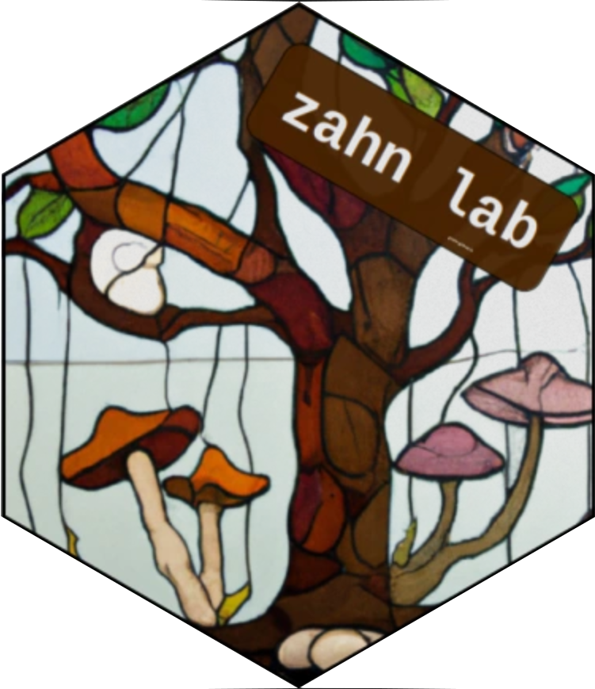

<head>

<!-- Global site tag (gtag.js) - Google Analytics -->
<script async src="https://www.googletagmanager.com/gtag/js?id=UA-61759609-2"></script>
<script>
  window.dataLayer = window.dataLayer || [];
  function gtag(){dataLayer.push(arguments);}
  gtag('js', new Date());

  gtag('config', 'UA-61759609-2');
</script>

</head>


<style type="text/css">
.main-container {
  max-width: 1800px;
  margin-left: auto;
  margin-right: auto;
}
</style>

<style>
div.gray { background-color:#aabdaf; border-radius: 5px; padding: 20px;}
</style>
<div class = "gray">


<style>
div.blue { background-color:#a89d82; border-radius: 5px; padding: 20px;}
</style>
<div class = "blue">

<div style= "float:right;position: relative;top:20px;right:20px">
```{r, out.width = "300px",echo=FALSE,fig.align='right'}

```
</div>

## [HOME](http://gzahn.github.io/) | [ABOUT ME](http://gzahn.github.io/about-me/) | [LAB](http://gzahn.github.io/lab/) | [RESEARCH](http://gzahn.github.io/pubs-and-pres/) | [TEACHING](http://gzahn.github.io/coursemap/) | [CV](https://gzahn.github.io/about-me/CV.pdf)


# **Zahn Lab - Utah Valley University**

## The Zahn lab is currently housed in the Department of Environmental Studies at Dartmouth College


```{r, out.width = "500px",out.height="375px",echo=FALSE}
knitr::include_graphics(c("./media/moss_mushrooms.jpg","./media/geoff_w_statue.jpg"))
```

<br>


___

<br>

### **Contact Info:**

**Geoffrey Zahn**

**Biology Department - Utah Valley University**

**Environmental Studies Department - Dartmouth College**

**zahn.geoff@gmail.com**

<br><br><br><br><br><br><br><br><br><br><br><br>

</div>


