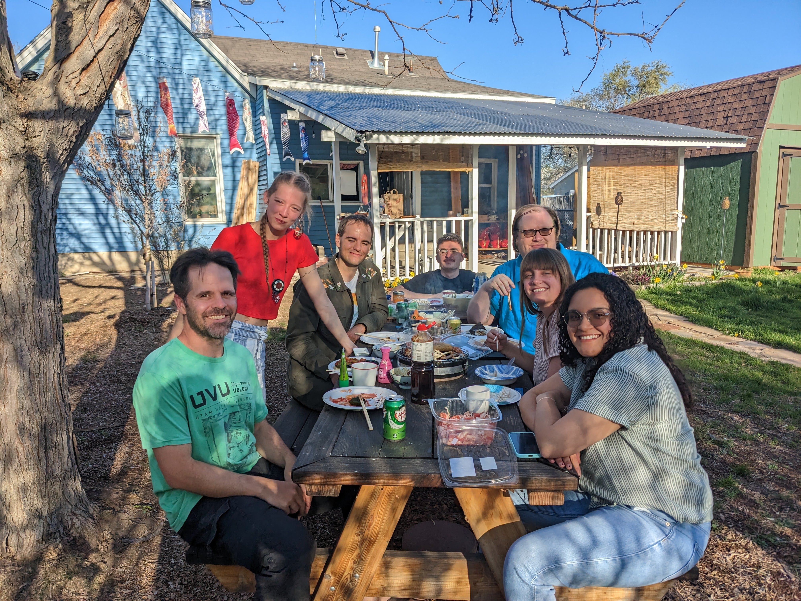
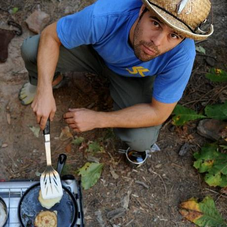

<style type="text/css">
.main-container {
  max-width: 1800px;
  margin-left: auto;
  margin-right: auto;
}
</style>


## [HOME](http://gzahn.github.io/) | [ABOUT ME](http://gzahn.github.io/about-me/) | [LAB](http://gzahn.github.io/lab/) | [RESEARCH](http://gzahn.github.io/pubs-and-pres/) | [TEACHING](http://gzahn.github.io/coursemap/) | [CV](https://gzahn.github.io/about-me/CV.pdf)

___

<style>
div.gray { background-color:#aabdaf; border-radius: 5px; padding: 20px;}
</style>
<div class = "gray">


## Our lab investigates the causes and consequences of microbial community formation, including the roles of fungi in symbioses, how microbes respond to and influence a changing environment, and how to harness microbes to improve conservation of macroorganisms.

### We use field surveys, experimental microcosms, molecular tools, ML/AI modeling, and bioinformatics to address important questions about how microbiomes assemble and how they interact to shape host phenotype.

### We also have *in silica* projects that leverage public metagenomic data to uncover global-scale fungal diversity and distribution.

___


<div style= "float:right;position: relative;">
```{r, out.width = "400px",echo=FALSE}

```
</div>


### Links (lab-only):

[**Projects & Data**](https://drive.google.com/drive/folders/11KhuVoiEB_GrGtuzr512420ltvLh8GDs?usp=sharing)

[**Lab meetings**](https://drive.google.com/drive/folders/1g6QNcbcsU8nlakyWu1I0U-gg1d2fk_TI?usp=sharing)

[**Working manuscripts**](https://drive.google.com/drive/folders/1_0dXBg5c0TCqa-6bO30AmA_rKGcnDoOX?usp=sharing)

[**Resources & media**](https://drive.google.com/drive/folders/1Q86Nk7MciILU1UZ1ZSohhql4SPe-jIuo?usp=sharing)


___


### Here’s the [online lab handbook](https://gzahn.github.io/lab/lab_handbook.html) with expectations and information for lab members.

### Space is limited, and applications are accepted on a rolling basis. Please feel free come by my office to chat with me if you have a specific project in mind. Priority is given to students with at least 2 years left until graduation.

### Here's our [shared reading folder](https://www.zotero.org/groups/415455/microbe_ecology/items?).

### If you need a reference letter from me for graduate or professional school, please see [these instructions](https://gzahn.github.io/lab/reference_letters.html)

</div>


<style>
div.blue { background-color:#a89d82; border-radius: 5px; padding: 20px;}
</style>
<div class = "blue">

<center>
# **People**
<br>

___

<br>

```{r, out.width = "200px",echo=FALSE,fig.pos='right'}

```

### **Geoff Zahn, PI**
<br>


```{r, out.width = "200px",echo=FALSE,fig.pos='right',out.height='200px'}
knitr::include_graphics(c("../media/Tayler_Fearn.png","../media/austen_miller_pic.png"))
```

###  **[Tayler Fearn](https://tcfearn1999.github.io/)** &emsp; &nbsp;&nbsp; **[Austen Miller](https://amaceituna.github.io/)**

Neural net community modeling &emsp;&emsp;&emsp; Spatial endophyte assembly &emsp;

<br>

___

## **Alumni**

(and last known whereabouts)
<br>

<br>


```{r, out.width = "200px",echo=FALSE,fig.pos='right',out.height='200px'}
knitr::include_graphics(c("../media/david_parker_pic.png","../media/jacob_mora_pic.jpeg"))
```

### **[David Parker](https://www.uvu.edu/news/wolverine-stories/2023/02/2023_02_08_wolverine_stories_david_parker.html)** &emsp; &nbsp;&nbsp; **[Jacob Mora](https://jakemora.github.io)**

Truncating cancer metastasis &emsp;&emsp;&emsp; Aquatic plant microbiomes

<br>


```{r, out.width = "200px",echo=FALSE,out.height='200px'}
knitr::include_graphics(c("../media/josh_leon_pic.jpeg","../media/magnolia_morelli_pic.png"))
```

### **&nbsp;&nbsp;&nbsp;[Josh Leon](https://jleon123.github.io/)** &emsp; &nbsp;&nbsp; **[Magnolia Morelli](https://magnoliamorelli.github.io/)**

PhD - UNC Chapel Hill &emsp;&emsp;&emsp;&emsp;&emsp;&emsp; Fungal genomics &emsp;&emsp;

<br>


```{r, out.width = "200px",echo=FALSE,fig.pos='right',out.height=200}
knitr::include_graphics(c("../media/jo_hickman_pic.jpeg","../media/clayton_rawson_pic.jpg"))
```

### **[Jo Hickman](https://kjehickman.github.io)** &emsp;&nbsp;  **Clayton Rawson**

PhD - MIT/WHOI &emsp;&emsp;&emsp;&emsp;&emsp; DO/PhD - Noorda/BYU

<br>

```{r, out.width = "200px",echo=FALSE,fig.pos='right',out.height="200px"}
knitr::include_graphics(c("../media/matthew_nielsen_pic.jpeg","../media/alyssa_tidwell_pic.jpg"))
```

### **Matthew Nielsen** &emsp;&nbsp; **Alyssa Tidwell**

DDS - Univ. of Utah &emsp;&emsp;&emsp;&emsp;&emsp; PhD - ORNL/UT Knoxville

<br>

```{r, out.width = "200px",echo=FALSE,fig.pos='right',out.height='200px'}
knitr::include_graphics(c("../media/reagan_dodge_pic.jpeg","../media/josh_zushi_pic.jpg"))
```

### **Reagan Dodge**  &emsp;&nbsp;&nbsp;&nbsp; **Josh Zushi**

BioFire Defense, Inc. &emsp;&emsp;&emsp;&emsp;&emsp;&nbsp; Instructure, Inc.

<br>

```{r, out.width = "200px",echo=FALSE,fig.pos='right',out.height='200px'}
knitr::include_graphics(c("../media/joseph_jimenez_pic.jpg","../media/sam_smalley_pic.jpeg"))
```

### **Joseph Jimenez** &emsp;&nbsp;&nbsp;&nbsp; **Sam Smalley**

DDS - Univ. of Texas &emsp;&emsp;&emsp;&emsp;&emsp;&nbsp; PhD - PNNL/WSU

<br>

```{r, out.width = "200px",echo=FALSE,fig.pos='right',out.height='200px'}
knitr::include_graphics(c("../media/bryce_brunetti_pic.jpg","../media/spencer_mcgee_pic.jpg"))
```

### **Bryce Brunetti** &emsp;&nbsp;&nbsp;&nbsp; **Spencer McGee**

BioFire Defense, Inc. &emsp;&nbsp;&nbsp;&nbsp; Intermountain Healthcare

<br>

```{r, out.width = "200px",echo=FALSE,fig.pos='right',out.height='200px'}
knitr::include_graphics(c("../media/nicholas_long_pic.jpg","../media/harrison_haws_pic.png"))
```

### **Nicholas Long** &emsp;&nbsp;&nbsp;&nbsp; **Harrison Haws**

DDS - Univ. of Iowa &emsp;&emsp;&emsp;&nbsp;&nbsp;&nbsp; DDS - Univ. of the Pacific

<br>


</center>
