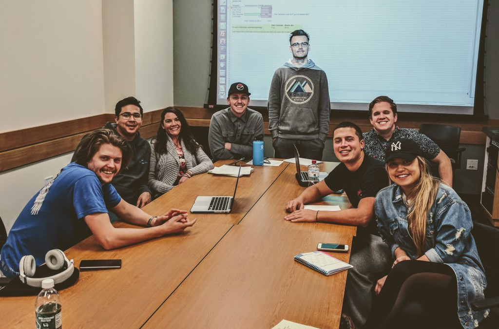
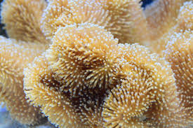
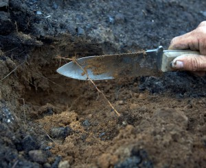
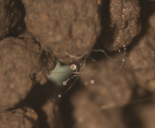
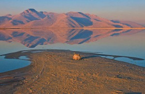
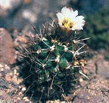

<style type="text/css">
.main-container {
  max-width: 1800px;
  margin-left: auto;
  margin-right: auto;
}
</style>

## [HOME](http://gzahn.github.io/) | [ABOUT ME](http://gzahn.github.io/about-me/) | [LAB](http://gzahn.github.io/lab/) | [RESEARCH](http://gzahn.github.io/pubs-and-pres/) | [BLOG](http://gzahn.github.io/blog-archive/)

___

<style>
div.gray { background-color:#aabdaf; border-radius: 5px; padding: 20px;}
</style>
<div class = "gray">

# Lab!

## Our lab investigates the causes and consequences of microbial community formation, including the roles of fungi in symbioses, how microbes respond to and influence a changing environment, and how to harness microbes to improve conservation of macroorganisms.

<div style= "float:right;position: relative;">
```{r, out.width = "400px",echo=FALSE}

```
</div>


## Here’s the [online lab handbook](https://github.com/gzahn/Lab_Manual/blob/master/README.md) with expectations and information for lab members.

## Students interested in joining the lab should [fill out this application](https://github.com/gzahn/Profile/raw/master/Student_Research_Application.docx) and bring a hard copy to my office.

## Space is limited, and applications are accepted on a rolling basis. Please feel free come by my office to chat with me if you have a specific project in mind. Priority is given to students with at least 2 years left until graduation.

### Here's our [shared reading folder](https://www.zotero.org/groups/415455/microbe_ecology/items?).
</div>

<style>
div.blue { background-color:#a89d82; border-radius: 5px; padding: 20px;}
</style>
<div class = "blue">

# **We work with a number of systems, focused on microbial community structure and function:**
<br><br>

<div style= "float:right;position: relative;">
```{r, out.width = "400px",echo=FALSE}

```
</div>

## **Urbanized coral reefs and seagrass meadows**
### We're collaborating with the National University of Singapore to explore the microbes associating with corals, and are especially interested in tracking community structure during bleaching events.
<br><br><br><br><br><br><br>

<div style= "float:left;position: relative;left: -5px">
```{r, out.width = "400px",echo=FALSE,fig.}

```
</div>

## **Alpine forest fires**
### We're using microcosms and the natural laboratory of Utah alpine forests to study microbial succession in soils after fires. Our sampling includes fire sites from ~20 years ago to recently burned areas. 
<br><br><br><br><br><br><br><br>

<div style= "float:right;position: relative;">
```{r, out.width = "400px",echo=FALSE}

```
</div>

<br><br>

## **Soil microcosms**
### We are using manipulated soil microcosms and high-throughput DNA sequencing to tease apart the roles that amoeboid predators have in shaping bacterial communities and how this role is influenced by a changing climate. By experimentally manipulating soil communities, we can study predations role in nutrient cycling under changing climate conditions.
<br><br><br><br><br><br><br><br><br><br><br>


<div style= "float:left;position: relative;left: -5px;top: 15">
```{r, out.width = "400px",echo=FALSE}

```
</div>

## **The Great Salt Lake**
### We are curious about the fungi that inhabit the hypersaline environment of the Great Salt Lake, and are sampling water and sediment along a salinity gradient from a freshwater input source up through the extremely hypersaline northern half of the lake. Our initial aim is to collect baseline data on the microbial food web in this important habitat and explore the environmental limits of extremophilic fungi. We are building a culture library of the unique fungi we find.
<br><br><br><br><br>


<div style= "float:right;position: relative;">
```{r, out.width = "400px",echo=FALSE}

```
</div>

## **Critically-endangered cacti**
### Working with Capitol Reef National Park, we developed non-detrimental methods to explore the microbial endophytes of critically-endangered cacti. We are using this system to explore the role of fungal symbionts in alleviating pathogen damage and herbivory for these rare plants.
<br><br><br><br><br><br><br><br><br><br><br><br><br>
 
</div>