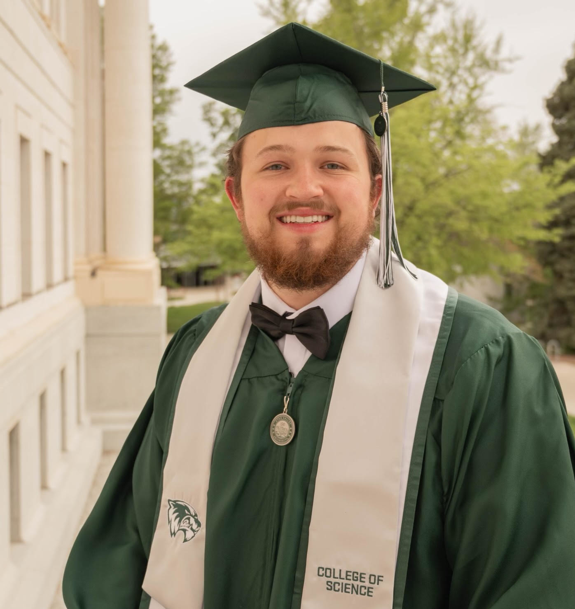
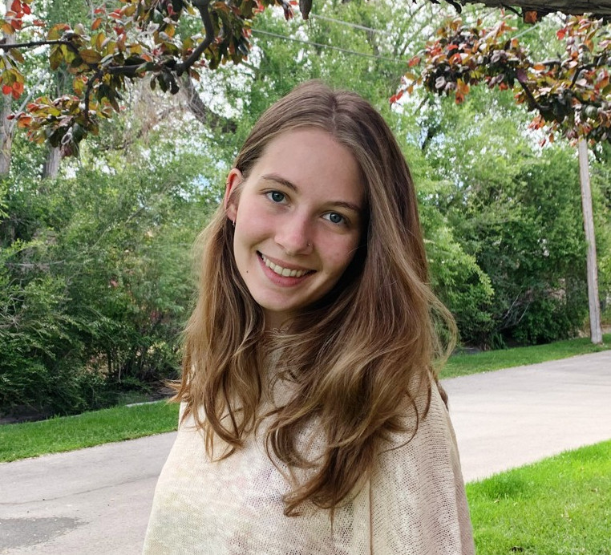
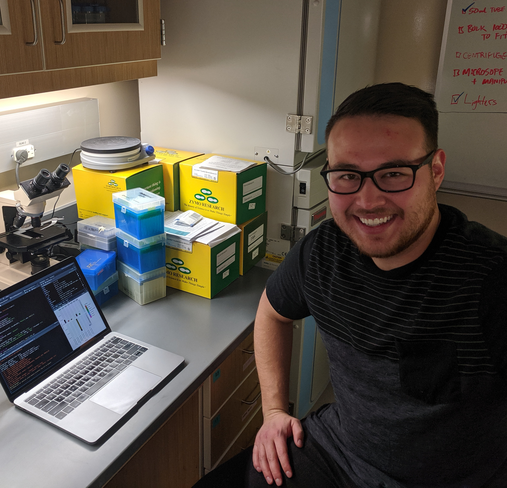

<style type="text/css">
.main-container {
  max-width: 1800px;
  margin-left: auto;
  margin-right: auto;
}
</style>


## [HOME](http://gzahn.github.io/) | [ABOUT ME](http://gzahn.github.io/about-me/) | [LAB](http://gzahn.github.io/lab/) | [RESEARCH](http://gzahn.github.io/pubs-and-pres/) | [TEACHING](http://gzahn.github.io/coursemap/)

___

<style>
div.gray { background-color:#aabdaf; border-radius: 5px; padding: 20px;}
</style>
<div class = "gray">


## Our lab investigates the causes and consequences of microbial community formation, including the roles of fungi in symbioses, how microbes respond to and influence a changing environment, and how to harness microbes to improve conservation of macroorganisms.

<div style= "float:right;position: relative;">
```{r, out.width = "400px",echo=FALSE}
knitr::include_graphics("../media/Lab_Cookout.jpg")
```
</div>


### Here’s the [online lab handbook](https://github.com/gzahn/Lab_Manual/blob/master/README.md) with expectations and information for lab members.

### Students interested in joining the lab should [fill out this application](https://github.com/gzahn/Profile/raw/master/Student_Research_Application.docx) and bring a hard copy to my office.

### Space is limited, and applications are accepted on a rolling basis. Please feel free come by my office to chat with me if you have a specific project in mind. Priority is given to students with at least 2 years left until graduation.

### Here's our [shared reading folder](https://www.zotero.org/groups/415455/microbe_ecology/items?).

### If you need a reference letter from me for graduate or professional school, please see [these instructions](https://gzahn.github.io/lab/reference_letters.html)

</div>


<style>
div.blue { background-color:#a89d82; border-radius: 5px; padding: 20px;}
</style>
<div class = "blue">

<center>
# **People**
<br>

___

<br>

```{r, out.width = "200px",echo=FALSE,fig.pos='right'}
knitr::include_graphics("../media/geoff_pic.jpeg")
```

### **Geoff Zahn, PI**
<br>


```{r, out.width = "200px",echo=FALSE,fig.pos='right'}

```

### **[Josh Leon](https://jleon123.github.io/)**

Plant microbiomes

<br>


```{r, out.width = "200px",echo=FALSE,fig.pos='right'}

```

### **[Magnolia Morelli](https://magnoliamorelli.github.io/)**

Fungal genomics

<br>


```{r, out.width = "200px",echo=FALSE,fig.pos='right'}
knitr::include_graphics("../media/Stick_Figure.png")
```

### **Jacob Mora**

Freshwater plant microbiomes

<br>


```{r, out.width = "200px",echo=FALSE,fig.pos='right'}

```

### **[Austen Miller](https://amaceituna.github.io/)**

Spatial endophyte assembly

___

## **Alumni**

(and last known whereabouts)
<br>

<br>


```{r, out.width = "200px",echo=FALSE,fig.pos='right'}

```

### **[Jo Hickman](https://kjehickman.github.io)**

PhD - MIT/WHOI

<br>


```{r, out.width = "200px",echo=FALSE,fig.pos='right'}

```

### **Clayton Rawson**

DO/PhD - Noorda/BYU

<br>

```{r, out.width = "200px",echo=FALSE,fig.pos='right'}

```

### **Matthew Nielsen**

DDS - Univ. of Utah

<br>

```{r, out.width = "200px",echo=FALSE,fig.pos='right'}
knitr::include_graphics("../media/alyssa_tidwell_pic.jpg")
```

### **Alyssa Tidwell**

PhD - ORNL/UT Knoxville

<br>

```{r, out.width = "200px",echo=FALSE,fig.pos='right'}

```

### **Reagan Dodge**

BioFire Defense, Inc.

<br>

```{r, out.width = "200px",echo=FALSE,fig.pos='right'}

```

### **Josh Zushi**

Instructure, Inc.

<br>

```{r, out.width = "200px",echo=FALSE,fig.pos='right'}

```

### **Joseph Jimenez**

DDS - Univ. of Texas

<br>

```{r, out.width = "200px",echo=FALSE,fig.pos='right'}

```

### **Sam Smalley**

PhD - PNNL/Washington State Univ.


<br>

```{r, out.width = "200px",echo=FALSE,fig.pos='right'}

```

### **Bryce Brunetti**

BioFire Defense, Inc.

<br>

```{r, out.width = "200px",echo=FALSE,fig.pos='right'}

```

### **Spencer McGee**

Intermountain Healthcare

<br>

```{r, out.width = "200px",echo=FALSE,fig.pos='right'}
knitr::include_graphics("../media/nicholas_long_pic.jpg")
```

### **Nicholas Long**

DDS - Univ. of Iowa

<br>

```{r, out.width = "200px",echo=FALSE,fig.pos='right'}

```

### **Harrison Haws**

DDS - Univ. of the Pacific


</center>
