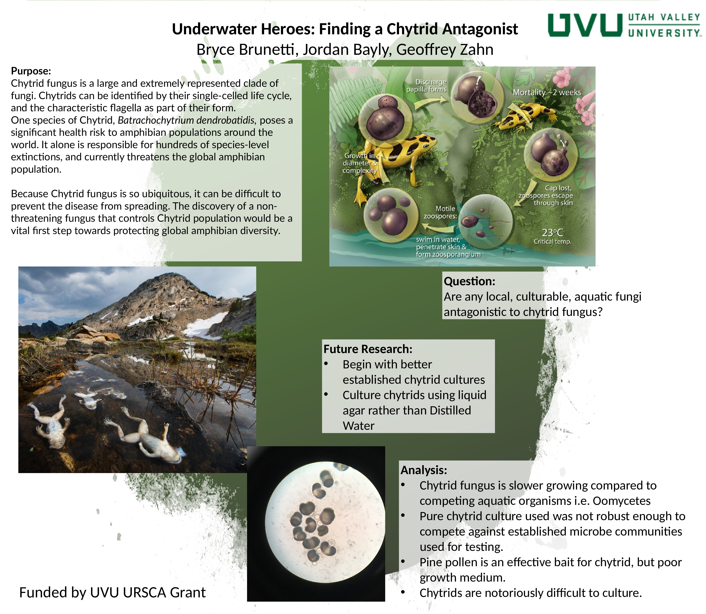

## [HOME](http://gzahn.github.io/) | [ABOUT ME](http://gzahn.github.io/about-me/) | [LAB](http://gzahn.github.io/lab/) | [RESEARCH](http://gzahn.github.io/pubs-and-pres/) | [BLOG](http://gzahn.github.io/blog-archive/) | [DATA COURSE](http://gzahn.github.io/data-course/)

# **Zahn Lab - Utah Valley University**

### Selected Student Research Posters

___

 

## **Contact Info:**

### Geoffrey Zahn 
### Biology Department - Utah Valley University 
### 800 W University Parkway - SB243c 
### Orem, UT 84058 
### zahn.geoff@gmail.com
   

