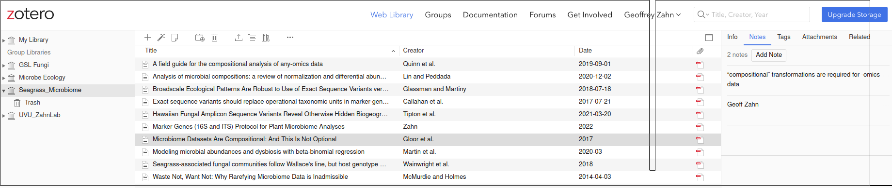
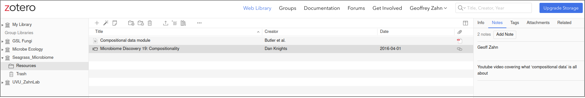

```{r setup, include=FALSE}
knitr::opts_chunk$set(echo = FALSE,warning = FALSE,message = FALSE)
```

## Task 1: Find primary literature that answers your questions

  - For each question/topic you're assigned in class, find a peer-reviewed article that helps address it
  - Add those articles to our shared Zotero library
  - Add a note that succinctly describes how the article is useful
  - Add a second note to each article with your name

Here's an example. The group Zotero library, a paper I added, and my two notes:



## Task 2: Find some easier-to-digest sources that help explain things

  - For each question/topic you're assigned in class, find one or two good online resources that
  
    1. Are helpful in understanding the concept
    2. Are geared towards usability
    3. These can be lecture notes, videos, diagrams, cartoons, R package vignetts, or whatever
    
  - Add those to our shared Zotero library in the "Resources" folder. Let's keep them separate from our citable papers.
  - Add two notes, as before. Your name, and what it is about.
  
  
  
## Task 3: Be ready to explain it to the class like we're all 5 years old

  - In class, you will have a few minutes (only a few) to help us all understand the concepts
  - Your in-class explanation should strive to avoid math, jargon, *etc.*. We are only 5 years old.

<br><br><br><br><br>

___