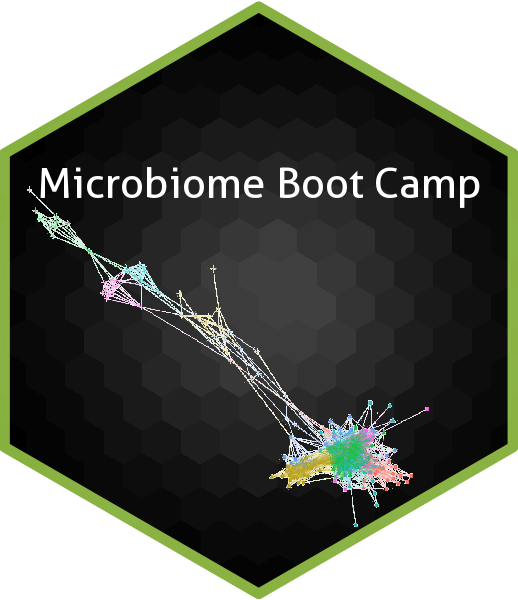
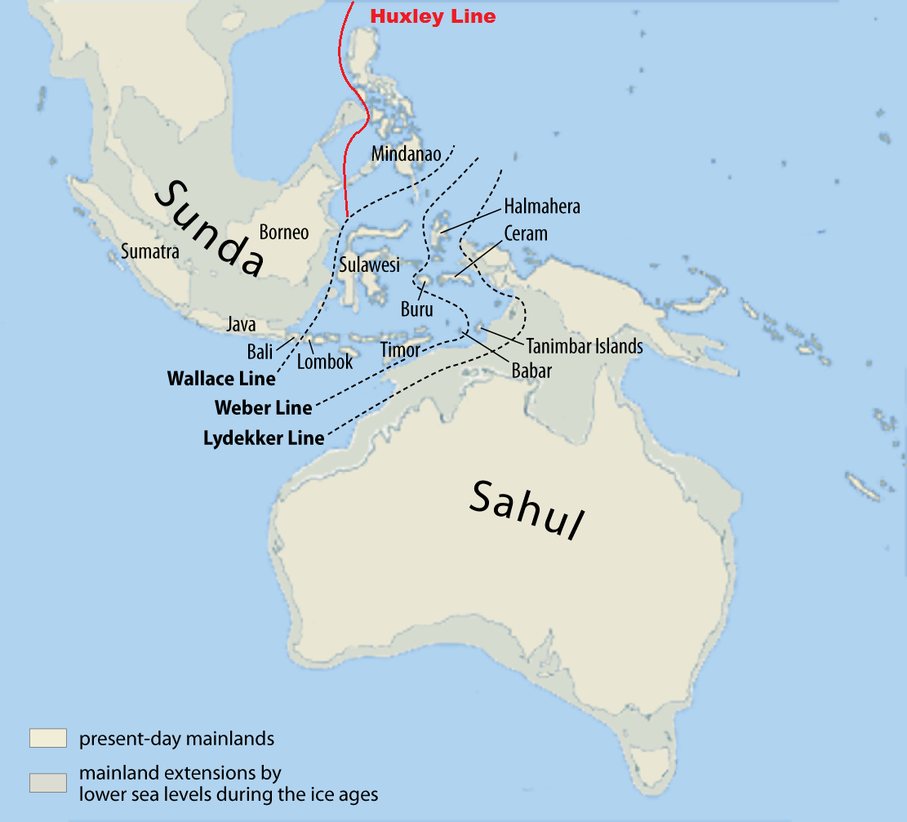

<style type="text/css">
.main-container {
  max-width: 1800px;
  margin-left: auto;
  margin-right: auto;
}
</style>


<div style= "float:right;position: relative;top:10px">
```{r, out.width = "300px",echo=FALSE}

```
</div>


<style>
div.gray { background-color:#aabdaf; border-radius: 5px; padding: 20px;}
</style>
<div class = "gray">


# **Microbiome Boot Camp**{#top}
Utah Valley University - BIOL490R

## [**Syllabus**](https://gzahn.github.io/microbiome_bootcamp/syllabus.html)

___


# Course goals

- Understand the data structure of microbiome studies
- Demonstrate how to process microbiome data into a usable format
- Explore processed microbiome data
- Test hypotheses
- Write a paper putting results into context of other research

___

# Course requirements

- Laptop with R and R Studio installed
- Previous experience with R programming
  + data cleaning / transformations
  + plotting with *ggplot*
  + file management
  + model training and evaluation


___

# Course setup

- We have a real data set and some question to address:
  + Do bacterial endophytes of seagrass follow Wallace's Line?
  + What is the core bacterial microbiome of seagrass and does is change with location?
  + Are any individual taxa differentially abundant on either side of Wallace's Line?
- We will use this data set to learn how to process and analyze microbiome data
- We will then write a paper as a class to present our findings for peer-review

```{r echo=FALSE,fig.align='left',fig.height=4,fig.width=4, fig.cap="Image from Wiki commons"}

```

>"In 1858 Wallace proposed a boundary line that splits Indonesia in half, running from the Pacific ocean between the islands of Borneo and Sulawesi and entering the Indian ocean via the Lombok Strait between the Islands of Bali and Lombok. This line closely follows the margin of the Sunda Shelf and would later become known as Wallace’s line when Thomas Huxley coined the term in 1868. Wallace described the fauna west of this line as typically Asian in origin and east of this line Australasian in origin. Several different taxa follow this pattern and it is especially apparent in birds."

`r tufte::quote_footer('--- Wainwright, et al. (2018)')`        

<br>

Previous work showed, surprisingly, that fungal endophytes of seagrass seem to follow Wallace's Line. We're not sure why, but we need to know if bacterial endophytes show the same patterns. As we start to accrue evidence of this phenomenon, we can contribute to the larger discussion of microbial biogeography. In reality, it's weird to see microbes with the same distributional limitations as birds, especially aquatic microbes. So what is going on? Can we see this play out with bacteria too!?

**Start by reading the [previous paper](https://gzahn.github.io/microbiome_bootcamp/media/Wainwright_2018.pdf){target="_blank} to get background on this topic. Read it several times... after all, you're going to be doing a lot of the same things for this project (but this time looking at the bacteria instead of fungi).**


___


Here's an overview of the different sites where seagrass (*Syringodium isoetifolium*) samples were collected

```{r echo=FALSE,warning=FALSE,message=FALSE}
library(tidyverse)
library(ggtext)
dat <- readxl::read_xlsx("./media/SI_Indo_Metadata_CorrectGPS.xlsx")
dat <- dat %>% filter(GPS != "N/A")
dat <- dat %>% 
  mutate(COLOR = case_when(`East or West of Wallace Line` == "East" ~ "Red",
                           TRUE ~ "Blue")) %>% 
  select(GPS,`East or West of Wallace Line`,COLOR,Location) %>% 
  unique.data.frame()
lat <- dat$GPS %>% str_split(" ") %>% map_chr(1) %>% as.numeric()
lon <- dat$GPS %>% str_split(" ") %>% map_chr(2) %>% as.numeric()
leaflet::leaflet() %>% 
  leaflet::addTiles() %>%
  leaflet::addCircleMarkers(lng=lon,lat = lat,radius =5,color = dat$COLOR,opacity = 1,label = dat$Location) 

```

## Brief methods

### Study sites

```{r echo=FALSE}
dat %>% 
  bind_cols(lat=round(lat,3),lon=round(lon,3)) %>% 
  select(Location,lat,lon) %>% 
  unique.data.frame() %>% 
  kableExtra::kable() %>% 
  kableExtra::kable_classic()

```

<br><br>

```{r fig.width=3,fig.height=3,fig.align="center",echo=FALSE,fig.cap="*Syringodium isoetifolium* (seagrass) meadow -- Image from Wiki commons"}
knitr::include_graphics("./media/Syringodium_isoetifolium_ployant_sous_la_houle.jpg")
```

### Sample processing

16 samples of seagrass were taken from each of 12 locations. The V3 region of the 16S rDNA from each sample was amplified (N=`r 12*16`). These amplicons were sequenced on an Illumina MiSeq machine with V3 (2x300) chemistry along with 8 sample blanks (Total study N=`r (12*16) + 8`).

### Data analysis

Here's where we come in. We've got raw 16S sequence data from this study and need to process it, explore and visualize it, and test hypotheses. Our final codebase will be deposited as part of the publication, along with any figures and statistical results we develop.

___

<br>

## Logistics

We will use R (and some Bash) along with Git/GitHub to conduct all of our work

Beyond the nitty gritty of coding, we will also be learning a lot about community ecology.

Some potential packages we will learn:

- [*DADA2*](https://benjjneb.github.io/dada2/){target="_blank"}
- [*phyloseq*](https://joey711.github.io/phyloseq/){target="_blank"}
- [*corncob*](https://cran.r-project.org/web/packages/corncob/vignettes/corncob-intro.pdf){target="_blank"}
- [*igraph*](https://igraph.org/r/){target="_blank"}
- [*phangorn*](https://cran.r-project.org/web/packages/phangorn/vignettes/Trees.html){target="_blank"}
- [*vegan*](https://github.com/vegandevs/vegan){target="_blank"}

Here's an example code archive for this type of work: [Workshop Repository](https://github.com/gzahn/Microbiome_Workshop){target="_blank"}.

Here's a BioProtocols paper walking through the workshop code: [16S Recipe](https://bio-protocol.org/e4395){target="_blank"} <sup>--You'll need to create a free account to download it</sup>


<br>

___

<br>

## Expectations and evaluation

**Grades will be based on assignments and code contributions**

**Assignments**

During the semester, several assignments will be given related to the course material. Examples include:

  - Looking up and reporting on alternative parameters for certain functions
  - Finding and presenting papers about relevant topics
  - Coding assignments such as novel figure generation
  - Annotated bibliographies on background and discussion topics
  - In-class participation in discussion and hypothesis generation
  
**Code contributions**

Each student is expected to contribute to our final codebase. Comment lines denoting code authorship will be included in the final paper.

**Writing**

Each student is expected to contribute to writing, background reading/research/references, and editing. Students with low participation will not earn authorship on our paper, but grades will not be based on writing.


<br><br>

___

## Working topics (subject to revision):

  - What is meta-amplicon technology?
  - The [Earth Microbiome Project](https://earthmicrobiome.org/)
  - Basics of community ecology
    + Who is there?
    + What are they doing?
    + How do they interact with each other?
    + How does the environment shape community structure?
    + Community assembly
    + Distributional ecology
  - Analytical methods in community ecology
    + Normalization / rarefaction
    + Alpha, beta, gamma diversity
    + Mantel / MRM / PermANOVA / Ordination / Networks
    + Differential tests
  - Technological methods and limitations

<br>

___

<br> 

# Weekly tasks and assignments

### [Assignment 1](https://gzahn.github.io/microbiome_bootcamp/assignments/assignment_1.html){target="_blank"}

  - Read a paper several times and compile questions
  
### [Assignment 2](https://gzahn.github.io/microbiome_bootcamp/assignments/assignment_2.html){target="_blank"}

  - Literature/resource search and annotation
  
### [Assignment 3](https://gzahn.github.io/microbiome_bootcamp/assignments/assignment_3.html){target="_blank"}

  - TBD

### [Assignment 4](https://gzahn.github.io/microbiome_bootcamp/assignments/assignment_4.html){target="_blank"}

  - TBD

### [Assignment 5](https://gzahn.github.io/microbiome_bootcamp/assignments/assignment_5.html){target="_blank"}

  - TBD

### [Assignment 6](https://gzahn.github.io/microbiome_bootcamp/assignments/assignment_6.html){target="_blank"}

  - TBD

### [Assignment 7](https://gzahn.github.io/microbiome_bootcamp/assignments/assignment_7.html){target="_blank"}

  - TBD

### [Assignment 8](https://gzahn.github.io/microbiome_bootcamp/assignments/assignment_8.html){target="_blank"}

  - TBD

### [Assignment 9](https://gzahn.github.io/microbiome_bootcamp/assignments/assignment_9.html){target="_blank"}

  - TBD

### [Assignment 10](https://gzahn.github.io/microbiome_bootcamp/assignments/assignment_10.html){target="_blank"}

  - TBD
