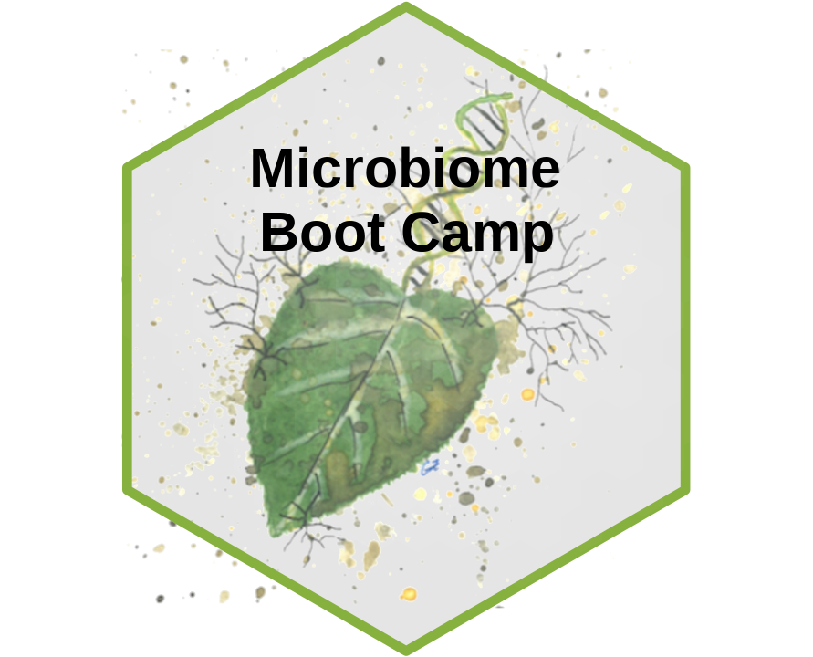
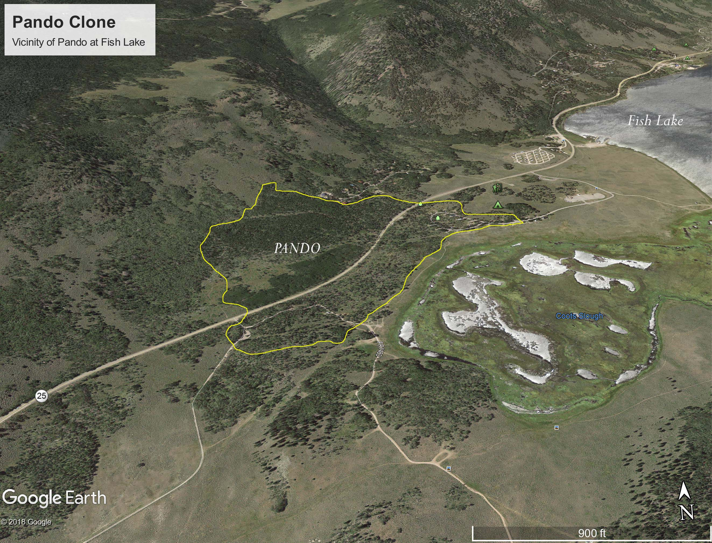
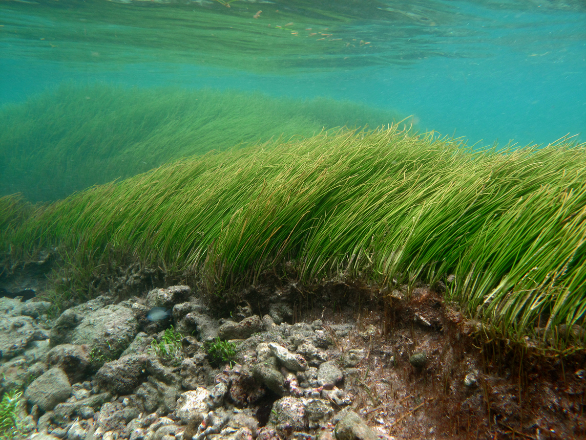

<style type="text/css">
.main-container {
  max-width: 1800px;
  margin-left: auto;
  margin-right: auto;
}
</style>


<div style= "float:right;position: relative;top:10px">
```{r, out.width = "300px",echo=FALSE}

```
</div>


<style>
div.gray { background-color:#aabdaf; border-radius: 5px; padding: 20px;}
</style>
<div class = "gray">


# **Microbiome Boot Camp**{#top}
Utah Valley University - BIOL490R

### [**Syllabus**](https://gzahn.github.io/microbiome_bootcamp/syllabus.html)

### [**Code repository**](https://github.com/gzahn/Pando_Fungi)

### [**Zotero library**](https://www.zotero.org/groups/5331232/pando_fungi)

___


# Course goals

- Understand the data structure of microbiome studies
- Demonstrate how to process microbiome data into a usable format
- Explore processed microbiome data
- Test hypotheses
- Write a paper putting results into context of other research

___

# Course requirements

- Laptop with R and R Studio installed
- Previous experience with R programming
  + data cleaning / transformations
  + plotting with *ggplot*
  + file management
  + model training and evaluation


___

# Course setup

- We have a real data set and some question to address:
  + Pando foliar fungi
  + Are trees selecting fungal endophyte or epiphyte community?
  + Do foliar fungi follow stochastic assembly?
  + What spatial structure is there?
  + Hypotheses:
    - 
- We will use this data set to learn how to process and analyze microbiome data
- We will then write a paper as a class to present our findings for peer-review

```{r echo=FALSE,fig.align='left',fig.height=4,fig.width=4, fig.cap="Image from Wiki commons"}

```

>"Pando is believed to be the largest, most dense organism ever found at nearly 13 million pounds. The clone spreads over 106 acres, consisting of over 40,000 individual trees. The exact age of the clone and its root system is difficult to calculate, but it is estimated to have started at the end of the last ice age. Some of the trees are over 130 years old. It was first recognized by researchers in the 1970s and more recently proven by geneticists. Its massive size, weight, and prehistoric age have caused worldwide fame."

`r tufte::quote_footer('--- US Forest Service')`        

<br>

We are using Pando as a natural laboratory to study the biogeography and assembly of fungi associated with the leaves of plants. These fungi, known as endophytes (inside the leaves) and epiphytes (on surface of leaves) are important components of the plant microbiome. They modify plant disease severity, alter plant phenotype, and can even help plants resist common stressors such as drought. One important question regards where plants get their foliar fungi. In grasses, they are passed along inside seeds (vertical transmission), but in dicot plants like Pando, they are assembled from the environment.

They blow in on the wind, or are carried by animals, or by raindrops. But it is interesting that not all fungi can have a healthy stable relationship with all plants. There is likely some *environmental filtering* going on... the abiotic environmental variables or the plant itself are possibly doing some selecting of which fungi make it into plant leaves.

Most studies of this nature have to contend with the fact that when you go out into the field, each plant you sample has a different genotype, even if you sample the same plant species. We don't have that problem in this study since every tree that's part of Pando is just a piece of the same genetic clone individual.

What this means is that we can sample leaves from Pando and can study the spatial structure of the fungal communities without worrying about plant genotype.

```{r echo=FALSE, fig.align='center',fig.height=4,fig.width=4, fig.cap="Geoff Zahn, Josh Leon, Austen Miller inside Pando clone"}
knitr::include_graphics("../media/PXL_20230909_205730304.jpg",dpi = 800)

```


In September 2023, we collected leaf samples from all over the Pando clone and extracted DNA from both the leaf surfaces and interiors. Those samples were sequenced on an Illumina MiSeq system (2x300bp). It's there that we start our work. **We will use bioinformatics tools to turn the raw DNA reads into fungal community data that we can work with and explore.  We will test hypotheses about environmental filtering of foliar fungi.**

Some questions we can ask:
  
  - Are foliar fungi reflective of their immediate environment? *i.e.*, Do samples that are physically close to each other share more similar fungal communities than can be expected by chance?
  - Are there any "edge effects" in our communities? Are samples from the edge of the clone more similar to each other than those deeper inside the forest patch?
  - Epiphytes might 'just be there' but endophytes are living inside the plant tissue. So do we see contrasting patterns between the two categories of fungi? If so, this could be evidence for environmental filtering of endophytes. And if there's no geographic structure in endophytes, it could suggest that the plants themselves are doing the filtering.
  

#### You will have lots of readings in this course.

**We will use a [shared Zotero library](https://www.zotero.org/groups/5331232/pando_fungi) to keep track of all our papers**

**Start by finding and reading: **

Darcy, J. L., Swift, S. O. I., Cobian, G. M., Zahn, G. L., Perry, B. A., & Amend, A. S. (2020). Fungal communities living within leaves of native Hawaiian dicots are structured by landscape-scale variables as well as by host plants. Molecular Ecology, 29(16), 3102–3115. https://doi.org/10.1111/mec.15544


___


Here's an overview of the different sites where we sampled 

############ read in csv of locations #############
############ display metadata in scroll box #######
############ include leaflet map of sites #########


```{r echo=FALSE,warning=FALSE,message=FALSE}
# library(tidyverse)
# library(ggtext)
# dat <- read_csv("../../Pando_Fungi/Data/pando_sample_metadata.csv")
# dat <- dat %>% filter(GPS != "N/A")
# dat <- dat %>% 
#   mutate(COLOR = case_when(`East or West of Wallace Line` == "East" ~ "Red",
#                            TRUE ~ "Blue")) %>% 
#   select(GPS,`East or West of Wallace Line`,COLOR,Location) %>% 
#   unique.data.frame()
# lat <- dat$GPS %>% str_split(" ") %>% map_chr(1) %>% as.numeric()
# lon <- dat$GPS %>% str_split(" ") %>% map_chr(2) %>% as.numeric()
# leaflet::leaflet() %>% 
#   leaflet::addTiles() %>%
#   leaflet::addCircleMarkers(lng=lon,lat = lat,radius =5,color = dat$COLOR,opacity = 1,label = dat$Location) 

```

## Brief methods

### Study sites

```{r echo=FALSE}
# dat %>% 
#   bind_cols(lat=round(lat,3),lon=round(lon,3)) %>% 
#   select(Location,lat,lon) %>% 
#   unique.data.frame() %>% 
#   kableExtra::kable() %>% 
#   kableExtra::kable_classic()

```

<br><br>

```{r fig.width=3,fig.height=3,fig.align="center",echo=FALSE,fig.cap="*Syringodium isoetifolium* (seagrass) meadow -- Image from Wiki commons"}

```

### Sample processing

16 samples of seagrass were taken from each of 12 locations. The V3 region of the 16S rDNA from each sample was amplified (N=`r 12*16`). These amplicons were sequenced on an Illumina MiSeq machine with V3 (2x300) chemistry along with 8 sample blanks (Total study N=`r (12*16) + 8`).

### Data analysis

Here's where we come in. We've got raw 16S sequence data from this study and need to process it, explore and visualize it, and test hypotheses. Our final codebase will be deposited as part of the publication, along with any figures and statistical results we develop.

___

<br>

## Logistics

We will use R (and some Bash) along with Git/GitHub to conduct all of our work

Beyond the nitty gritty of coding, we will also be learning a lot about community ecology.

Some potential packages we will learn:

- [*DADA2*](https://benjjneb.github.io/dada2/){target="_blank"}
- [*phyloseq*](https://joey711.github.io/phyloseq/){target="_blank"}
- [*corncob*](https://cran.r-project.org/web/packages/corncob/vignettes/corncob-intro.pdf){target="_blank"}
- [*igraph*](https://igraph.org/r/){target="_blank"}
- [*phangorn*](https://cran.r-project.org/web/packages/phangorn/vignettes/Trees.html){target="_blank"}
- [*vegan*](https://github.com/vegandevs/vegan){target="_blank"}

Here's an example code archive for this type of work: [Workshop Repository](https://github.com/gzahn/Microbiome_Workshop){target="_blank"}.

Here's a BioProtocols paper walking through the workshop code: [16S Recipe](https://bio-protocol.org/e4395){target="_blank"} <sup>--You'll need to create a free account to download it</sup>


<br>

___

<br>

## Expectations and evaluation

**Grades will be based on assignments and code contributions**

**Assignments**

During the semester, several assignments will be given related to the course material. Examples include:

  - Looking up and reporting on alternative parameters for certain functions
  - Finding and presenting papers about relevant topics
  - Coding assignments such as novel figure generation
  - Annotated bibliographies on background and discussion topics
  - In-class participation in discussion and hypothesis generation
  
**Code contributions**

Each student is expected to contribute to our final codebase. Comment lines denoting code authorship will be included in the final paper.

**Writing**

Each student is expected to contribute to writing, background reading/research/references, and editing. Students with low participation will not earn authorship on our paper, but grades will not be based on writing.


<br><br>

___

## Working topics (subject to revision):

  - What is meta-amplicon technology?
  - The [Earth Microbiome Project](https://earthmicrobiome.org/)
  - Basics of community ecology
    + Who is there?
    + What are they doing?
    + How do they interact with each other?
    + How does the environment shape community structure?
    + Community assembly
    + Distributional ecology
  - Analytical methods in community ecology
    + Normalization / rarefaction
    + Alpha, beta, gamma diversity
    + Mantel / MRM / PermANOVA / Ordination / Networks
    + Differential tests
  - Technological methods and limitations

<br>

___

<br> 

# Weekly tasks and assignments

### [Assignment 1](https://gzahn.github.io/microbiome_bootcamp/assignments/assignment_1.html){target="_blank"}

  - Read a paper several times and compile questions
  
### [Assignment 2](https://gzahn.github.io/microbiome_bootcamp/assignments/assignment_2.html){target="_blank"}

  - Literature/resource search and annotation
  
### [Assignment 3](https://gzahn.github.io/microbiome_bootcamp/assignments/assignment_3.html){target="_blank"}

  - TBD

### [Assignment 4](https://gzahn.github.io/microbiome_bootcamp/assignments/assignment_4.html){target="_blank"}

  - TBD

### [Assignment 5](https://gzahn.github.io/microbiome_bootcamp/assignments/assignment_5.html){target="_blank"}

  - TBD

### [Assignment 6](https://gzahn.github.io/microbiome_bootcamp/assignments/assignment_6.html){target="_blank"}

  - TBD

### [Assignment 7](https://gzahn.github.io/microbiome_bootcamp/assignments/assignment_7.html){target="_blank"}

  - TBD

### [Assignment 8](https://gzahn.github.io/microbiome_bootcamp/assignments/assignment_8.html){target="_blank"}

  - TBD

### [Assignment 9](https://gzahn.github.io/microbiome_bootcamp/assignments/assignment_9.html){target="_blank"}

  - TBD

### [Assignment 10](https://gzahn.github.io/microbiome_bootcamp/assignments/assignment_10.html){target="_blank"}

  - TBD
