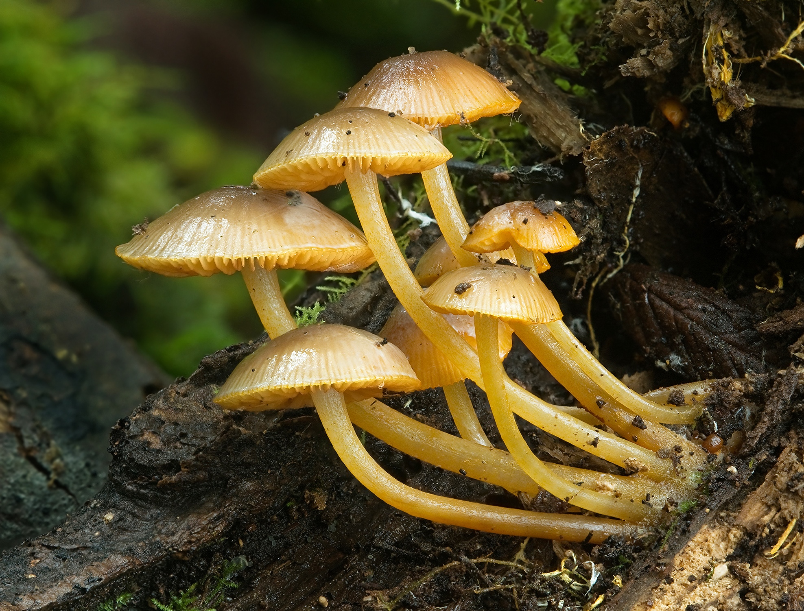
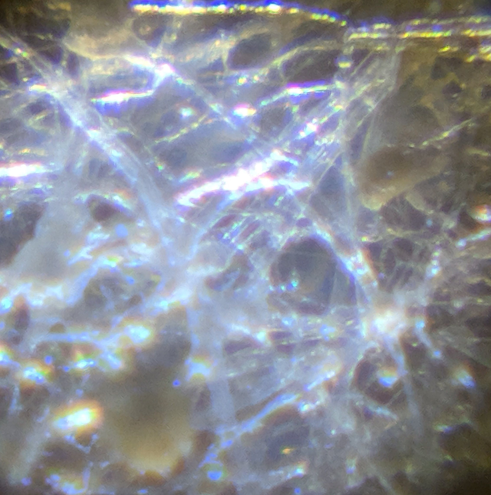

<style type="text/css">
.main-container {
  max-width: 1800px;
  margin-left: auto;
  margin-right: auto;
}
</style>


## [HOME](http://gzahn.github.io/) | [ABOUT ME](http://gzahn.github.io/about-me/) | [LAB](http://gzahn.github.io/lab/) | [RESEARCH](http://gzahn.github.io/pubs-and-pres/) | [TEACHING](http://gzahn.github.io/coursemap/)

<div style= "float:right;position: relative;top:10px">
```{r, out.width = "250px",echo=FALSE}

```
</div>

<style>
div.gray { background-color:#aabdaf; border-radius: 5px; padding: 20px;}
</style>
<div class = "gray">


# Hillbilly Mycology

There are a lot of scattered resources for how to do mycology at home without a bunch of specialized equipment. Here, I'm just trying to bring a bunch of them together in one place for you. All the equipment on here is easy to find for quite cheap or even free. I've provided purchase links when reasonable. **The only *equipment* required for class is the microscope.**  Anything else you need will be prepared for you on campus so you can pick it up at your convenience.

This collection consists of equipment (stuff you need but only have to buy once), materials (stuff you run out of after long enough), and protocols (links to published protocols, videos, tutorials, for how to put your equipment and materials to work).

Mycology doesn't have to be too difficult. I got started with mycology at home, using scrap materials and winging it. The resources here should be enough to do things like:

  - Isolate the major groups of fungi and observe them at a pretty small scale
  - Do mating crosses, simple competition experiments, and morphology-based surveys
  - Grow your own edible mushrooms at home
  - Identify macrofungi with (a bit) more confidence using spore traits
  
Naturally, you are unlikely to be doing any genomics or cellular ultrastructure with these resources. That's fine. You'll live. If you want to do that stuff, vote for politicians who take pandemics seriously and fund vaccine research so we can get back to the molecular lab on campus.


**Quick Links: [Equipment](#equipment) |  [Materials](#materials) |  [Protocols](#protocols)**

___

## Equipment{#equipment}

<div style= "float:right;position: relative;top:10px">
```{r, out.width = "250px",echo=FALSE}

```
</div>

[**Microscope**](https://amzn.to/31KPjZM){target="_blank"}

You'll want a microscope since you're dealing with microbes, after all.  This one is cheap and works really well. It even clips onto your phone with a minimum of toe-curling frustration so you can take photos.

[**Autoclave**](https://amzn.to/2ZR7DOb){target="_blank"}

Well, it's not an autoclave, but most pressure cookers (including Instant Pots) can get your media sterilized.

[**Scale**](https://www.amazon.com/Weigh-Gram-Digital-Jewelry-Kitchen/dp/B06Y61YW7S){target="_blank"}

Just a way to measure grams of material. Low accuracy is fine. This is hillbilly mycology.

[**Scalpel**](https://gzahn.github.io/mycology/media/knife.jpg){target="_blank"}

Okay, when I say scalpel, I mean a cheap steak knife or similar. Something you can get red hot to sterilize with a handle that won't burn your fingers off.

[**Tweezers**](https://www.walmart.com/search/?query=tweezers){target="_blank"}

Cheapest metal tweezers you can find. They're quite useful.

___

## Materials{#materials}

[**Agar**](https://amzn.to/2Cg1piL){target="_blank"}

This is a very low-nutrient "jelly" made from seaweed. It provides a medium for fungi to grow on and can be supplemented with specific nutrients. It needs to be sterilized, poured into a sterile mold while still hot, and then allowed to cool in a sterile environment. You can find it in little packets at Asian Grocery stores for really cheap.

[**Petri dishes**](https://amzn.to/2ZNIeoM){target="_blank"}

Lot's of things work here. The short wide-mouth Mason jars are nice, but a bit pricey. The benefit is that you can "autoclave" them for sterility. Still, you can use the condiment cups from the link as long as you sterilize them with alcohol and let them dry completely in a clean location before pouring your media into them. 

[**Biological Stain**](https://www.amazon.com/Amazon-Brand-Turmeric-Ground-Ounces/dp/B07W1WWT5D/ref=sr_1_7?dchild=1&keywords=turmeric+powder&qid=1594249188&s=grocery&sr=1-7){target="_blank"}

Turmeric powder is [proven](https://www.tandfonline.com/doi/abs/10.1080/10520295.2017.1310925?src=recsys&journalCode=ibih20){target="_blank"} to work pretty well as a stain. No need to go through the alcohol extraction and centrifugation though. Just add boiling water to a bit of powder. Stir. Let settle and cool. Decant the yellow liquid into a new container.  Don't let it get on your clothes...it *stains*.

[**Parafilm**](https://amzn.to/2ZaTJr1){target="_blank"}

Honestly, Scotch tape works well enough if you don't want to buy this stuff. This is a way to seal culture dishes so they don't dry out or get contaminated. Consider it a luxury item in our context.

[**TyVek**](https://store.usps.com/store/product/shipping-supplies/priority-mail-tyvek-envelope-ep14-P_EP_14){target="_blank"}

Free source, shipped to your door from the USPS. This stuff is nice as a filter for your grain spawn jars. Cut to fit inside a Mason jar lid - lets gasses exchange but keeps bacteria out!


[](){target="_blank"}

[](){target="_blank"}

[](){target="_blank"}

</br></br>

___


## Protocols{#protocols}

[**Isolate Chytrids from water**](){target="_blank"}

  - Step 1 - find some questionable water outside
  - Step 2 - sprinkle a *little* pine pollen onto the water and leave it for a few days
  - Step 3 - carefully put a drop of this on a slide and look at your chytrids


</br></br>


[**Isolate Zygomycetes from soil**](){target="_blank"}

  - Step 1 - the moldy bread experience [video](https://youtu.be/JzVBlk0Rqj8){target="_blank"}
  - Step 2 - isolating a strain [video](){target="_blank}
  - Step 3 - looking closely for "zygo" characteristics [video](){target="_blank}


</br></br>


[**Grow oyster mushrooms at home**](){target="_blank"}

There are really a ton of good resources already made for this particular project. We will go through this together as a class on a small scale:

  - Overview of the steps involved [**web page**](https://blog.freshcapmushrooms.com/learn/how-to-grow-mushrooms-a-basic-outline/){target="_blank"}
  - How to find yourself a clone for free [**video**](https://www.youtube.com/watch?v=TDhQcRPPd9c){target="_blank"}
  - How to transfer fungal cultures to new growth medium [**video**](https://www.youtube.com/watch?v=sk4Adz12W5U){target="_blank"}
  - How to clean up a culture without antibiotics [**video**](https://www.ncbi.nlm.nih.gov/pmc/articles/PMC6834272/){target="_blank"}
  - Grain spawn recipe [**instructions**](https://blog.freshcapmushrooms.com/learn/how-to-make-perfect-grain-spawn-for-growing-mushrooms-at-home/){target="_blank"}
  - Inoculating your bulk carbon source and fruiting [**instructions**](https://blog.freshcapmushrooms.com/learn/grow-at-home-how-to-grow-mushrooms-at-home-using-straw-logs/){target="_blank"}
 

</br></br>


[**Slide culture**](https://www.youtube.com/watch?v=0RJKvTngF5s){target="_blank"}

  - How to view intact sporangial structures on a slide


</br></br>


[**Spore prints and spore characteristics**](){target="_blank"}

  - How to make a spore print [video](){target="_blank"}
  - Visualizing spores [video](){target="_blank"}
  - Stephanie Kivlin's spore trait database [download](https://gzahn.github.io/mycology/media/FungalTraits_2011_05_25.xlsx){target="_blank"}
  - Spore morphology [slideshow](https://gzahn.github.io/mycology/media/Spore_morphology_Presentation.pdf){target="_blank"} from Estelle Levetin, PhD


</br></br>


[**Mating crosses**](){target="_blank"}

  - How to get single-spore haploid cultures accidentally [video](){target="_blank"}
  - Setting up a mating cross experiment [video](){target="_blank"}
  - Analyzing a mating cross [video](){target="_blank"}


</br></br>


[**Cheese mycology**](){target="_blank"}


</br></br>


[**Sourdough mycology**](){target="_blank"}


</br></br>


[](){target="_blank"}

[](){target="_blank"}


##


</br></br></br></br></br></br>
</div>