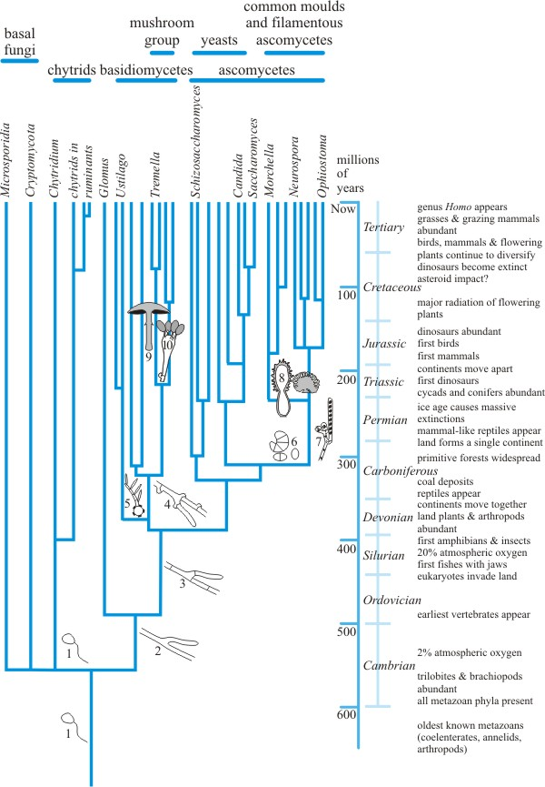

<style type="text/css">
.main-container {
  max-width: 1800px;
  margin-left: auto;
  margin-right: auto;
}
</style>

## [HOME](http://gzahn.github.io/) | [ABOUT ME](http://gzahn.github.io/about-me/) | [LAB](http://gzahn.github.io/lab/) | [RESEARCH](http://gzahn.github.io/pubs-and-pres/) | [BLOG](http://gzahn.github.io/blog-archive/) | [DATA COURSE](http://gzahn.github.io/data-course/) | [INTRO BIO II](http://gzahn.github.io/BIOL1620/) | [MYCOLOGY](http://gzahn.github.io/mycology/)

<div style= "float:right;position: relative;top:10px">
```{r, out.width = "300px",echo=FALSE}
knitr::include_graphics("./media/w_w_book.jpg")
```
</div>

<style>
div.gray { background-color:#aabdaf; border-radius: 5px; padding: 20px;}
</style>
<div class = "gray">


# **MYCOLOGY**{#top}
Utah Valley University - BIOL1620

#### This course section is entirely online. All assignments, quizzes, and exams will be turned in and taken on Canvas. My preferred contact method is our group Slack channel.

#### This webpage will host links to all resources and videos, and serves as a roadmap for the semester, listing readings, assignments, etc.

___

#### **Course overview:**
The course consists of several components:
  
  - **Required readings**
    + Textbook: Webster and Weber, *Introduction to Fungi - 3rd ed.* (specific sections)
    + Scientific papers: Usually weekly, linked below
    + Fun book: *Mr. Bloomfield's Orchard*, by Nicholas Money
  - **Weekly quizzes on reading material** (on Canvas)
  - **Assorted "Redneck mycology" lab and field exercises** (on Canvas)
  - **Exams** (3 of these, on Canvas, open-note) 
  - **Project: Design a new fungus**

___

## Quick links:

#### [Course Syllabus](){target="_blank"}

#### [Course Text Book](https://gzahn.github.io/mycology/media/WEBSTER_and_WEBER_3rd-ed.pdf){target="_blank"}

____

## Good web resources:

[**21st Century Guidebook to Fungi**](http://www.davidmoore.org.uk/21st_Century_Guidebook_to_Fungi_PLATINUM/index.htm){target="_blank} (This is pretty useful for this class!)

Cornell's [**Virtual Fungal Library**](http://mycology.cornell.edu/){target="_blank} (Extensive links to resources!)

[**Fungal Gene Database**](https://fungidb.org/fungidb/){target="_blank} (Exactly what it sounds like.)

[**Emerging fungal diseases**](https://www.cdc.gov/fungal/resources.html){target="_blank} CDC resource page for those with a medical bent

Nice [**YouTube Channel**](https://www.youtube.com/channel/UCkzY4M9kg2VmqJ2nNcNM8hw){target="_blank} with videos featuring do-it-at-home mycology

___

#### Table of Contents

[Week 1](#Week-1)    |    [Week 5](#Week-5)    |    [Week 9](#Week-9) | [Week 13](#Week-13)

[Week 2](#Week-2)    |    [Week 6](#Week-6)    |    [Week 10](#Week-10) | [Week 14](#Week-14)

[Week 3](#Week-3)    |    [Week 7](#Week-7)    |    [Week 11](#Week-11) | [Week 15](#Week-15)

[Week 4](#Week-4)    |    [Week 8](#Week-8)    |    [Week 12](#Week-12) | [Week 16](#Week-16)


</div>

___

<style>
div.blue { background-color:#a89d82; border-radius: 5px; padding: 20px;}
</style>
<div class = "blue">


<div style= "float:right;position: relative;top:10px">
```{r, out.width = "350px",echo=FALSE}

```
</div>


### **Week 1**{#Week-1}

**Topics:** 

  - What are fungi? | Chytrids and divergence from metazoa | Fungal phylogeny

**Readings and Assignments**  

  - Read [James, et al., 2006](https://gzahn.github.io/mycology/media/James_et_al_-_2006_Reconstructing_the_early_evolution_of_Fungi.pdf)
  - Read Webster & Weber: 1.1, 1.5, 6.1 
  - Canvas quiz on readings
  - Find and grow zygomycete fungi (Canvas assignment)
  - Get "Mr. Bloomfield's Orchard" by Nicholas Money [(LINK)](https://amzn.to/2ByMPTa){target="_blank}
  
  
**Resources**

  - [Major Topics]()
  - 
  -
  -
  -
  
**Videos**

  - 
  -
  -

[Back to top of page](#top)

___

<div style= "float:right;position: relative;top:10px">
```{r, out.width = "350px",echo=FALSE}
knitr::include_graphics("./media/mycelium.jpg")
```
</div>

### **Week 2**{#Week-2}
**Topics**

  - The "hyphal lifestyle" | Fungal physiology | Zygomycetes | Reproduction in fungi

**Readings and Assignments**

  - Read [Fisher, et al., 2018](https://gzahn.github.io/mycology/media/fisher2018.pdf)
  - Read Webster & Weber: **1.2** | **1.3** | **1.4** | **7.1** | **7.2** | **7.3.1** | **7.3.2**
  - Canvas quiz on readings


**Resources**

  - [Major Topics](https://gzahn.github.io/){target="_blank"}
  - fungal mating types
  - zygo life cycle
  - 
  
**Videos**

  - 
  -
  -  
  
  
[Back to top of page](#top)

___

<div style= "float:right;position: relative;top:10px">
```{r, out.width = "350px",echo=FALSE}
knitr::include_graphics("./media/asco_life_cycle.jpg")
```
</div>


### **Week 3**{#Week-3}

**Topics**

  - Ascomycetes | Species concept in fungi | Anamorphs and Teleomorphs | Dikaryotism

**Readings and Assignments**

  - Read Webster & Weber: **8** | **10.2** | **12.1** | **12.2.1**

**Resources**

  - [Major Topics]
  - ascus formation video
  - 
  
**Videos**

  - 
  -
  -  
  
[Back to top of page](#top)
  
___

<div style= "float:right;position: relative;top:10px">
```{r, out.width = "250px",echo=FALSE}
knitr::include_graphics("./media/basidios.jpg")
```
</div>
  
  
### **Week 4**{#Week-4}
**Topics**

  - Basidiomycetes

**Readings and Assignments**

  - Read Webster & Weber: **18** | **19.1** | **20.1** | **21.1** | **24.1**
  
**Resources**

  - [Major Topics]
  
**Videos**

  - 
  -
  -
  
[Back to top of page](#top)

___


<div style= "float:right;position: relative;top:10px">
```{r, out.width = "350px",echo=FALSE}
knitr::include_graphics("./media/dispersal.jpeg")
```
</div>

### **Week 5**{#Week-5}
**Topics**

  - Fungal development | Mushroom mechanics | Active dispersal
  
**Readings and Assignments**

  - Read [Hammad, et al., 1993](https://gzahn.github.io/mycology/media/Hammad_et_al_1993.pdf)
  - **Exam 1** (Covers material from weeks 1-4)
  
**Resources**

  - [Major Topics]
  
**Videos**

  - 
  -
  -
  
[Back to top of page](#top)

___


<div style= "float:right;position: relative;top:10px">
```{r, out.width = "350px",echo=FALSE}
knitr::include_graphics("./media/medical_mycology.jpeg")
```
</div>

### **Week 6**{#Week-6}
**Topics**

  - Medical mycology 
  
**Readings and Assignments**

  - Read [Huffnagle & Noverr, 2013](https://gzahn.github.io/mycology/media/Huffnagle_and_Noverr_2013.pdf)
  
**Resources**

  - [Major Topics]
  
**Videos**

  - 
  -
  -
  
[Back to top of page](#top)


___

### **Week 7**{#Week-7}

<div style= "float:right;position: relative;top:10px">
```{r, out.width = "350px",echo=FALSE}
knitr::include_graphics("./media/rust.jpg")
```
</div>

**Topics**

  - Plant pathogens
  
**Readings and Assignments**

  - Read [Roy, 1993](https://gzahn.github.io/mycology/media/Roy_1993.pdf)
  - Read Webster & Weber: **22**
  -
  -
  
  
**Resources**

  - [Major Topics]
  -
  -
  -
  -
  
**Videos**

  - 
  -
  -  

[Back to top of page](#top)

___

<div style= "float:right;position: relative;top:10px">
```{r, out.width = "350px",echo=FALSE}
knitr::include_graphics("./media/dist_chytrid.jpg")
```
</div>


### **Week 8**{#Week-8}
**Topics**

  - Distribution and dispersal | Population ecology
  
**Readings and Assignments**

  - Read [Bacigalupe, et al., 2017](https://gzahn.github.io/mycology/media/Bacigalupe_et_al_2017.pdf)
  - Read Money: Chapters 1-2
  
**Resources**

  - [Major Topics]
  
**Videos**

  - 
  -
  -
  
[Back to top of page](#top)

___

<div style= "float:right;position: relative;top:10px">
```{r, out.width = "350px",echo=FALSE}
knitr::include_graphics("./media/symbiosis.jpeg")
```
</div>


### **Week 9**{#Week-9}
**Topics**

  - Symbioses: Endophytes
  
**Readings and Assignments**

  - Read [Christian, et al., 2017](https://gzahn.github.io/mycology/media/Christian_et_al_2017.pdf)
  - Read Money: Chapter 3
  - **Exam 2** (Covers material from weeks 5-8)
    + Development
    + Pathology
    + Distribution
  
**Resources**

  - [Major Topics]
  
**Videos**

  - 
  -
  -
  
___

<div style= "float:right;position: relative;top:10px">
```{r, out.width = "350px",echo=FALSE}
knitr::include_graphics("./media/ectomycorrhizae.jpg")
```
</div>

[Back to top of page](#top)  


### **Week 10**{#Week-10}

**Topics**

  - Symbioses: Mycorrhizae
  
**Readings and Assignments**

  - 
  - Read Money: Chapter 4
  - 
  
**Resources**

  - [Major Topics]
  
**Videos**

  - 
  -
  -  
  
[Back to top of page](#top)

___

<div style= "float:right;position: relative;top:10px">
```{r, out.width = "350px",echo=FALSE}
knitr::include_graphics("./media/lichen.jpg")
```
</div>

### **Week 11**{#Week-11}

**Topics**

  - Symbioses: Lichens
  
**Readings and Assignments**

  - Read [Spribille, et al., 2016](https://gzahn.github.io/mycology/media/Spribille_et_al_2016.pdf)
  - Read Money: Chapter 5-6
  
**Resources**

  - [Major Topics]
  
**Videos**

  - 
  

[Back to top of page](#top)

___

  <div style= "float:right;position: relative;top:10px">
```{r, out.width = "250px",echo=FALSE}
knitr::include_graphics("./media/rot.jpg")
```
</div>

### **Week 12**{#Week-12}

**Topics**

  - Fungi and ecosystems
  
**Readings and Assignments**

  - Read [Hoppe, et al., 2016](https://gzahn.github.io/mycology/media/Hoppe_et_al_2016.pdf)
  - Read Money: Chapter 7
  - 
  
**Resources**

  - [Major Topics]
  
**Videos**

  - 
  
[Back to top of page](#top)

___

<div style= "float:right;position: relative;top:10px">
```{r, out.width = "350px",echo=FALSE}
knitr::include_graphics("./media/ethnomycology.jpeg")
```
</div>


### **Week 13**{#Week-13}

**Topics**

  - Ethnomycology
  
**Readings and Assignments**

  - Read [Dugan, 2008](https://gzahn.github.io/mycology/media/Dugan_2008.pdf)
  - Read Money: Chapter 8-9
  - **Exam 3** (Covers material from weeks 9-12)
    + Symbioses
    + Ecology

  
**Resources**

  - [Major Topics]
  
**Videos**

  - 
  
[Back to top of page](#top)

___


<div style= "float:right;position: relative;top:10px">
```{r, out.width = "350px",echo=FALSE}
knitr::include_graphics("../media/turkey.jpeg")
```
</div>

### **Week 14**{#Week-14}

# Thanksgiving Break

<br/><br/><br/><br/><br/><br/><br/><br/>

___


<div style= "float:right;position: relative;top:10px">
```{r, out.width = "350px",echo=FALSE}
knitr::include_graphics("./media/Primer_map_2015_March.png")
```
</div>

### **Week 15**{#Week-15}

**Topics**

  - Molecular mycology | Intro to fungal bioinformatics
  
**Readings and Assignments**

  - Read [Raja, et al., 2017](https://gzahn.github.io/mycology/media/Raja_et_al_2017.pdf)
  - Read Money: Chapter 9

  
**Resources**

  - [Major Topics]
  
**Videos**

  - 
  -
  -

[Back to top of page](#top)

___

<div style= "float:right;position: relative;top:10px">
```{r, out.width = "350px",echo=FALSE}
knitr::include_graphics("../media/week16.jpg")
```
</div>

### **Week 16**{#Week-16}

**Topics**

  - Wrap-up
  
**Readings and Assignments**

  - Start on Final Exam
  
**Resources**

  - [Main Topics] 
  
**Videos**

  - 
  -
  -
  
  
[Back to top of page](#top)

___

<br/><br/>

## Final Exam 

#### The final exam is project-based. You will design **and illustrate** a new fungal species, complete with a detailed life-cycle, physiology, ecology, etc.

**For the Final Exam schedule,** [**click here**](https://www.uvu.edu/academicscheduling/exam_schedule/){target="_blank"}

<br/>
<br/>
<br/>
<br/>

</div>
