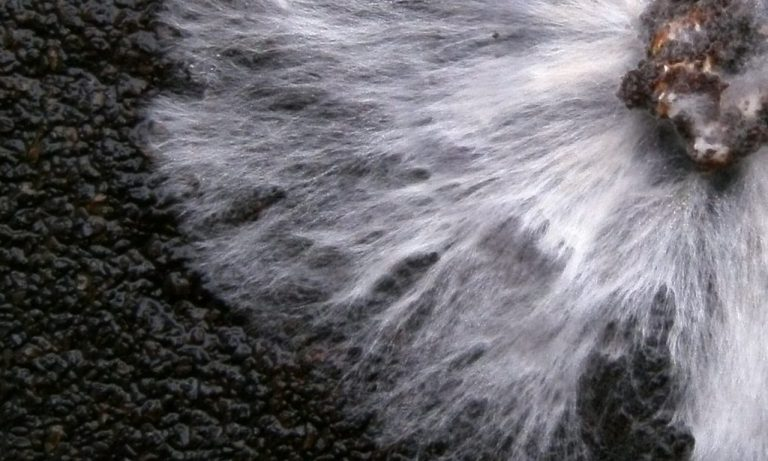

<style type="text/css">
.main-container {
  max-width: 1800px;
  margin-left: auto;
  margin-right: auto;
}
</style>


## [HOME](http://gzahn.github.io/) | [ABOUT ME](http://gzahn.github.io/about-me/) | [LAB](http://gzahn.github.io/lab/) | [RESEARCH](http://gzahn.github.io/pubs-and-pres/) | [TEACHING](http://gzahn.github.io/coursemap/)

<div style= "float:right;position: relative;top:10px">
```{r, out.width = "300px",echo=FALSE}

```
</div>

<style>
div.gray { background-color:#aabdaf; border-radius: 5px; padding: 20px;}
</style>
<div class = "gray">


# **MYCOLOGY**{#top}
**Utah Valley University - BIOL1620**

This course section is entirely online. All assignments, quizzes, and exams will be turned in and taken on Canvas. My preferred contact method is our group Slack channel.

This webpage will host links to all resources and videos, and serves as a roadmap for the semester, listing readings, assignments, etc.

___

#### **Course overview:**
**The course consists of several components:**
  
  - **Required readings**
    + Textbook: Webster and Weber, *Introduction to Fungi - 3rd ed.* (specific sections)
    + Scientific papers: Usually weekly, linked below
    + Fun book: *Mr. Bloomfield's Orchard*, by Nicholas Money
  - **Weekly quizzes on reading material** (on Canvas)
  - **Assorted "home mycology" lab, research, and field exercises** (on Canvas)
  - **Exams** (3 of these, on Canvas, open-note) 

**The course is broken into 4 rough sections:**

  **1.** Getting to know fungal biology and major groups (get ready for a bunch of mycological terminology)
  
  **2.** Fungi as the enemy (human and plant pathogens, fungal distribution, secondary compounds)
  
  **3.** Fungi as a friend (mutualistic symbioses)
  
  **4.** Molecular mycology (intro to modern methods and fungal bioinformatics)
  
**Course assumptions (about you):**

  - You know how to read a phylogeny and argue whether a trait is ancestral or derived
  - You know how to find and read a scientific journal article
  - You can write intelligibly 
  - You understand the following terms and concepts:
    + monophyletic, taxon, clade, outgroup
    + central dogma of biology
    + chromosome, locus, gene, variant, phenotype
    + niche, dispersal, genetic drift, diploid/haploid
    + respiration, oxidation/reduction
  - In other words, you've had (and paid attention to) the material from BIOL1610 and BIOL1620


___

## Quick links:

#### [Course Syllabus](https://gzahn.github.io/mycology/media/Syllabus_Fa_2020.pdf){target="_blank"}

#### [Course Text Book](https://gzahn.github.io/mycology/media/WEBSTER_and_WEBER_3rd-ed.pdf){target="_blank"}

#### My [Hillbilly Mycology](https://gzahn.github.io/mycology/hillbilly_mycology.html){target="_blank"} resource page

____

## Good web resources:

[**21st Century Guidebook to Fungi**](http://www.davidmoore.org.uk/21st_Century_Guidebook_to_Fungi_PLATINUM/index.htm){target="_blank} (This is pretty useful for this class!) Full [download link](https://gzahn.github.io/mycology/media/21st_Century_Guide_to_Fungi_1st_ed.zip) for older edition (zipped).

"The Fifth Kingdom" [**website**](http://www.mycolog.com/fifthtoc.html){target="_blank"}

Cornell's [**Virtual Fungal Library**](http://mycology.cornell.edu/){target="_blank} (Extensive links to resources!)

[**Fungal Gene Database**](https://fungidb.org/fungidb/){target="_blank} (Exactly what it sounds like.)

[**Emerging fungal diseases**](https://www.cdc.gov/fungal/resources.html){target="_blank} CDC resource page for those with a medical bent

Nice [**YouTube Channel**](https://www.youtube.com/channel/UCkzY4M9kg2VmqJ2nNcNM8hw){target="_blank} with videos featuring do-it-at-home mycology

___

## Table of Contents

[Week 1](#Week-1)    |    [Week 5](#Week-5)    |    [Week 9](#Week-9) | [Week 13](#Week-13)

[Week 2](#Week-2)    |    [Week 6](#Week-6)    |    [Week 10](#Week-10) | [Week 14](#Week-14)

[Week 3](#Week-3)    |    [Week 7](#Week-7)    |    [Week 11](#Week-11) | [Week 15](#Week-15)

[Week 4](#Week-4)    |    [Week 8](#Week-8)    |    [Week 12](#Week-12) | [Week 16](#Week-16)


</div>

___

<style>
div.blue { background-color:#a89d82; border-radius: 5px; padding: 20px;}
</style>
<div class = "blue">


<div style= "float:right;position: relative;top:10px">
```{r, out.width = "350px",echo=FALSE}

```
</div>


### **Week 1**{#Week-1}

**Topics:** 

  - What are fungi? | Chytrids and divergence from metazoa | Fungal phylogeny

**Readings and Assignments**  

  - Study the lesson slides (link below)
  - Read [James, et al., 2006](https://gzahn.github.io/mycology/media/James_et_al_-_2006_Reconstructing_the_early_evolution_of_Fungi.pdf){target="_blank"}
  - Read Webster & Weber: **1.1** | **1.5** | **6.1** 
  - Canvas quiz on readings (due before class Thursday)
  - Watch [this video](https://youtu.be/jLAHbP-LLFM){target="_blank"} on how fungi changed the world. Watch it before next week.
  - Find and grow zygomycete fungi (Canvas assignment; video walkthrough below)
  - Buy this cool pocket microscope [Amazon link](https://amzn.to/3grbsQG){target="_blank"} (this is in lieu of your textbook fee)
  - Slack discussion on readings (Thursday 11:15am)
  
**Resources**

  - [Main study topics](https://gzahn.github.io/mycology/study_topics/week_1.txt){target="_blank"}
  - Lesson [slides](https://gzahn.github.io/mycology/lectures/Week1.odp){target="_blank"}
  - Lesson [video](https://youtu.be/F5SASVef1YY){target="_blank"} Part 1
  - Lesson [video](https://youtu.be/DTVme2O8Y3g){target="_blank"} Part 2
  - How to isolate Zygomycetes with soil and bread...for assignment [video](https://youtu.be/JzVBlk0Rqj8){target="_blank"}
  - Fungi are probably at least [800 million years old!](https://advances.sciencemag.org/content/6/4/eaax7599){target="_blank"}
  - [Fossil fungi](http://www-news.uchicago.edu/releases/07/070423.fungus.shtmla){target="_blank}
  - [Biophysics of pressurized growth in fungi](https://www.nature.com/articles/nrmicro2591.pdf?origin=ppub){target="_blank}

**Videos**

  - Chytrid [trophic modes](https://www.youtube.com/watch?v=N6Z_MlahSx8){target="_blank}
  - What's [killing the world's amphibians?](https://www.youtube.com/watch?v=BvidpapF1bg){target="_blank}
  - Chytrid sexual [life cycle](https://www.youtube.com/watch?v=ehQusvH8r1s){target="_blank}
    
[Back to top of page](#top)

___

<div style= "float:right;position: relative;top:10px">
```{r, out.width = "350px",echo=FALSE}

```
</div>

### **Week 2**{#Week-2}
**Topics**

  - The "hyphal lifestyle" | Fungal physiology | Zygomycetes | Reproduction in fungi

**Readings and Assignments**

  - Read [Fisher, et al., 2018](https://gzahn.github.io/mycology/media/fisher2018.pdf) (Have a phylogeny of Zygomycetes at the ready while you read this)
  - Read Webster & Weber: **1.2** | **1.3** | **1.4** | **7.1** | **7.2** | **7.3.1** | **7.3.2**
  - Canvas quiz on readings  (due before class Thursday)
  - Slack discussion on readings (Thursday 11:15am)
  - Turn in your Zygomycete microscopy photos (Canvas)

**Resources**

  - [Main study topics](https://gzahn.github.io/mycology/study_topics/week_2.txt){target="_blank"}
  - Lesson [slides](https://gzahn.github.io/mycology/lectures/Week2.odp){target="_blank"}
  - Lesson [video](https://youtu.be/hMdPcBkovl0){target="_blank"} (Part 1)
  - Lesson [video](https://youtu.be/ccrK54W3JrQ){target="_blank"} (Part 2)
  - ZyGoLife [website](http://zygolife.org/home/){target="_blank} for current phylogenies, etc.
  - Phylum-level [classification of Zygomycetes](https://www.tandfonline.com/doi/full/10.3852/16-042){target="_blank}
  - Good [web page](https://www.forestfloornarrative.com/blog/2017/8/24/hyphal-aggregates){target="_blank} on hyphal aggregates
  
**Videos**

  - Generic Zygomycete [life cycle video](https://youtu.be/1tpEKYvKy7I){target="_blank}
  - Another life cycle [video](https://youtu.be/M-dDUB5mnko){target="_blank}
  - Zygospore formation [video](https://youtu.be/8Hqfc1xeF1M){target="_blank}
  - Hyphal types [video](https://youtu.be/ISPA7IM4zaU){target="_blank"} (though she mispronounces "coenocytic" ... it's like "see - no - sit - ic")
  - Mucor as a human pathogen [video](https://youtu.be/DntLhHpdAuc){target="_blank"}
  - Mucor as a model of Zygomycete anatomy [video](https://youtu.be/OPldLIlltNg){target="_blank"} (ridiculous music warning)
  - Cool time-lapse video of [growing hyphae](https://www.youtube.com/watch?v=i9T727tz7FA){target="_blank}
  - Hyphal morphology [video](https://www.youtube.com/watch?v=OZuFzbNIVUQ){target="_blank}

  
  
[Back to top of page](#top)

___

<div style= "float:right;position: relative;top:10px">
```{r, out.width = "350px",echo=FALSE}
knitr::include_graphics("./media/asco_life_cycle.jpg")
```
</div>


### **Week 3**{#Week-3}

**Topics**

  - Ascomycetes | Species concept in fungi | Anamorphs and Teleomorphs | Dikaryotism

**Readings and Assignments**

  - Read Webster & Weber: **8** | **10.2** | **12.1** | **12.2.1** | **17.2.6**
  - Canvas quiz on readings (due before class Thursday)
  - Slack discussion on readings (Thursday 11:15am)
  - How many Ascomycete species exist? (Canvas assignment)

**Resources**

  - [Major Topics](https://gzahn.github.io/mycology/study_topics/week_3.txt){target="_blank"}
  - Leson [slides](https://gzahn.github.io/mycology/lectures/Week3_mini.odp){target="_blank"}
  - Lesson [video](https://youtu.be/u3DyHgNfaGQ){target="_blank"} (Part 1)
  - Lesson [video](https://youtu.be/EXP-vOXJAEY){target="_blank"} (Part 2)
  - Species concept in fungi [paper](http://140.232.1.129/faculty/dhibbett/Reprints%20PDFs/Taylor%20et%20al%202000%20FGB.pdf){target="_blank"}
  - Ascus formation [web page](http://website.nbm-mnb.ca/mycologywebpages/NaturalHistoryOfFungi/Asci.html){target="_blank"}
  - Anamorphs and Teliomorphs [paper](https://gzahn.github.io/mycology/media/Kirschner_2019.pdf){target="_blank"}
  - [Saccharomyces](https://mmbr.asm.org/content/mmbr/52/4/536.full.pdf){target="_blank"}
  - [Sordaria](https://botit.botany.wisc.edu/toms_fungi/mar2007.html){target="_blank"}
  - [Alternaria](https://microbenotes.com/alternaria-alternata/){target="_blank"}
  - [Xylaria](https://www.researchgate.net/profile/Bitty_Roy/publication/291205851_Spatial_Ecology_of_the_Fungal_Genus_Xylaria_in_a_Tropical_Cloud_Forest/links/5b0aff7caca2725783ea5226/Spatial-Ecology-of-the-Fungal-Genus-Xylaria-in-a-Tropical-Cloud-Forest.pdf?_sg%5B0%5D=fzmK3YP24yHpk6IUyNunKNS_YcId4zwW3mSnQLgQTLP9AJtFYwOLp3LVPRA912Naiw9YyNtIMxaYyfeIXzbdFg.KYhMYissEHmJQeAyzM0zRohYDWGV1nla4FjitQeroTVaMC0szw8nxAPZwedkSGifd-sM8vGNb2rAMRhkuXCOPA&_sg%5B1%5D=T6R2h1UVgXv6iUi4vPnQBHRmmQ0CfhTR6BNVlGjVh05r5gipSFvVq0OcaQVdcNn53lUD7Ttz1Nt_j1p-WPWnJkVL3PvnMdBDCm1elCKi01f8.KYhMYissEHmJQeAyzM0zRohYDWGV1nla4FjitQeroTVaMC0szw8nxAPZwedkSGifd-sM8vGNb2rAMRhkuXCOPA&_iepl=){target="_blank"}
  - Mycobank fungal name [synonym search](http://www.mycobank.org/quicksearch.aspx){target="_blank"}
  - What's so good about being diploid? [paper](https://onlinelibrary.wiley.com/doi/full/10.1046/j.1420-9101.2001.00245.x){target="_blank"}
  - Why does Saccharomyces cereviseae perform ethanol fermentation even in the presence of oxygen, even at a cost to energy production? [paper](https://www.frontiersin.org/articles/10.3389/fmolb.2014.00017/full){target="_blank"}
  
**Videos**

  - [Good overview](https://youtu.be/q7V9avKWeo0){target="_blank"} of Ascomycete characteristcs
  - Sordaria [crossing over](https://youtu.be/gXUxH1aFRp0){target="_blank"}
  - How fungi helped us solve the central dogma of biology: 
    + [Part 1](https://youtu.be/cETqxjsB_Bw){target="_blank"} (Why *Neruospora crassa* was the perfect model organism) 
    + [Part 2](https://youtu.be/fXASTY-YoRQ){target="_blank"} (The famous Beadle and Tatum experiment)
    
[Back to top of page](#top)
  
___

<div style= "float:right;position: relative;top:10px">
```{r, out.width = "250px",echo=FALSE}
knitr::include_graphics("./media/basidios.jpg")
```
</div>
  
  
### **Week 4**{#Week-4}
**Topics**

  - Basidiomycetes

**Readings and Assignments**

  - Read Webster & Weber: **18** | **19.1** | **19.4.5** | **20.1** | **20.3** | **21.1** | **21.5**
  - Canvas quiz on readings (due before class Thursday)
  - Slack discussion on readings (Thursday 11:15am)

**Resources**

  - [Major Topics](https://gzahn.github.io/mycology/study_topics/week_4.txt){target="_blank"}
  - Leson [slides](https://gzahn.github.io/mycology/lectures/Week4.odp){target="_blank"}
  - Lesson [video](https://youtu.be/nunoVMGLfyY){target="_blank"} Part 1
  - Lesson [video](https://youtu.be/MAAhQAZco6I){target="_blank"} Part 2
  - Basidiomycete [life cycle](){target="_blank"} #see slides for now
  - Basidiomycete [phylogeny](){target="_blank"} #see slides for now
  - [Pleurotus](){target="_blank"} #see slides for now
  - [Lycoperdon](){target="_blank"} #see slides for now
  - [Tremella](){target="_blank"} #see slides for now

  
**Videos**

  - Basidium formation 
  - Spore discharge
  -
  
[Back to top of page](#top)

___


<div style= "float:right;position: relative;top:10px">
```{r, out.width = "350px",echo=FALSE}

```
</div>

### **Week 5**{#Week-5}
**Topics**

  - Fungal development | Mushroom mechanics | Active dispersal | Mushroom ID
  
**Readings and Assignments**

  - Read [Kiss, *et al.*, 2019](https://www.nature.com/articles/s41467-019-12085-w)
  - **Exam 1** (Covers material from weeks 1-4)
  - Fungal collections (5 types of macrofungi) and IDs (Turned in on Canvas next week)
    + Photo of fungus in its habitat
    + Photo of spore print and/or micrograph of spores
    + Description of each fungus according to the mushroom characters cheat sheet (below)
    + Tentative genus identification if you are feeling bold
  - [LINK](https://gzahn.github.io/mycology/media/mushroom_collection_notes.pdf){target="_blank"} to an example for one collection.
  
**Resources**

  - [Major Topics](https://gzahn.github.io/mycology/study_topics/week_5.txt){target="_blank"}
  - Leson [slides](https://gzahn.github.io/mycology/lectures/Week5.odp){target="_blank"}
  - Lesson [video](https://youtu.be/u87U92kY9JY){target="_blank"} Part 1
  - Resources for how to collect and ID fungi found in my hillbilly mycology [protocols section](https://gzahn.github.io/mycology/hillbilly_mycology.html#protocols){target="_blank"}
  - Mushroom characters [cheat sheet](https://gzahn.github.io//mycology/media/Mushroom_Descriptions_ID_copy.jpg){target="_blank"}
  
  
**Videos**

  - 
  -
  -
  
[Back to top of page](#top)

___


<div style= "float:right;position: relative;top:10px">
```{r, out.width = "350px",echo=FALSE}

```
</div>

### **Week 6**{#Week-6}
**Topics**

  - Medical mycology 
  
**Readings and Assignments**

  - Read [Huffnagle & Noverr, 2013](https://gzahn.github.io/mycology/media/Huffnagle_and_Noverr_2013.pdf)
  
**Resources**

  - [Major Topics](https://gzahn.github.io/mycology/study_topics/week_6.txt){target="_blank"}
  - Leson [slides](https://gzahn.github.io/mycology/lectures/Week6.odp){target="_blank"}
  - Lesson [video](https://youtu.be/5ywrCY0TiSI){target="_blank"} Part 1
  - CDC [Website](https://www.cdc.gov/fungal/index.html){target="_blank"} for fungal diseases
  - Fungal toxins [review paper](https://www.ncbi.nlm.nih.gov/pmc/articles/PMC164220/){target="_blank"}
  - Global warming is driving thermotolerance and evolving more human pathogenic fungi [paper](https://gzahn.github.io/mycology/media/Robert_et_al_2015.pdf){target="_blank"}
  
**Videos**

  - 
  -
  -
  
[Back to top of page](#top)


___

### **Week 7**{#Week-7}

<div style= "float:right;position: relative;top:10px">
```{r, out.width = "350px",echo=FALSE}

```
</div>

**Topics**

  - Plant pathogens
  
**Readings and Assignments**

  - Read [Roy, 1993](https://gzahn.github.io/mycology/media/Roy_1993.pdf)
  - Read Webster & Weber: **22**
  -
  -
  
**Resources**

  - [Major Topics](){target="_blank"}
  - Leson [slides](){target="_blank"}
  - Lesson [video](){target="_blank"} (Recorded during class and posted after)  
  
**Videos**

  - 
  -
  -  

[Back to top of page](#top)

___

<div style= "float:right;position: relative;top:10px">
```{r, out.width = "350px",echo=FALSE}
knitr::include_graphics("./media/dist_chytrid.jpg")
```
</div>


### **Week 8**{#Week-8}
**Topics**

  - Distribution and dispersal | Population ecology
  
**Readings and Assignments**

  - Read [Bacigalupe, et al., 2017](https://gzahn.github.io/mycology/media/Bacigalupe_et_al_2017.pdf)
  - Read Money: Chapters 1-2
  
**Resources**

  - [Major Topics](){target="_blank"}
  - Leson [slides](){target="_blank"}
  - Lesson [video](){target="_blank"} (Recorded during class and posted after)
  
**Videos**

  - 
  -
  -
  
[Back to top of page](#top)

___

<div style= "float:right;position: relative;top:10px">
```{r, out.width = "350px",echo=FALSE}

```
</div>


### **Week 9**{#Week-9}
**Topics**

  - Symbioses: Endophytes
  
**Readings and Assignments**

  - Read [Christian, et al., 2017](https://gzahn.github.io/mycology/media/Christian_et_al_2017.pdf)
  - Read Money: Chapter 3
  - **Exam 2** (Covers material from weeks 5-8)
    + Development
    + Pathology
    + Distribution
  
**Resources**

  - [Major Topics](){target="_blank"}
  - Leson [slides](){target="_blank"}
  - Lesson [video](){target="_blank"} (Recorded during class and posted after)
  
**Videos**

  - 
  -
  -
  
___

<div style= "float:right;position: relative;top:10px">
```{r, out.width = "350px",echo=FALSE}

```
</div>

[Back to top of page](#top)  


### **Week 10**{#Week-10}

**Topics**

  - Symbioses: Mycorrhizae
  
**Readings and Assignments**

  - 
  - Read Money: Chapter 4
  - 
  
**Resources**

  - [Major Topics](){target="_blank"}
  - Leson [slides](){target="_blank"}
  - Lesson [video](){target="_blank"} (Recorded during class and posted after)
  
**Videos**

  - 
  -
  -  
  
[Back to top of page](#top)

___

<div style= "float:right;position: relative;top:10px">
```{r, out.width = "350px",echo=FALSE}
knitr::include_graphics("./media/lichen.jpg")
```
</div>

### **Week 11**{#Week-11}

**Topics**

  - Symbioses: Lichens
  
**Readings and Assignments**

  - Read [Spribille, et al., 2016](https://gzahn.github.io/mycology/media/Spribille_et_al_2016.pdf)
  - Read Money: Chapter 5-6
  
**Resources**

  - [Major Topics](){target="_blank"}
  - Leson [slides](){target="_blank"}
  - Lesson [video](){target="_blank"} (Recorded during class and posted after)
  
**Videos**

  - 
  

[Back to top of page](#top)

___

  <div style= "float:right;position: relative;top:10px">
```{r, out.width = "250px",echo=FALSE}
knitr::include_graphics("./media/rot.jpg")
```
</div>

### **Week 12**{#Week-12}

**Topics**

  - Fungi and ecosystems
  
**Readings and Assignments**

  - Read [Hoppe, et al., 2016](https://gzahn.github.io/mycology/media/Hoppe_et_al_2016.pdf)
  - Read Money: Chapter 7
  - 
  
**Resources**

  - [Major Topics](){target="_blank"}
  - Leson [slides](){target="_blank"}
  - Lesson [video](){target="_blank"} (Recorded during class and posted after)
  
**Videos**

  - 
  
[Back to top of page](#top)

___

<div style= "float:right;position: relative;top:10px">
```{r, out.width = "350px",echo=FALSE}

```
</div>


### **Week 13**{#Week-13}

**Topics**

  - Ethnomycology
  
**Readings and Assignments**

  - Read [Dugan, 2008](https://gzahn.github.io/mycology/media/Dugan_2008.pdf)
  - Read Money: Chapter 8-9
  - **Exam 3** (Covers material from weeks 9-12)
    + Symbioses
    + Ecology

  
**Resources**

  - [Major Topics](){target="_blank"}
  - Leson [slides](){target="_blank"}
  - Lesson [video](){target="_blank"} (Recorded during class and posted after)
  
**Videos**

  - 
  
[Back to top of page](#top)

___


<div style= "float:right;position: relative;top:10px">
```{r, out.width = "350px",echo=FALSE}
knitr::include_graphics("../media/turkey.jpeg")
```
</div>

### **Week 14**{#Week-14}

# Thanksgiving Break

<br/><br/><br/><br/><br/><br/><br/><br/>

___


<div style= "float:right;position: relative;top:10px">
```{r, out.width = "350px",echo=FALSE}

```
</div>

### **Week 15**{#Week-15}

**Topics**

  - Molecular mycology | Intro to fungal bioinformatics
  
**Readings and Assignments**

  - Read [Raja, et al., 2017](https://gzahn.github.io/mycology/media/Raja_et_al_2017.pdf){target="_blank"}
  - Read Money: Chapter 9

  
**Resources**

  - [Major Topics](){target="_blank"}
  - Leson [slides](){target="_blank"}
  - Lesson [video](){target="_blank"} (Recorded during class and posted after)
  - How to use BLAST [tutorial](https://digitalworldbiology.com/blast){target="_blank"}
  - [Terminology](https://www.ncbi.nlm.nih.gov/BLAST/tutorial/Altschul-1.html){target="_blank"} of sequence similarity 
  
  
**Videos**

  - 
  -
  -

[Back to top of page](#top)

___

<div style= "float:right;position: relative;top:10px">
```{r, out.width = "350px",echo=FALSE}

```
</div>

### **Week 16**{#Week-16}

**Topics**

  - Wrap-up
  
**Readings and Assignments**

  - Start on Final Exam
  

  
[Back to top of page](#top)

___

<br/><br/>

## Final Exam 


**For the Final Exam schedule,** [**click here**](https://www.uvu.edu/academicscheduling/exam_schedule/){target="_blank"}

<br/>
<br/>
<br/>
<br/>

</div>
